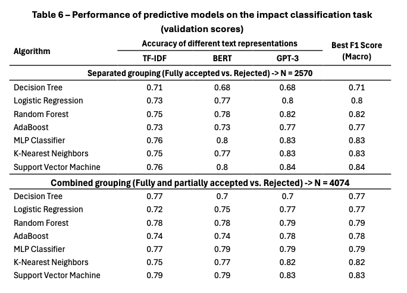
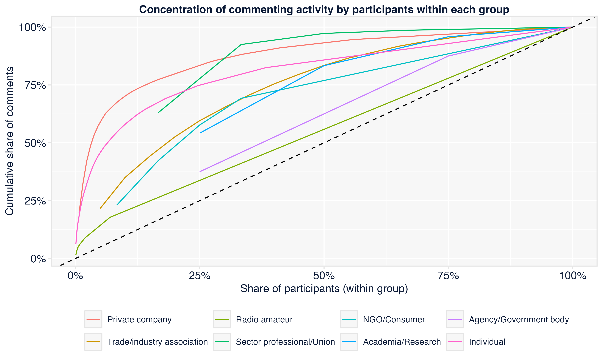
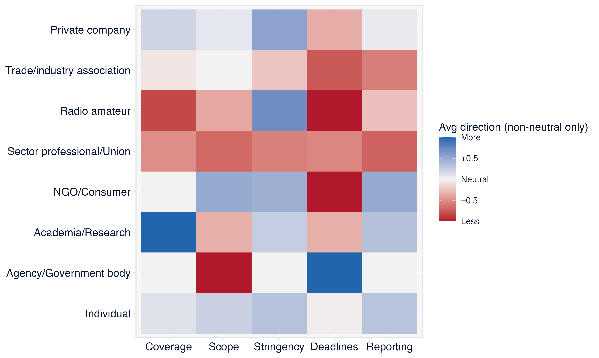
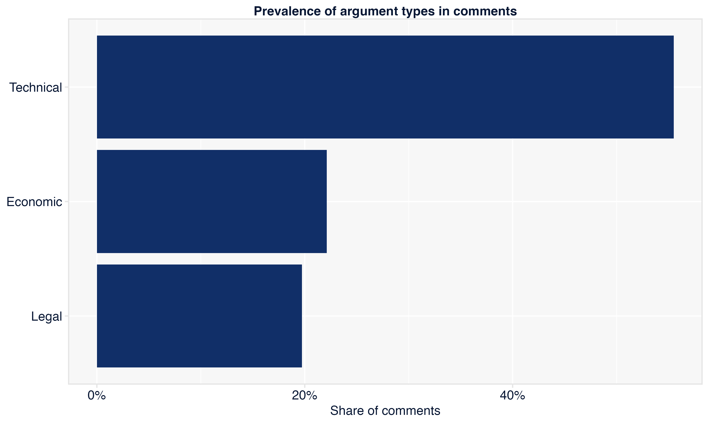
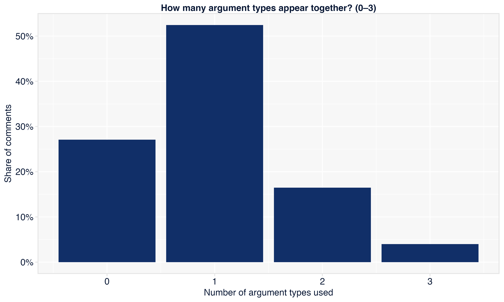
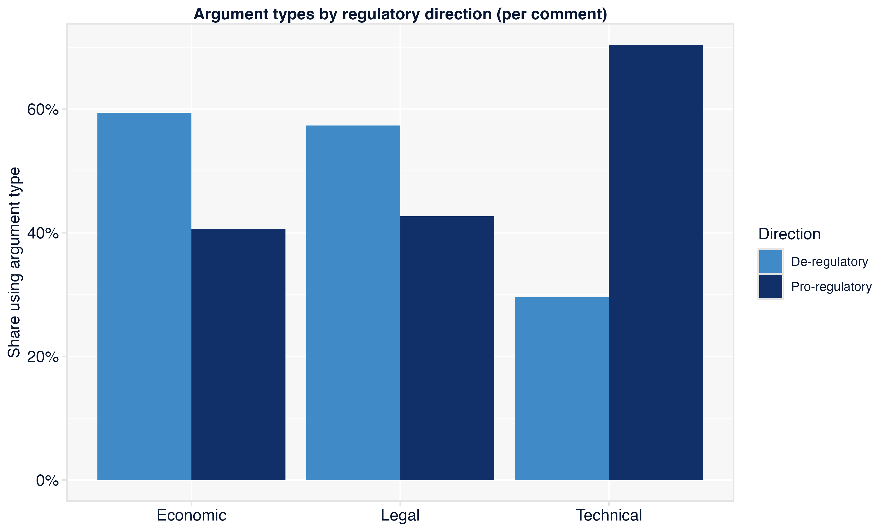

# Inteligência Artificial para Análise de Contribuições em Processos de Participação Social

 

*Natasha Salinas* | *Lucas Thevenard* | Março 2026

---

<!--
paginate: true
header: IA para Análise de Contribuições em Participação Social
footer: lucas.gomes@fgv.br | 26/03/2026
-->

## Um uso acadêmico de ferramentas de IA

- Na minha tese, meu interesse científico era entender a relação entre **grupos de interesses**, **conteúdo das contribuições** e **impacto** em processos de participação social.
* Para responder às minhas perguntas de pesquisa, foi preciso criar formas de medir o conteúdo das contribuições em larga escala.
* Dados disponíveis:
  - Metadados estruturados coletados do site da Anatel;
  - Texto das contribuições;
  - Respostas da agência.

---

## Dois usos para os textos das contribuições

* Representação estatística (GPT Embeddings) dos textos para uso em **modelos preditivos e descritivos**.
* Extração de variáveis qualitativas dos textos: **produção de dados estruturados** a partir de documentos textuais

---

## Modelo preditivo do impacto das contribuições

- **Objetivo**: criar um **modelo para prever o impacto das contribuições** (se ela foi ou não aceita) a partir do texto.
- **Metodologia**: padrão típico de **treinamento supervisionado** de um classificador usando de algoritmos de Machine Learning.

---

<!--
_header: ""
_footer: ""
-->

---

## Extração de variáveis qualitativas dos textos
- **IA como "[assistente de pesquisa](https://regulatorystudies.columbian.gwu.edu/ai-research-assistant-regulatory-studies-methodological-note)"**:
  - Identificação de participantes;
  - Classificação da "direção regulatória";
  - Fundamentação: usos de argumentos econômicos, jurídicos e técnicos.
* **Metodologia**: automação simples e *prompt engineering* (mas seria possível também treinar modelos usando *fine tuning*, PEFT, etc. para obter maior fidelidade).

---

---

---

---

---

---

---

---

## Potencial de ferramentas de IA para a análise da participação social

- Permitem transformar textos longos e heterogêneos em **informação estruturada, comparável e auditável**.
- Viabilizam **leituras transversais** das contribuições.

---

## Aplicações para auxiliar reguladores no processamento das contribuições

- Identificação mais rápida dos **participantes** e dos **pedidos** formulados.
* Sistematização da **fundamentação dos pedidos**, a qual pode se organizar a partir de leituras transversais e multitemáticas: fundamentos econômicos, fundamentos jurídicos, fundamentos técnicos, etc.
- Extração e sistematização de **dados empíricos** e evidências trazidos pelos participantes.
- **Triagem** preliminar de contribuições, agrupamento de **casos semelhantes** e apoio à elaboração de **relatórios analíticos**.

---

## Também há usos promissores na formulação das contribuições

- IA pode interagir com participantes, explicar a consulta, tirar dúvidas e sugerir melhorias de redação.
- Esse campo tem potencial para tornar a participação mais acessível, dinâmica e produtiva, sobretudo para grupos que hoje enfrentam maiores barreiras técnicas.
- Não é o foco principal desta fala, mas é uma fronteira importante para ampliar a qualidade do diálogo regulatório.

---

## Condições para uso responsável

- Definir previamente as categorias e os critérios de extração.
- Trabalhar com processos auditáveis, amostras de validação humana e documentação das métricas.
- Usar IA como **ferramenta de apoio**, não como substituta do juízo regulatório.

---

### Obrigado!
