

# Ferramentas de IA para pesquisas em regulação

## Uma nota metodológica

Lucas Thevenard | Março 2026

---

<!--
paginate: true
header: Ferramentas de IA para pesquisas em regulação
footer: lucas.gomes@fgv.br | 06/03/2026
-->

## Por que IA em estudos regulatórios?

- A regulação é **construída**, **justificada**, **contestada** e **revisada** por meio de textos.
* Os registros públicos (Diário Oficial, SEI, sistemas das agências) são verdadeiras minas de ouro de informação textual, mas:
  * Os dados estão desestruturados;
  * A informação dispersa e em forma de prosa oferece desafios técnicos à pesquisa.

---

## Novas ferramentas de análise textual (sobretudo com o avanço dos LLMs)

- Três “famílias” de solução para análise de texto:
  1. Representações estatísticas do texto
  2. Classificador especializado (supervisionado) OU Fine Tuning do Modelo
  3. Codificação assistida por LLM (prompting)

---

<!-- 
_header: ""
_footer: ""
-->

# Representações estatísticas e treinamento de modelos baseados em LLMs

---

## Representações estatísticas do texto

- Transformação do texto em um vetor numérico (para uso em modelos estatísticos), processo também chamado de *feature extraction*
* **Modelos de saco de palavras** (TF-IDF): capturam apenas informações básicas do vocabulário do texto.
* **Modelos baseados em embeddings** (BERT, GPT, etc): capturam relações sintáticas e semânticas muito mais complexas, a depender do modelo treinado.
  * Alguns LLMs, como o GPT da OpenAI, possuem APIs por meio dos quais é possível gerar a representação estatística do texto (na minha tese usei embeddings do GPT-3).

---

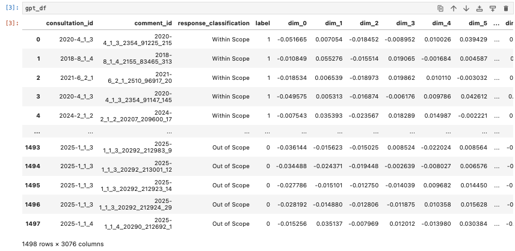

---

## Treinamento de classificadores

- Modelo preditivo:
  * São usados algoritmos de machine learning para treinar o modelo em um subconjunto de dados.
    - Nesse etapa, são definidos intervalos para hiperparâmetros do algoritmo e é usado um processo de k-folding para selecionar os melhores parâmetros.
    - Uma vez treinado, o modelo é testado com dados que não fizeram parte do treinamento.
    - Por fim, o modelo é validado com dados que não estavam nem no treinamento, nem no teste.

---

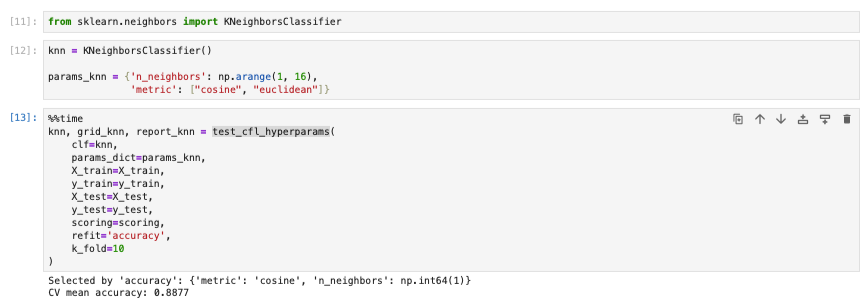

---

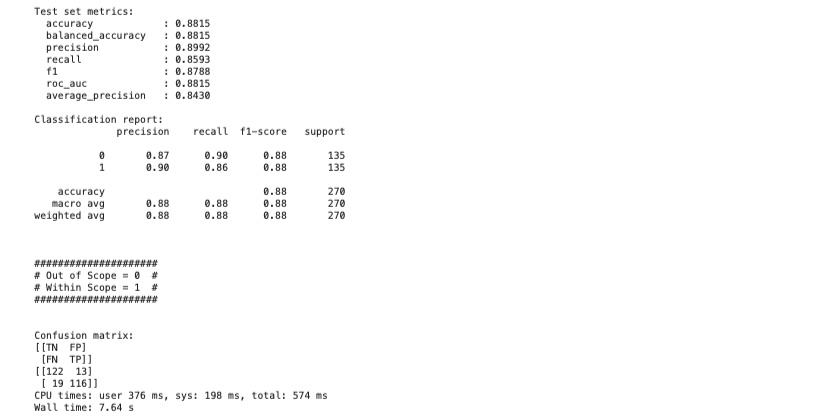

---

## Treinamento independente por feature extraction vs. Fine Tuning de um LLM

**1. Feature extraction (embeddings + classificador)**

#### **Arquitetura**: Texto -> LLM (embeddings) -> Classificador supervisionado

 

- O LLM é usado apenas como **extrator de representações**
- O vetor de **embeddings** vira input para um modelo de machine learning tradicional  
  (ex.: KNN, regressão logística, SVM, random forest)
- **Somente o classificador é treinado**

---

## Treinamento independente por feature extraction vs. Fine Tuning de um LLM

**2. Fine-tuning do LLM**

#### **Arquitetura**: Texto → LLM ajustado → classe

 

- O próprio **modelo de linguagem é treinado novamente**
- Os **pesos internos do LLM são atualizados**
- O modelo aprende **diretamente a tarefa**

---

### Comparação: Feature extraction vs Fine-tuning

| Aspecto | Embeddings + Classificador | Fine-tuning |
|---|---|---|
Custo computacional | baixo | alto |
Quantidade de dados | menor | maior |
Complexidade técnica | simples | maior |
Treinamento | rápido | mais lento |
Controle do modelo | maior interpretabilidade | menor |
Performance potencial | boa | geralmente maior |
Atualização do LLM | não | sim |

---

## Quando usar embeddings + classificador

✔ datasets pequenos  
✔ pesquisa aplicada  
✔ modelos interpretáveis  
✔ pipelines rápidos

## Quando usar fine-tuning do LLM

✔ tarefas complexas  
✔ grande volume de dados  
✔ necessidade de máxima performance  
✔ aplicações de produção

---

## Adapter training – um meio termo entre *feature extraction* e *fine-tuning*

#### **Arquitetura**: Texto → LLM layer → Adapter → LLM layer → Adapter → saída

 

- Os **pesos originais do LLM ficam congelados**
- Apenas os **adapters são treinados**

**Vantagens**

✔ treina **muito menos parâmetros**  
✔ preserva o conhecimento do modelo base  
✔ permite múltiplas tarefas com o mesmo LLM

---

## Relação do Adapter Training com outras técnicas modernas

Adapter training faz parte da família **PEFT (Parameter-Efficient Fine-Tuning)**.

Outras técnicas similares:

- **LoRA**
- **Prefix tuning**
- **Prompt tuning**

---

<!-- 
_header: ""
_footer: ""
-->

# Usando IA como assistente de pesquisa

---

## Uma alternativa: LLM-assisted coding

- Até agora vimos abordagens que **adaptam modelos** para tarefas específicas. Essas abordagens tratam o LLM (ou suas features) como **objeto de treinamento**.

- Outra possibilidade: Usar o LLM diretamente como **assistente de pesquisa**.

#### **Arquitetura**: Texto → prompt estruturado → LLM → variável codificada

- Por essa metodologia, não treinamos nem adaptamos o modelo, apenas pedimos para ele analisar o texto e extrair a informação desejada de forma estruturada (como faríamos com um ser humano).

---

## LLM-assisted coding

Abordagem metodológica baseada em **prompt engineering + validação humana**.

O pesquisador fornece ao modelo:

• definição do constructo  
• instruções de codificação  
• exemplos ou critérios decisórios  
• formato estruturado de resposta

---

## Estratégias de Prompt Engineering

* **Quanto à contextualização por exemplos**:
  - **Zero-shot prompting**: O modelo recebe *apenas a instrução da tarefa*, sem exemplos (embora possam ser definidos o contexto, o papel do modelo, etc).
  - **Few-shot prompting**: O prompt também inclui *exemplos de input → output* que serão observados antes da tarefa.
* **Quanto ao modelo de resposta**:
  - **Chain-of-thought prompting**: O modelo é instruído a *explicitar o raciocínio antes da resposta final*.
  - **Structured prompting**: O prompt exige *um formato específico de resposta*.

---

## Vantagens do LLM-assisted coding

- Replica técnicas humanas de pesquisa que já são familiares (análise de conteúdo, classificação subjetiva/qualitativa e intercoder reliability test).
- Não exige alto conhecimento técnico (mas algum conhecimento em programação é útil, para automatizar e escalar a tarefa).
- Não exige dados classificados, muito menos onerosa de partida (torna-se necessário apenas classificar a amostra de validação).

## Desvantagens do LLM-assisted coding
- Menor acurácia/qualidade das classificações.
- Engenharia de prompt pode ser menos replicável em outros contextos.

---

## Caso empírico: consultas públicas da Anatel

- Unidade: contribuições escritas + resposta da agência (proxy de influência)
- Variáveis do artigo:
  - **Participante**: grupo de interesses do participante.
  - **Preferência (direção) regulatória**: pro-regulatory vs. de-regulatory.
  - **Tipo de argumento**: econômico, legal, técnico.
  - **Influência (proxy)**: fully accepted / partially accepted / rejected (e “out of scope”).

---

<!--
_header: ""
_footer: ""
-->

# Evidências no caso da Anatel: resultados da minha tese de doutorado

---

### Participantes

---

---

### Preferência regulatória (direção)

---

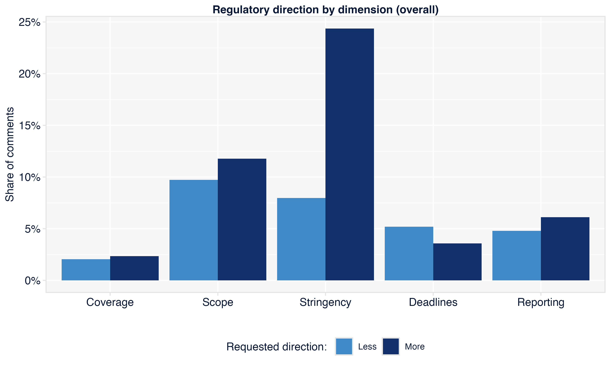

---

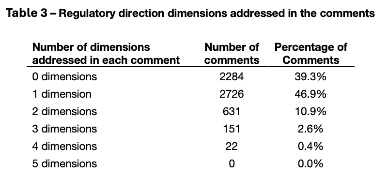

---

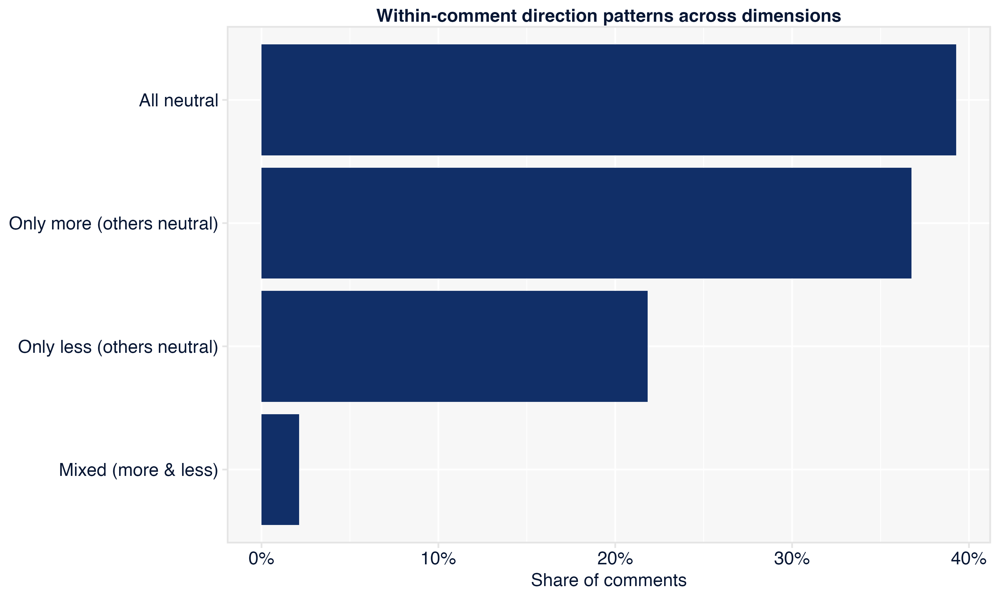

---

---

### Justificativa (tipos de argumento)

---

---

---

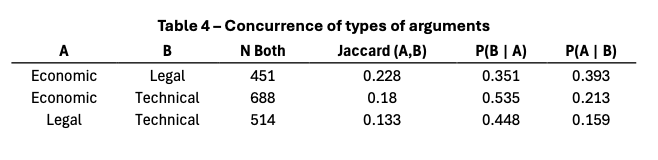

---

---

### Impacto

---

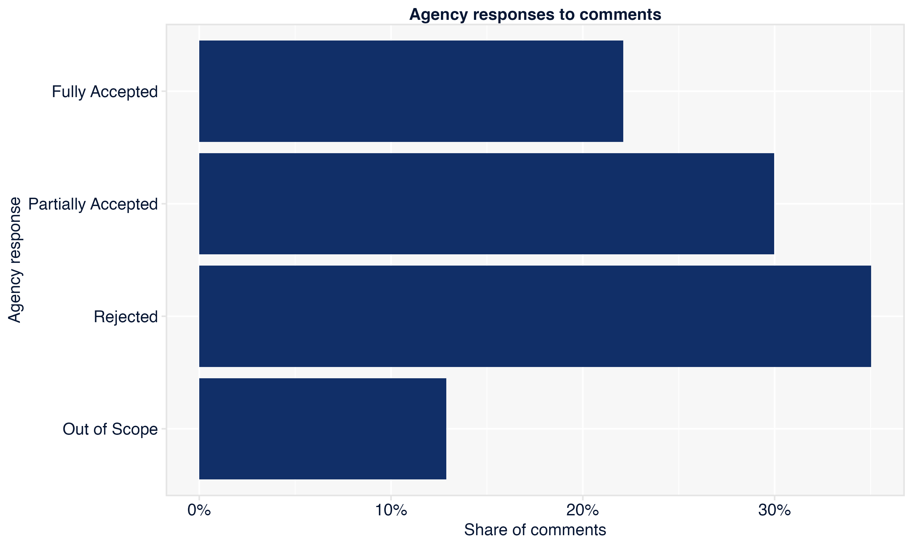

---

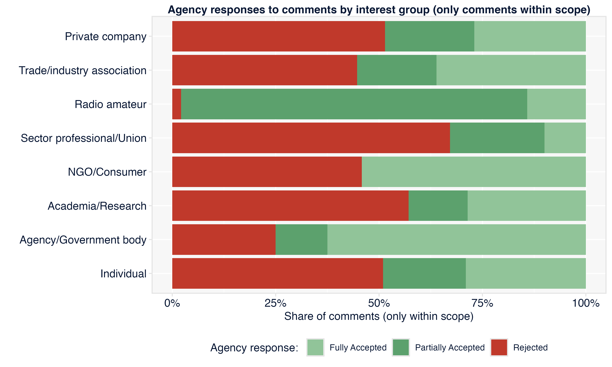

---

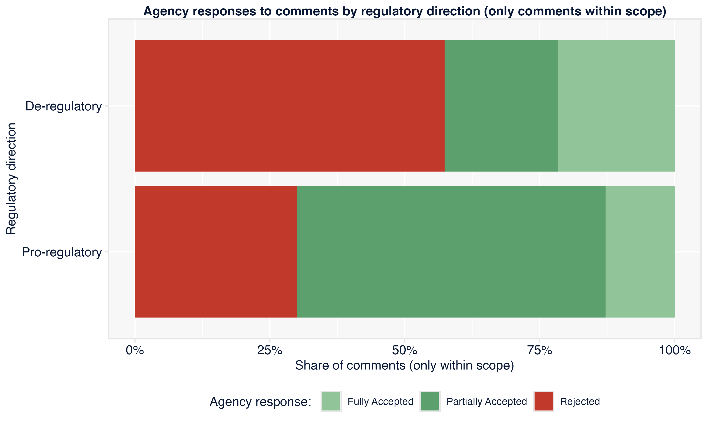

---

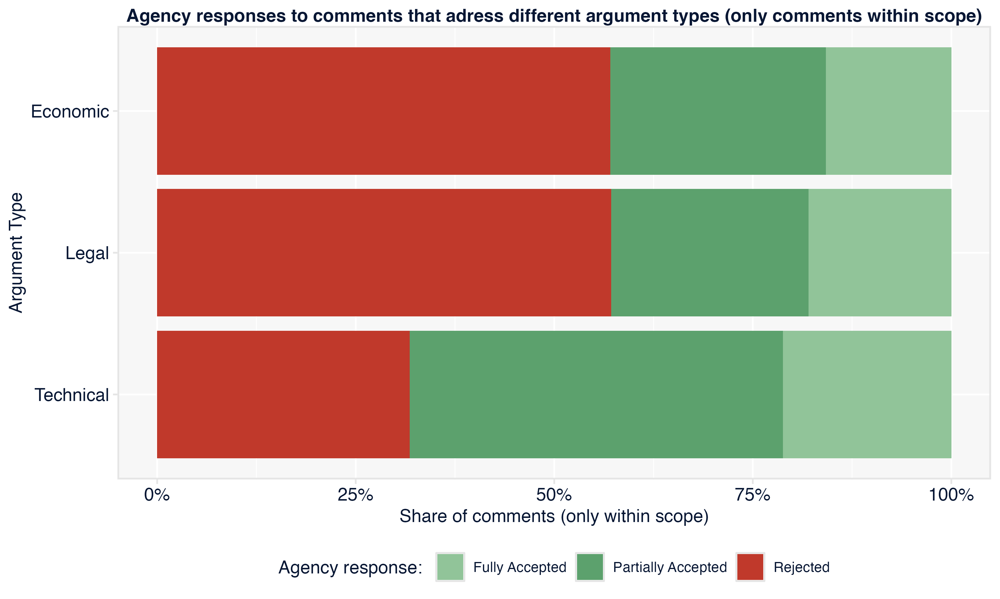

---

### Modelos: previsão das respostas da Anatel e explicabilidade do impacto por grupos de interesse

---

## Modelos preditivos e explicativos utilizados na tese

- **Modelos Preditivos**: prever a resposta da Anatel às contribuições. Duas tarefas:
  - Classificação do escopo.
  - Classificação do impacto (com 2 agrupamentos distintos dos dados).
- **Modelos Explicativos**: verificar o peso de variáveis de identidade vs. variáveis de conteúdo das contribuições no escopo e no impacto.
  - Sequência de 10 modelos distintos para avaliar como diferentes características afetavam o impacto.

---

<!--
_header: ""
_footer: ""
-->

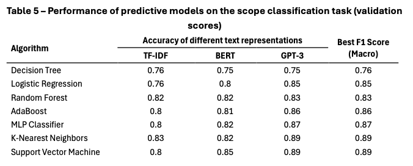

---

<!--
_header: ""
_footer: ""
-->

---

<!--
_header: ""
_footer: ""
-->

### Modelos explicativos: sequência de especificações

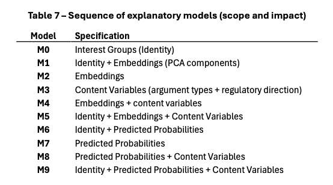

---

<!--
_header: ""
_footer: ""
-->

### Performance dos modelos explicativos (impacto)

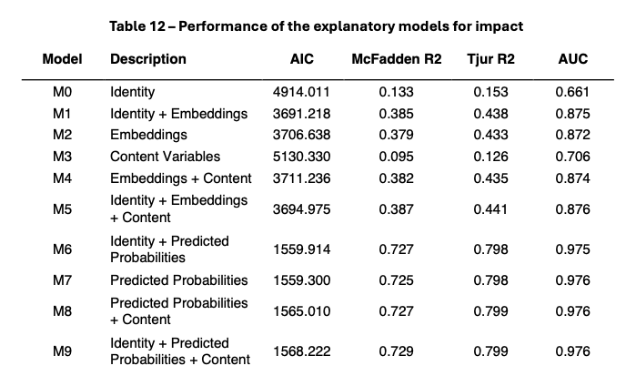

---

# Voltando ao problema metodológico...

---

## Takeaways para o grupo

- Trate IA como **medição**: defina categorias, avalie, audite e documente
- Combine abordagens: embeddings/classificadores para escala + LLM para tarefas abertas
- Prompting pode ser uma ferramenta de pesquisa subestimada! Muito efetiva em alguns casos e não necessita de tanta expertise técnica.
  - No entanto, fine tuning ainda é o estado da arte para tarefas técnicas complexas em que se exige alta acurácia.
- Publicar: métricas, procedimentos e limites é tão importante quanto o resultado

---

### Obrigado!

