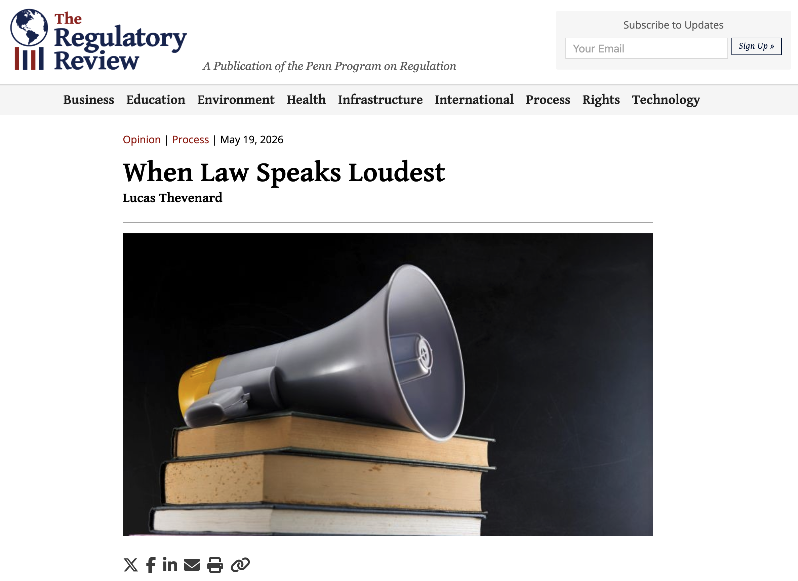
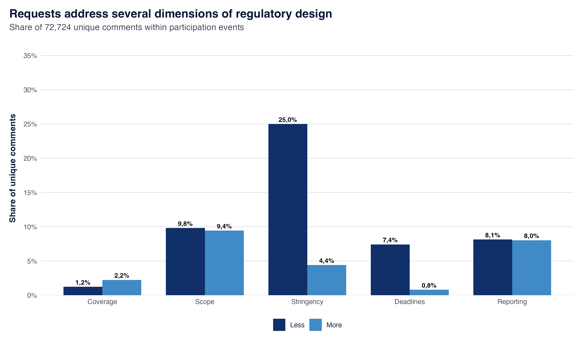
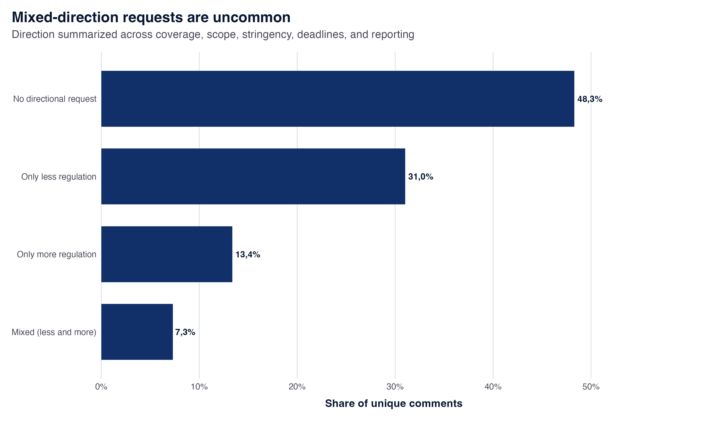
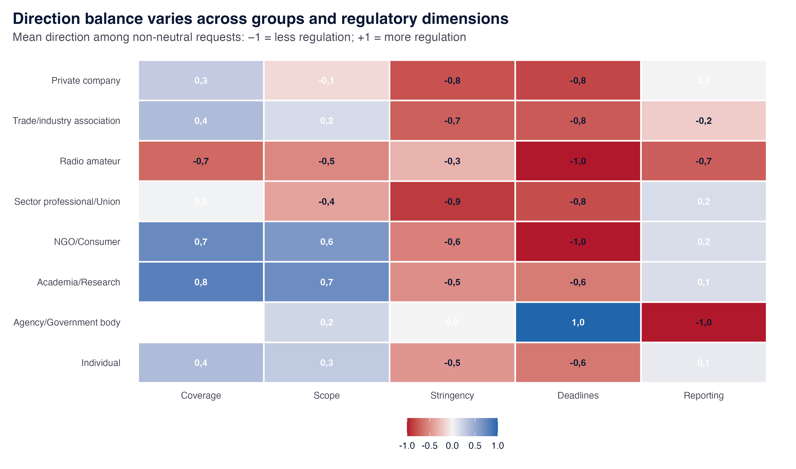
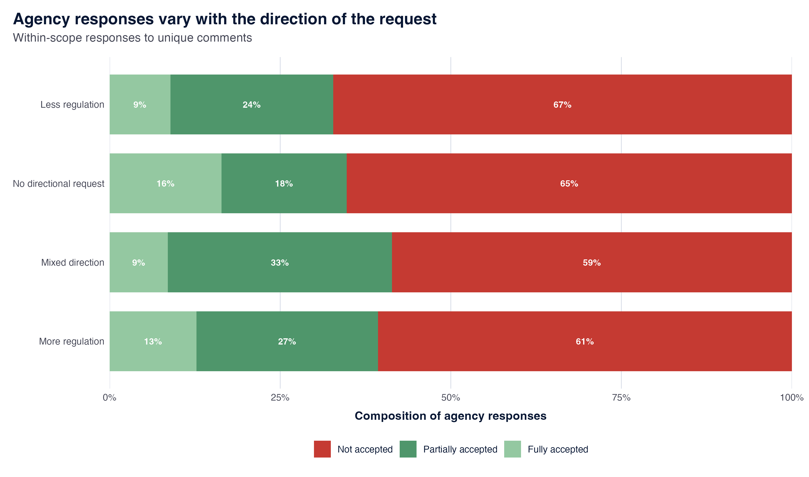
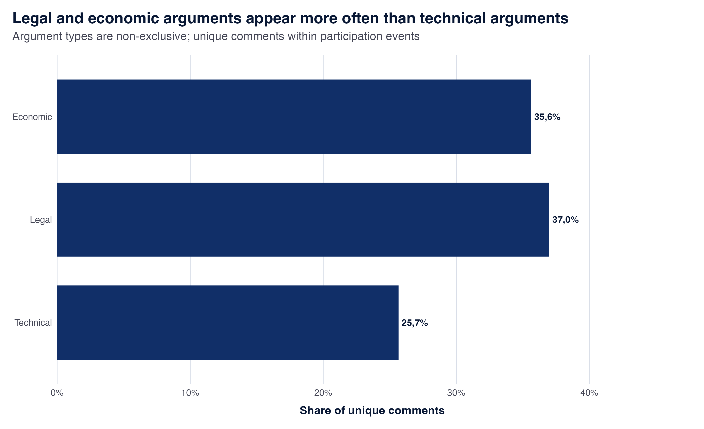
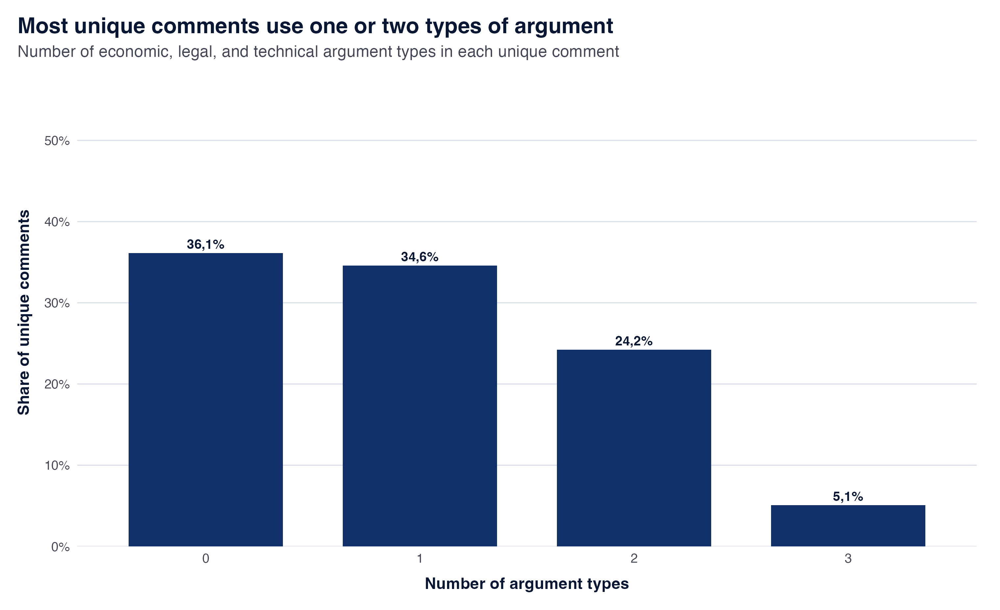
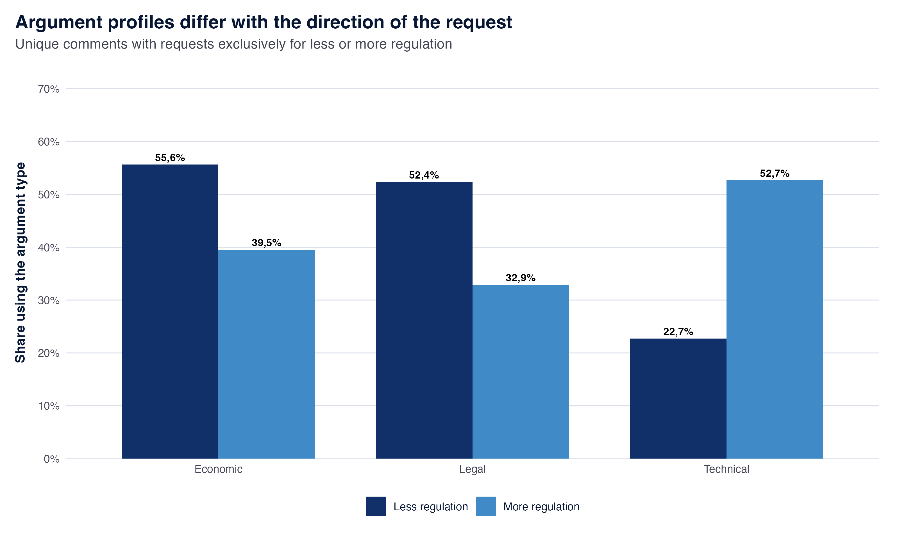
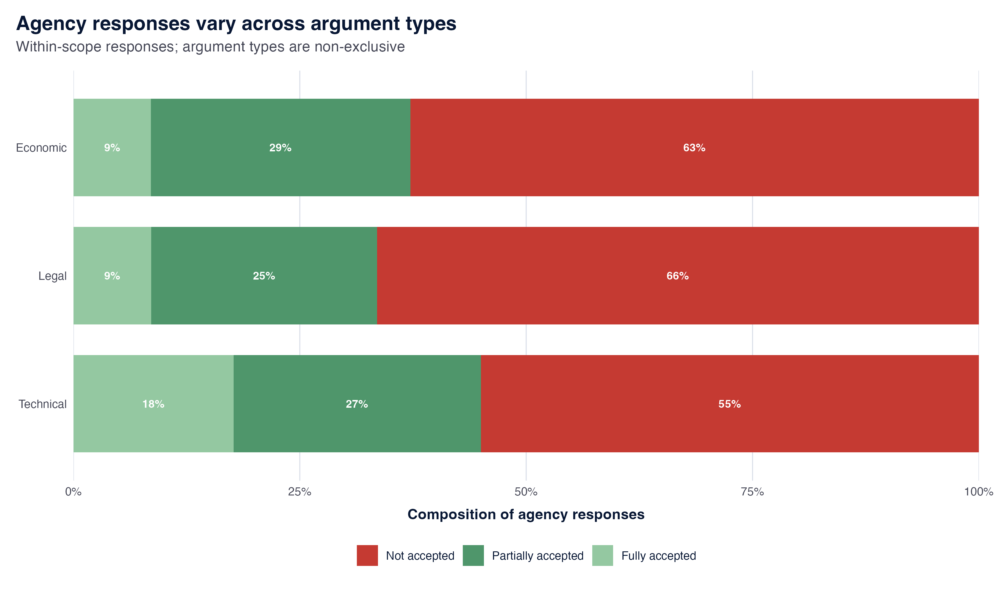
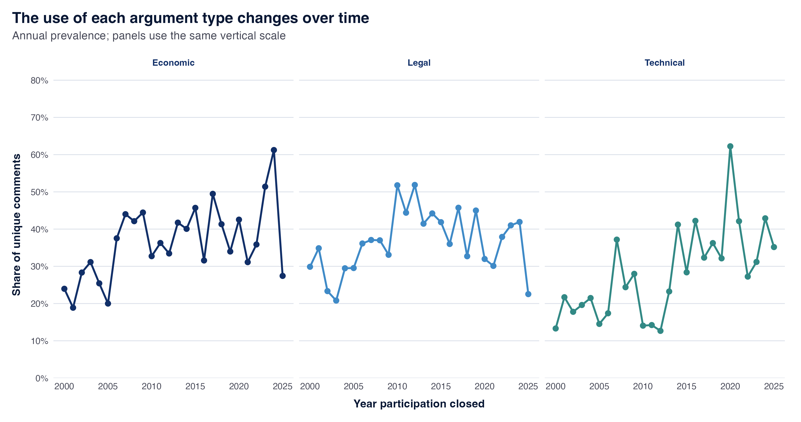

# Ideas, Issue Networks, and the Argumentative Structure of Brazilian Notice-and-Comment Rulemaking

## SPASRG 2026
Lucas Thevenard

<!--
[Sources]
- Visual template and background: Lucas Thevenard, dissertation_presentation_1.
-->

---

<!--
paginate: true
header: Ideas, Issue Networks, and Brazilian Notice-and-Comment Rulemaking
footer: lucas.gomes@fgv.br | SPASRG 2026
_class: compact
-->

## Framing the problem

* Empirical quantitative research on Notice and Comment focuses a lot on **who participates** and **who gets heard**, but says little about **what people want** and **what they say**.
* Qualitative studies are usually done with only a few case studies that focus on **exceptional (outlier) cases** that are **highly salient**.
* The **normative debate** is divided between overly optimistic (more participation = better decisions) and naïve (well-intentioned open-minded regulators) accounts, or highly skeptical accounts (Elliott's Kabuki Theater theory).

---

## Legalism as a dual problem

* **Legalism** becomes detrimental when legal form and procedural compliance replace or limit how other forms of reasoning (economic, tehcnical) enter the public/formal debate.
* Two ways in which this can happen:
  - **Formalistic rigidity**: Peci et al. (2026) associate standardized RIA templates in Brazil with lower-quality analyses.
  - **Legal bypassing**: A 2025 U.S. presidential memorandum directed agencies to consider repealing certain regulations without notice and comment under the APA's good-cause exception (The White House, 2025).

<!--
[Sources]
- Peci, Alketa et al. 2026. “‘Hitting the Target, but Missing the Point’ in Regulatory Impact Assessments: Does Bureaucratization Lead to Better RIAs?” Regulation & Governance. https://doi.org/10.1111/rego.70166
- The White House. “Directing the Repeal of Unlawful Regulations.” Presidential Memorandum, April 9, 2025. https://www.whitehouse.gov/presidential-actions/2025/04/directing-the-repeal-of-unlawful-regulations/
- Thevenard, Lucas. “When Law Speaks Loudest.” The Regulatory Review, May 19, 2026. https://www.theregreview.org/2026/05/19/thevenard-when-law-speaks-loudest/
- The wording reports an association in Peci et al. (2026); it does not make a causal claim about the legal mandate itself.
- Elliott, E. Donald. 1992. “Re-Inventing Rulemaking.” Duke Law Journal 41: 1490–1496. https://scholarship.law.duke.edu/dlj/vol41/iss6/4/
- Thevenard, Lucas. “When Law Speaks Loudest.” The Regulatory Review, May 19, 2026. https://www.theregreview.org/2026/05/19/thevenard-when-law-speaks-loudest/
- The research question and analytical sequence are the author's current theoretical framing for the dissertation.
-->

---

---

## An alternative account

- An alternative account treats participation as part of regulatory decision-making when it introduces additional reasons and connects them to agency responses.

Under what conditions can public participation improve regulatory outcomes by introducing new economic and technical reasons, and under what conditions does it become merely a <i>pro forma</i> exercise?

---

## A model for understanding notice-and-comment procedures

  

1

<strong>Agency</strong> chooses if and how participation will occur

  
↓

  

2

<strong>Affected actors</strong> decide if and how to participate

  
↓

  

3

<strong>Comments</strong> showcase patterns of participation (coalitions, requests, arguments)

  
↓

  

4

<strong>Agency</strong> decides on the regulatory proposal

  
↓

  

5

<strong>Agency</strong> chooses how to respond

<!--
[Sources]
- Analytical model developed for the current dissertation project.
-->

---

## A model for understanding notice-and-comment procedures

  

1

<strong>Agency</strong> chooses if and how participation will occur

  
↓

  

2

<strong>Affected actors</strong> decide if and how to participate

  
↓

  

3

<strong>Comments</strong> showcase patterns of participation (coalitions, requests, arguments)

  
↓

  

4

<strong>Agency</strong> decides on the regulatory proposal

  
↓

  

5

<strong>Agency</strong> chooses how to respond

<!--
[Sources]
- Analytical model developed for the current dissertation project.
-->

---

## A model for understanding notice-and-comment procedures

  

1

<strong>Agency</strong> chooses if and how participation will occur

  
↓

  

2

<strong>Affected actors</strong> decide if and how to participate

  
↓

  

3

<strong>Comments</strong> showcase patterns of participation (coalitions, requests, arguments)

  
↓

  

4

<strong>Agency</strong> decides on the regulatory proposal

  
↓

  

5

<strong>Agency</strong> chooses how to respond

<!--
[Sources]
- Analytical model developed for the current dissertation project.
-->

---

## A model for understanding notice-and-comment procedures

  

1

<strong>Agency</strong> chooses if and how participation will occur

  
↓

  

2

<strong>Affected actors</strong> decide if and how to participate

  
↓

  

3

<strong>Comments</strong> showcase patterns of participation (coalitions, requests, arguments)

  
↓

  

4

<strong>Agency</strong> decides on the regulatory proposal

  
↓

  

5

<strong>Agency</strong> chooses how to respond

<!--
[Sources]
- Analytical model developed for the current dissertation project.
-->

---

## A model for understanding notice-and-comment procedures

  

1

<strong>Agency</strong> chooses if and how participation will occur

  
↓

  

2

<strong>Affected actors</strong> decide if and how to participate

  
↓

  

3

<strong>Comments</strong> showcase patterns of participation (coalitions, requests, arguments)

  
↓

  

4

<strong>Agency</strong> decides on the regulatory proposal

  
↓

  

5

<strong>Agency</strong> chooses if and how it will respond

<!--
[Sources]
- Analytical model developed for the current dissertation project.
-->

---

* **Questions on agency design and use of participation**
  - (1) What are the main uses of participation? (2) When and why does the agency decide not to use participation? (3) How legal obligations have affected the agency's use of participation.
* **Questions on participant engagement and their argumentative strategies**
  - (4) Who participates? Are there recurring actors? (**5**) What are people asking for. Who is seeking "more" or "less" regulation? (**6**) How actors substantiate their requests, what type of arguments are used? (**7**) How does argumentative choices impact the effectiveness of participation?
* **Questions on agency responsiveness to participation**
  - (1) How responsive is the agency and why? (2) Does the obligation to respond affect the likelihood of using formal  participatory procedures?

---

## Methodology
  * Data collection: from 2000 to 2026, 89.179 comments to the Brazilian Telecommunication  Agency                                      (ANATEL) (1.746 PCs), 42.150 contributions with agency responses (761 PCs).
  * Text preprocessing and representation (TF-IDF, BERT, GPT-3 embeddings)
  * LLM-assisted dataset enrichment
    - Interest group classification
    - Regulatory direction classification
    - Types of arguments

---

## Regulatory direction (5 dimensions)

You analyze Brazilian regulatory consultation comments and classify what the commenter is asking for relative to the proposed regulation (i.e., whether they ask for 'more' or 'less' rigorous regulation). Return only the five integer codes (-1, 0, 1) according to the definitions below. Be conservative—if the comment is unclear or off-topic for a dimension, return 0.

Definitions (always return -1, 0, or 1):

1) <strong>entities</strong>: Does the comment request that the number of regulated entities (e.g., facilities, companies, industries) increases (1), decreases (-1), or stays the same (0)?

2) <strong>outcomes</strong>: Does the comment request that the number of outcomes (e.g., activities, substances) being regulated increases (1), decreases (-1), or stays the same (0)?

3) <strong>levels</strong>: Does the comment request that the level of outcomes (e.g., quality standards) being regulated increases (1), decreases (-1), or stays the same (0)?

4) <strong>compliance_deadline</strong>: Does the comment request that compliance/effective deadlines move to an earlier date (1), a later date (-1), or stay the same (0)?

5) <strong>monitoring_reporting</strong>: Does the comment request stricter (1), more lenient (-1), or the same (0) monitoring and reporting requirements?
Return only integers (-1, 0, or 1) for each field

---

---

---

---

---

## Argument types

You analyze Brazilian regulatory consultation comments and classify whether the comment meaningfully employs the following TYPES OF ARGUMENTS. Return ONLY binary flags (1 or 0) using the definitions:

(1) economic_argument (1/0): Mark 1 if the comment substantively uses economic reasoning, e.g., costs, benefits, efficiency, compliance costs/burdens, investment incentives, price effects, competition, productivity, feasibility/cost-benefit tradeoffs, market impacts. Incidental words like “cost” without an argument do not count.

---

## Argument types (cont.)

(2) legal_argument (1/0): Mark 1 if the comment substantively uses legal reasoning, e.g., cites or relies on laws, decrees, agency resolutions, jurisprudence/case law, constitutional/administrative competence, due process, legal certainty, legality/ultra vires challenges, or other legal grounds.

---

## Argument types (cont.)

(3) technical_argument (1/0): Mark 1 if the comment substantively uses technical/engineering or telecom network reasoning, e.g., references to spectrum, RF, modulation, bandwidth, latency, interference, QoS/QoE, standards (e.g., ITU/3GPP/ABNT), network architecture, interoperability, equipment specs, safety/performance metrics.

---

## Argument types (cont.)

Guidance: Mark 1 only when the reasoning is a meaningful part of the comment; be conservative. If unclear, mark 0. Return exactly the three integers (1 or 0), one for each field.

---

---

---

---

---

