

# Regulation in Numbers: research agenda
## 2025.2
Lucas Thevenard

---
<!-- 
paginate: true 
header: Regulation in Numbers: research agenda
footer: lucas.gomes@fgv.br | September 30, 2025
-->

## Introduction

- **Lucas Thevenard**
  - PhD Candidate in Regulation Law, FGV Rio Law
  - Visiting Scholar, GW Regulatory Studies Center 🎉
  - I'm currently a professor at FGV Rio's Law School (Decision Theory), and a permanent researcher of FGV's *Regulation in Numbers* project
* Research interests:  
  - My main focus is on **regulatory governance**, including topics such as *public participation*, *regulatory impact assessments*, *regulatory agendas*,  *regulatory complexity*

---

## Regulation in Numbers

- Academic initiative based at FGV Rio Law
- Focus: empirical study of regulation in Brazil  
- Main Activities:
  - Outreach: Newsletter, media appearances
  - Regulatory committees
  - Academic research: **regulatory governance**, **control over regulation** 

---

<!-- 
_header: ""
_footer: ""
-->

# 2. Public Participation

---

## Legal framework
- **Independent Regulatory Agencies**
  - **1990s-2020**. The Laws that stablished the agencies required public consultations (mandatory for most agencies), but provided no clear model.
  - **2020-today**: The General Law of the Agencies (2019) created many rules on how public participation should be conducted by the independent agencies.
* **Other Executive Bodies (Direct Administration)**
  - **until 2022**: there was no obligation to open rules for notice and comment or conduct public hearings, although public participation was used for some rules.
  - **2022-today**: Decree no. 11.243 (2022) and Decree no. 12.002 (2024) required notice and comment for the aproval of new rules.

---

## Regulation in Numbers research on public participation

- The largest research effort we have conducted so far.
  * Comprehensive meta-data on every public consultation (similar to notice and comment) and public hearing procedure conducted by the 11 independent regulatory agencies since their creation. (+5k)
  * Comprehensive data collection about participants and their contributions, including agency responses.
    - For 2 agencies that had very large datasets of comments, we used sampling to analyze comment data, but for the other 9 agencies, all comments have been collected and classified during a 8-year long research effort. (~45k)

---

## Some important variables in the dataset

- Procedures (meta):
    - *When and how participation occurs?* → how it has evolved over time, purposes of participation, type of participation, stage of the reg process.
    - *How long does it take?* → time available for participation, time until the agency responds, time until the agency publishes its final project.
    - *How transparent is the agency?* → what kinds of information is available on the agency's website and what documents are available, for each procedure.
- Comments:
    - *Who participates and who gets heard?* → interest groups and sub-interest groups involved, representative entities, public x private, impact category.

---

## Publications / academic research

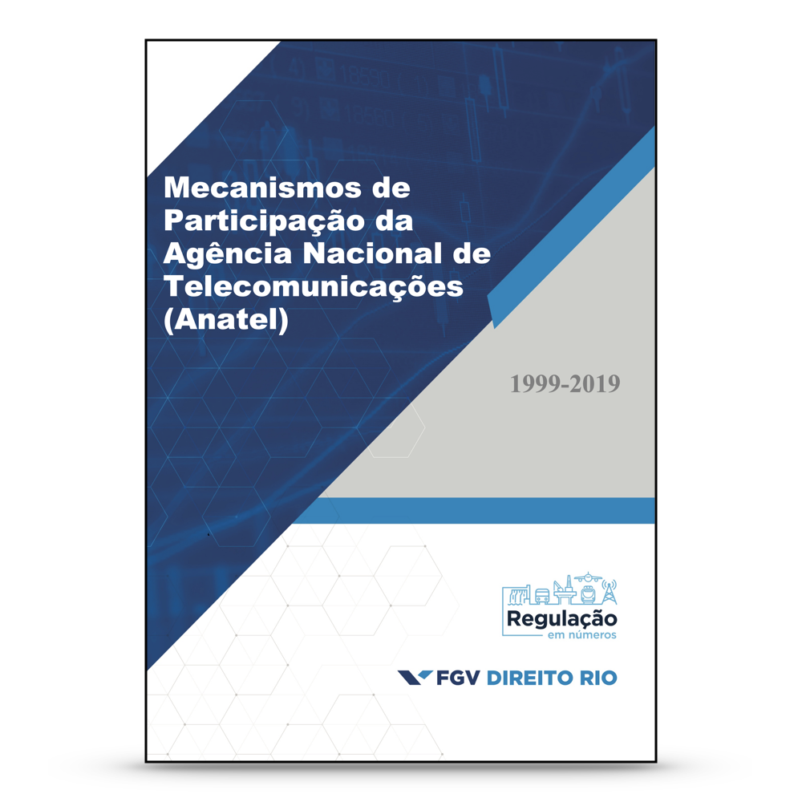

**AGENCY REPORTS**:
- Cover the period from agency creation to 2019 (they were published in 2020).
* One for each of the 11 independent agencies (plus the Brazil's Central Bank and CVM)
* Descriptive statistics of all the variables previously mentioned, with extensive analysis of the agency's  practices.

---

## Publications / academic research

**JOURNAL ARTICLES**:
- Many journal publications on diverse topics about participation.
* At first, cross-agency analysis and simple hypothesis testing.
  - Who participates? Who gets heard? Strategic behavior?
* Now, more efforts are being directed at qualitative analysis of comments and agency response.

---

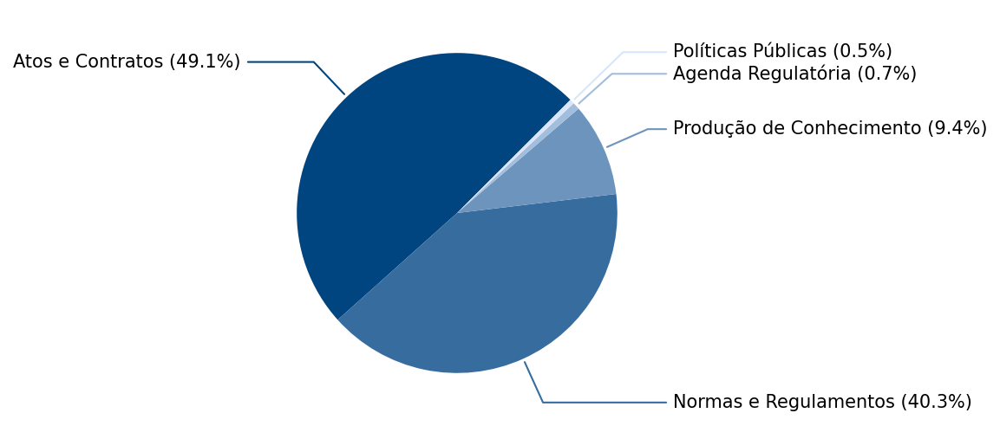

---

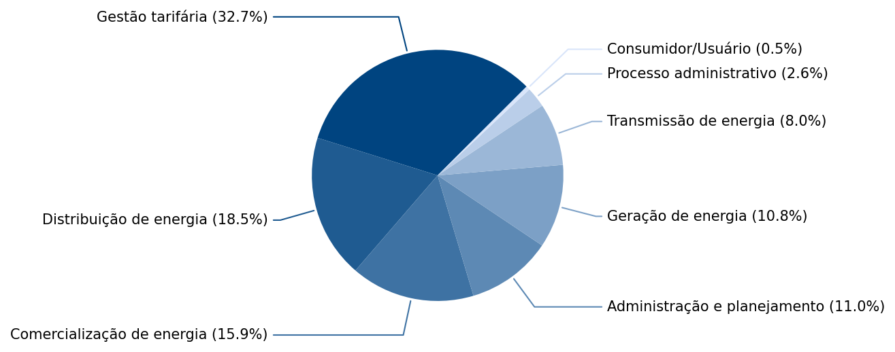

---

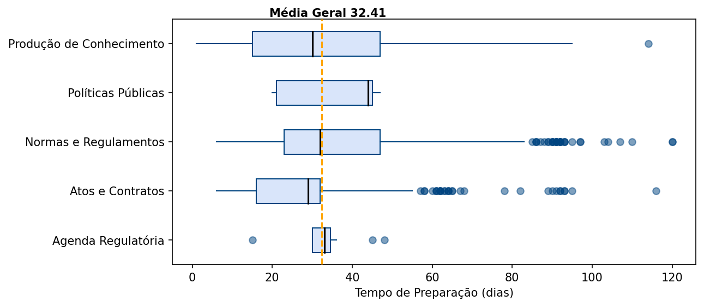

---

---

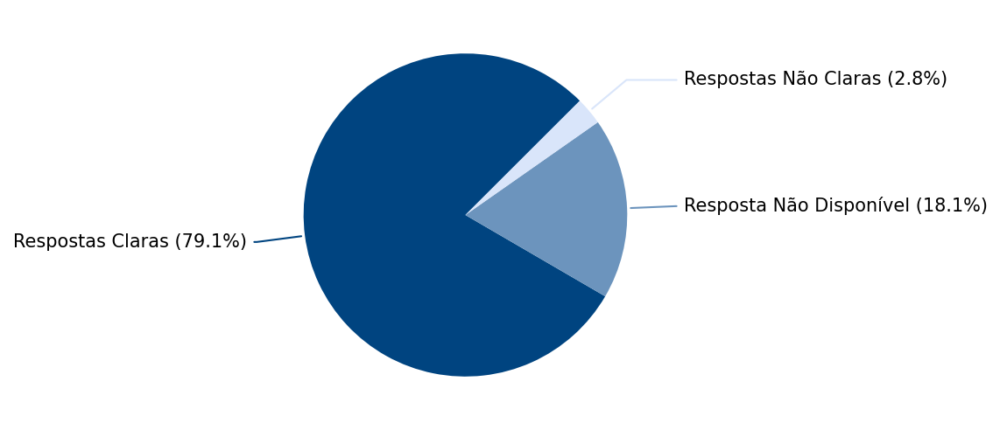

---

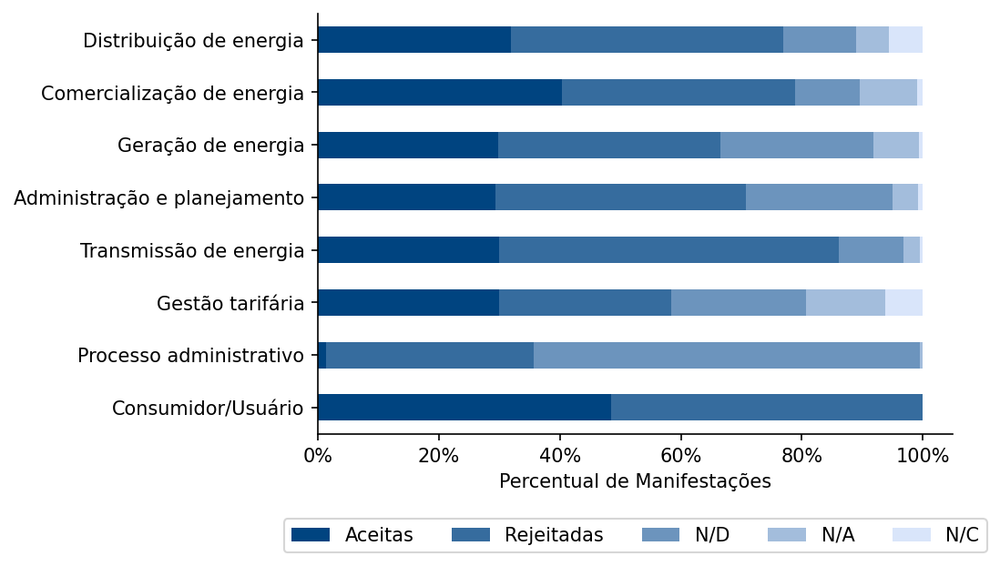

---

---

---

---

---

## How predictable is the agency identification of 'out-of-scope' cases?

* **Scope classification**  
  - Best results (final validation stage, N=150): **SVM** and **KNN**
    - SVM: Accuracy ≈ **89.3%**, F1 ≈ **0.89333**
    - KNN: Accuracy ≈ **88.7%**, F1 ≈ **0.88654**  
  - Comments judged “out of scope” can be predicted with high reliability

---

## How predictable are agency's acceptance/rejection responses?

* **Impact classification**  
  - Best results (final validation stage, N=815): **SVM** and **KNN**
    - SVM: Accuracy ≈ **83.4%**, F1 ≈ **0.83435**
    - KNN: Accuracy ≈ **81.9%**, F1 ≈ **0.81867** 
  - Agency acceptance/rejection is also highly predictable from comment text

---

<!-- 
_header: ""
_footer: ""
-->

# 3. Regulatory Impact Analysis

---

## Legal framework
- **Independent Regulatory Agencies**
  - **2008-2021**. Pro-Reg program starts and some agencies voluntarily use RIAs for some rules. The Health Surveillance Agency (Anvisa) was the only agency using RIAs consistently.
* **Other Executive Bodies (Direct Administration)**: Until 2021, the Direct Administration had produced almost no RIAs.
* **Common obligation (2021-today)**: Both the General Law of the Agencies (2019) and the Economic Freedom Act (2019) create a formal obligations to use RIA that extend both to Independent Agencies and to the Direct Administration. Decree no. 10.411 stablishes specific procedures, exemption cases, etc.

---

 

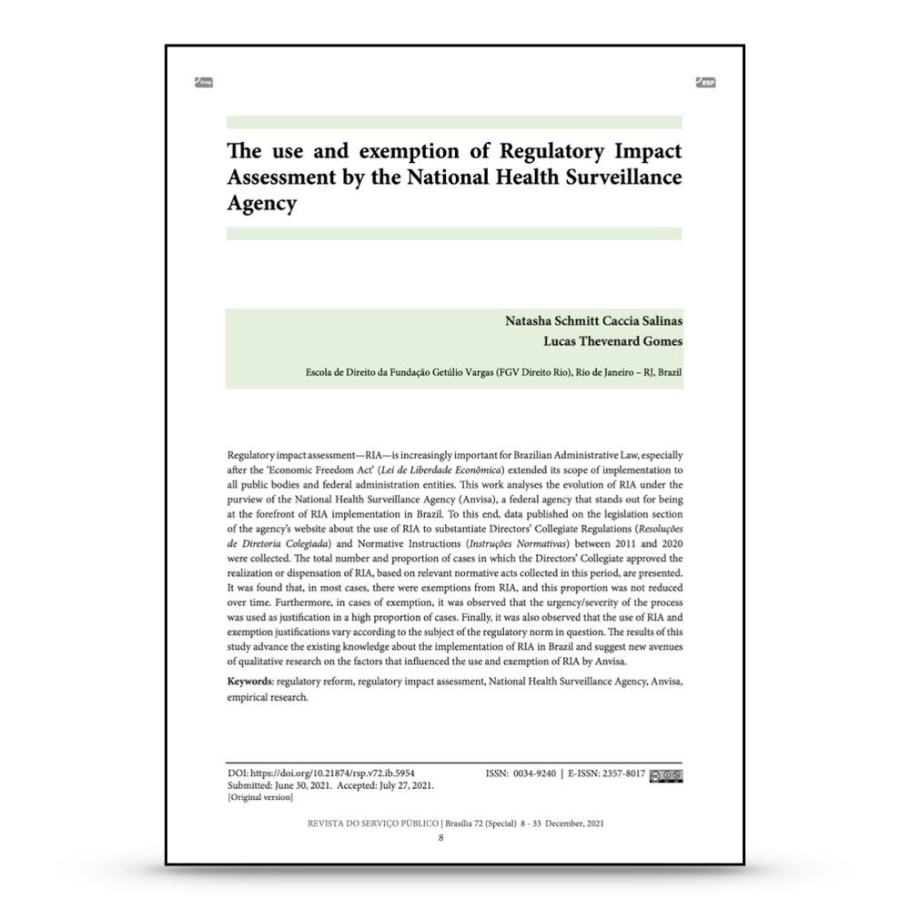

**Article: The use and exemption of Regulatory Impact Asssessment by the National Health Surveillance Agency.**
- Anvisa is a pioneer in implementing Regulatory Impact Assessment (RIA) in Brazil, but most normative acts between 2011–2020 were exempted from RIA (56.7%)
* Exemptions were overwhelmingly justified by urgency/severity, accounting for more than 80% of cases.
* Use and exemption of RIA vary significantly across regulatory themes (e.g., drugs, food, agrochemicals). Findings raise questions about whether exemptions are consistent with RIA’s rationality and legitimacy goals.

---

 

**Article: Open Exceptions: Why Does the Brazilian Health Regulatory Agency (ANVISA) Exempts RIA and *Ex Post* Reviews?**
- After the 2019 RIA mandate, Anvisa used exemptions **more often** than before, not less. Exemptions became the *predominant response* to the new requirement.
* The agency diversified justifications, drawing on multiple legal grounds beyond urgency (althought urgency remained a very common justification).
* The findings suggest a strategic adaptation of bureaucratic behavior that may undermine the effectiveness of mandatory RIAs.

---

<!-- 
_header: ""
_footer: ""
-->

---

 

**Report: Análise dos três anos de Regulamentação da AIR no Brasil.**
- Extensive data collection of all (normative) regulatory acts produced by all independent regulatory agencies during the first 3 years after the obligation to use RIAs came into effect.
* Over 50% of regulatory acts were issued without RIA or an exemption note.
* Exemptions were frequent.
* RIAs often lacked depth: few alternatives, minimal economic analysis, and limited public participation (below 20% in key agencies)

---

<!-- 
_header: ""
_footer: ""
-->

---

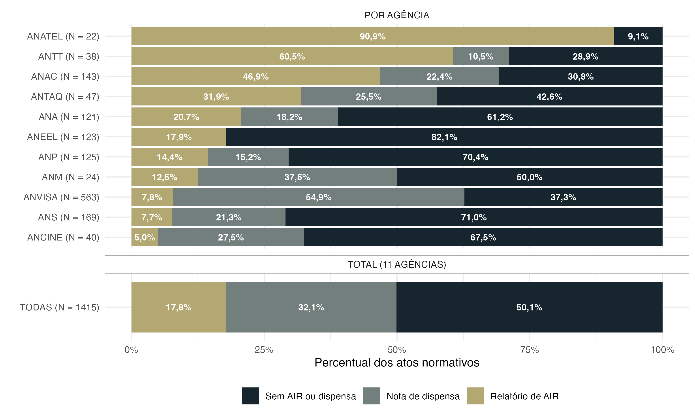

---

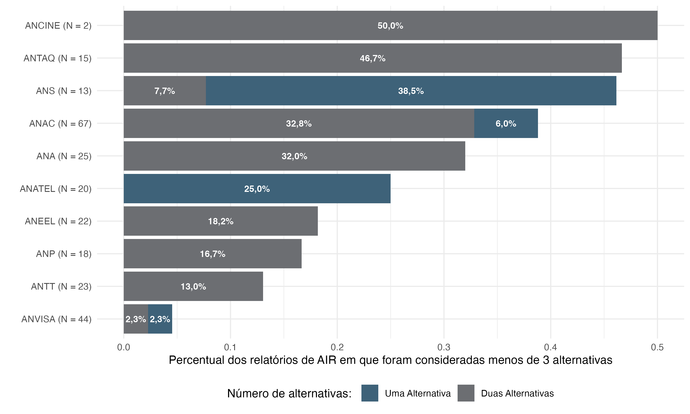

---

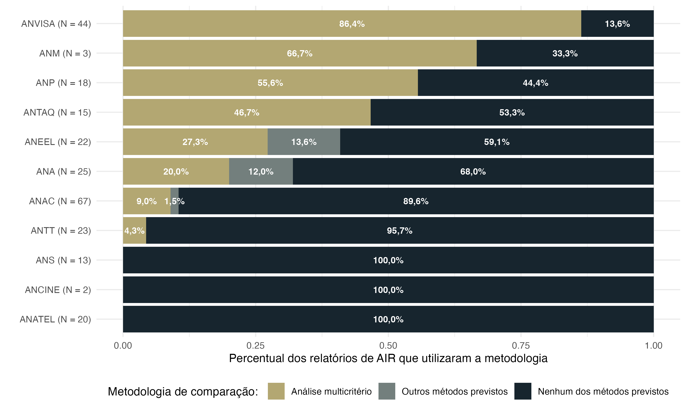

---

## Other research areas

- Budget of the agencies
- Political control of the agencies (by Congress)
- Regulatory Agendas

---

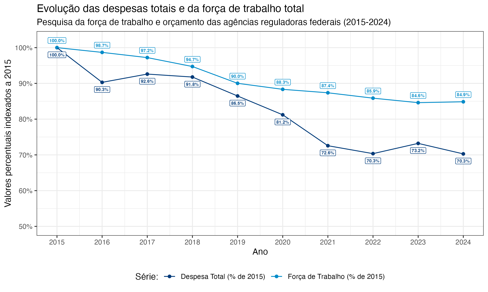

---

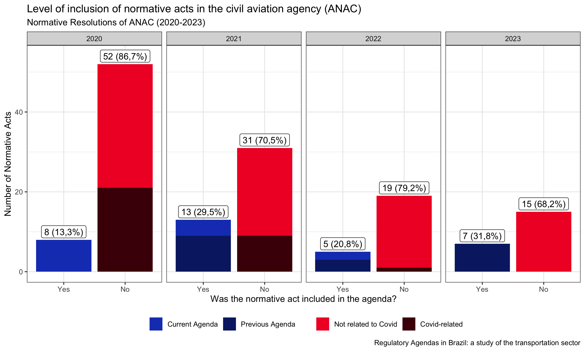

---

### Thank you
