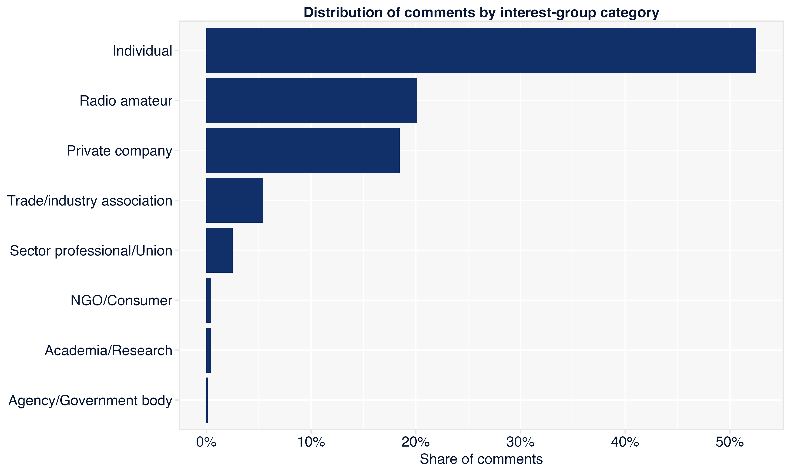
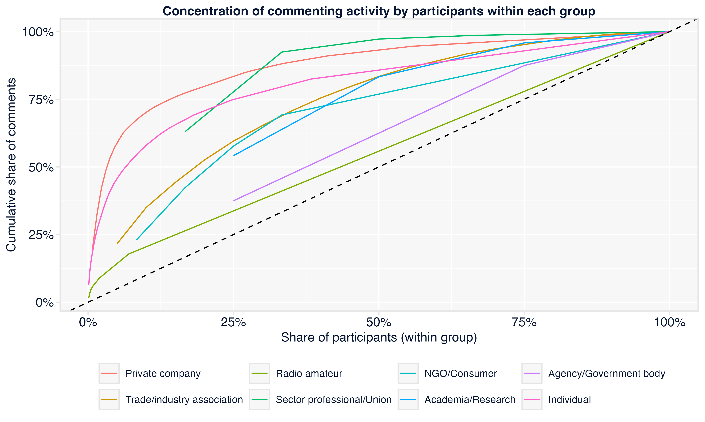
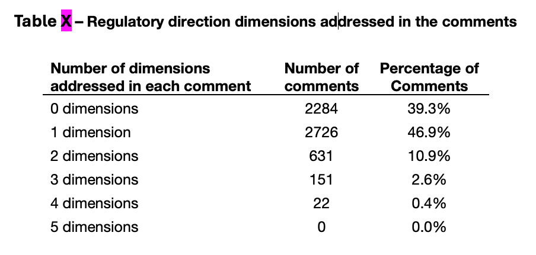
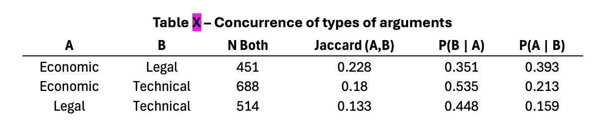
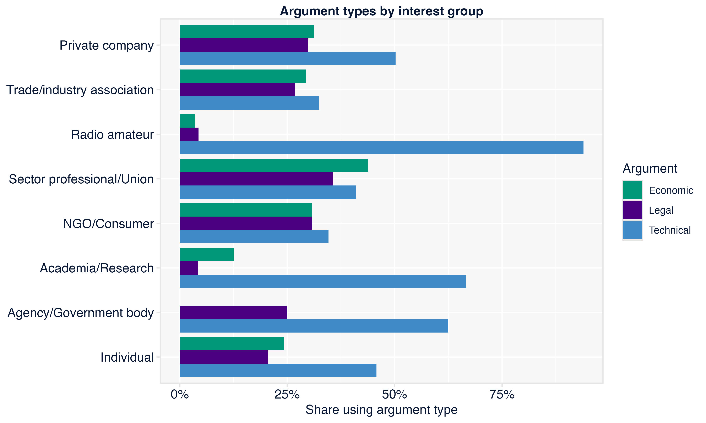
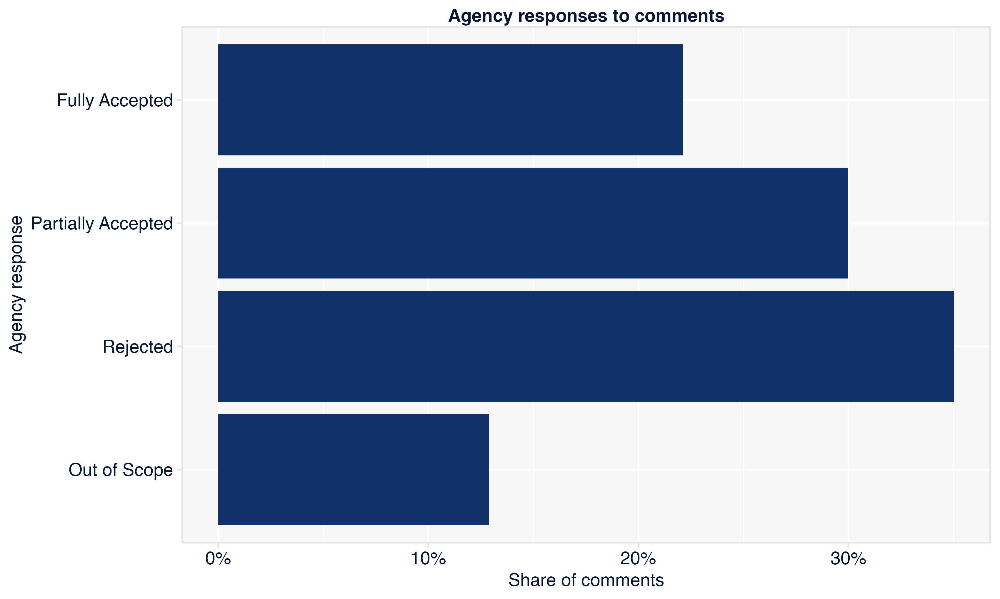
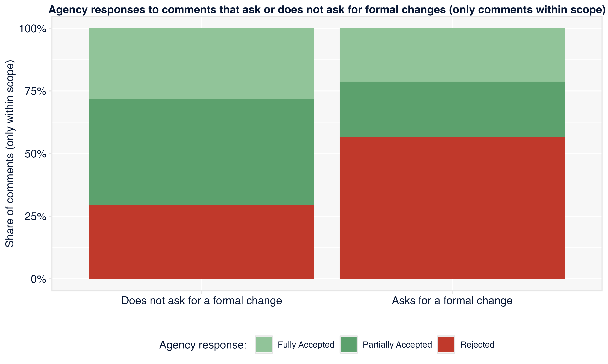
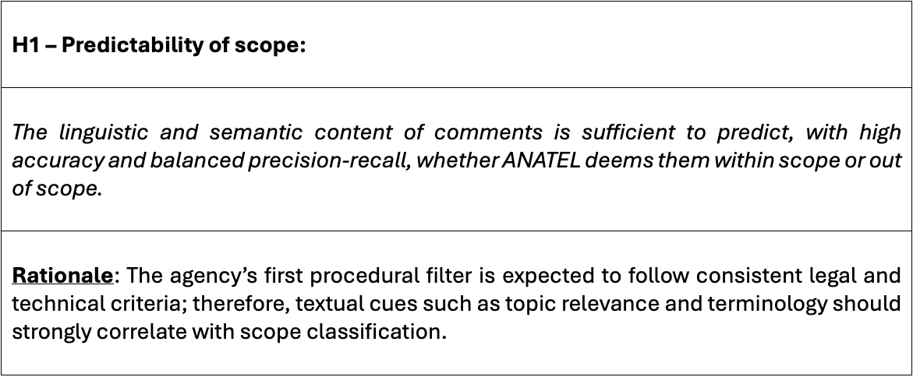
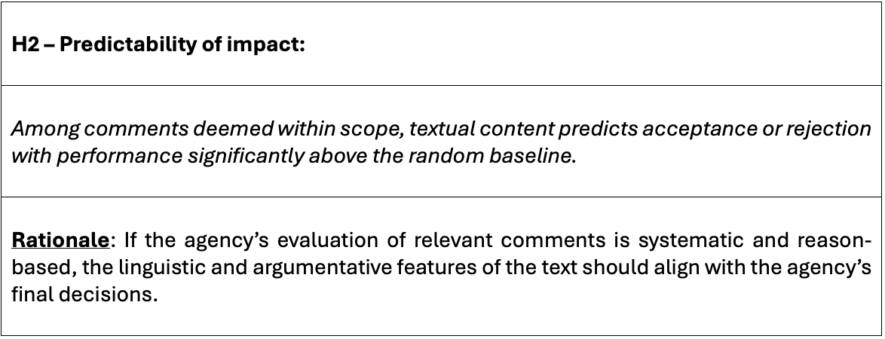

# Ideas, interests and the effectiveness of public participation

## 2025.2
Lucas Thevenard

---

<!-- 
_header: ""
_footer: ""
-->

# Chapter 1: Introduction

---

<!-- 
paginate: true 
header: Dissertation: Ideas, interests and the effectiveness of public participation
footer: lucas.gomes@fgv.br | September 30, 2025
-->

## Chapter 1: Introduction

* Does commenter identity matter in notice and comment procedures?
  - Balla (2022): bureaucrats say it doesn't
  - Legal framework: participation as information exchange (a dialogue)
* Interest group theory: theoretical focus on who participates
  - Participation as representation
  - Facing the research challenges of measuring ideas: two ways to use IA
* Implications for regulatory policy
  - Concrete policy implications
  - Access is not enough (Regulations.gov, examples from Anvisa and Aneel) 

---

## Chapter 1: Introduction

**Outline:**
- Chapter 2: Theoretical Framework
- Chapter 3: ANATEL's public consultations: methodology and descriptive statistics
- Chapter 4: Who says it, or what is said?
- Chapter 5: Uncovering interest group dynamics
- Chapter 6: Issue networks and the circulation of ideas
- Chapter 7: Conclusion

---
<!-- 
_header: ""
_footer: ""
-->

# Chapter 2: Theoretical Framework

---

## Chapter 2: Theoretical Framework

- 🚧🚧 UNDER CONSTRUCTION 🚧🚧
- "Knowledge" vs. "Interests"
- More importantly: applied research

---

<!-- 
_header: ""
_footer: ""
-->

# Chapter 3: Methodology and descriptive statistics

---

## Chapter 3: Methodology and descriptive statistics

- **Methodology**
  - Data collection
  - Text preprocessing and representation (TF-IDF, BERT, GPT-3 embeddings)
  - LLM-assisted dataset enrichment
    - Interest group classification
    - Regulatory direction classification
    - Types of arguments
* **Descriptive statistics**: ...

---

<!-- 
_header: ""
_footer: ""
-->

## Composition of participants

---

---

---

<!-- 
_header: ""
_footer: ""
-->

## Regulatory direction of comments

---

---

---

---

---

<!-- 
_header: ""
_footer: ""
-->

## Argument types in comments

---

---

---

---

---

---

<!-- 
_header: ""
_footer: ""
-->

## Agency's responses to comments

---

---

---

---

---

---

<!-- 
_header: ""
_footer: ""
-->

## Chapter 4: Who says it, or what is said?

---

## Chapter 4: Who says it, or what is said?

- **Research design and hypotheses**: what matters most, ideas or group affiliation?
  - **Predictive logic**: measuring the informational regularity of responsiveness
  - **Explanatory logic**: assessing the relative weight of ideas and interests

---

## Chapter 4: Who says it, or what is said?

---

## Chapter 4: Who says it, or what is said?

---

## Chapter 4: Who says it, or what is said?

---

## Chapter 4: Who says it, or what is said?

---

## How predictable is the agency identification of 'out-of-scope' cases?

* **Scope classification**  
  - Best results (final validation stage, N=150): **SVM** and **KNN**
    - SVM: Accuracy ≈ **89.3%**, F1 ≈ **0.89333**
    - KNN: Accuracy ≈ **88.7%**, F1 ≈ **0.88654**  
  - Comments judged “out of scope” can be predicted with high reliability

---

## How predictable are agency's acceptance/rejection responses?

* **Impact classification**  
  - Best results (final validation stage, N=815): **SVM** and **KNN**
    - SVM: Accuracy ≈ **83.4%**, F1 ≈ **0.83435**
    - KNN: Accuracy ≈ **81.9%**, F1 ≈ **0.81867** 
  - Agency acceptance/rejection is also highly predictable from comment text

---

## Explanatory models (logistic regressions)

    - M0 - only identity
    - M1 - identity + embeddings
    - M2 - only embeddings
    - M3 - only content variables
    - M4 - embeddings + content variables
    - M5 - identity + embeddings + content variables
    - M6 - identity + predicted probabilities
    - M7 - only predicted probabilities
    - M8 - predicted probabilities + content variables
    - M9 - identity + predicted probabilities + content variables

---

<!-- 
_header: ""
_footer: ""
-->

# In conclusion

---

## Next steps
- Finish explanatory models for chapter 4 (almost done)
- Next empirical chapters (5 and 6): all the data is there, now is just a matter of doing the analysis and writing the results.
- Chapter 2 and Conclusion: for most of next year, refining the theoretical chapter, revision and improving discussions of the results.

---

### Thank you
