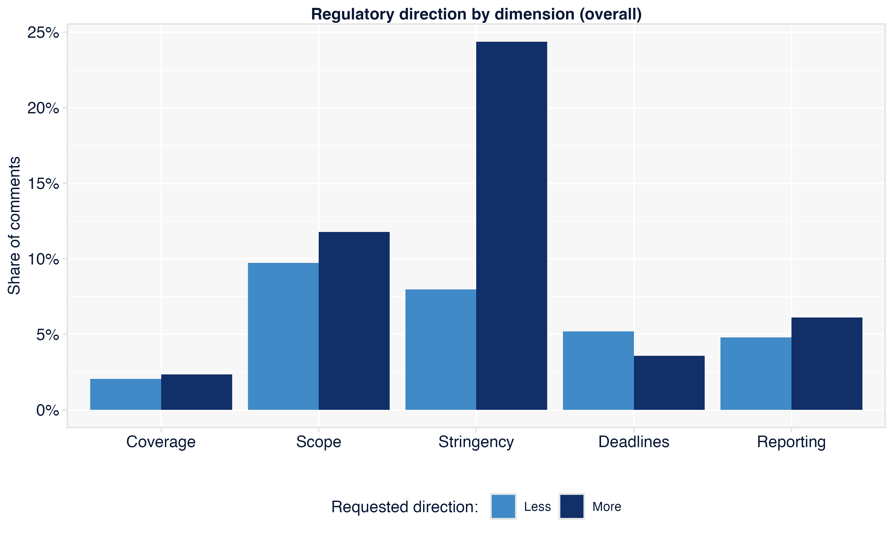
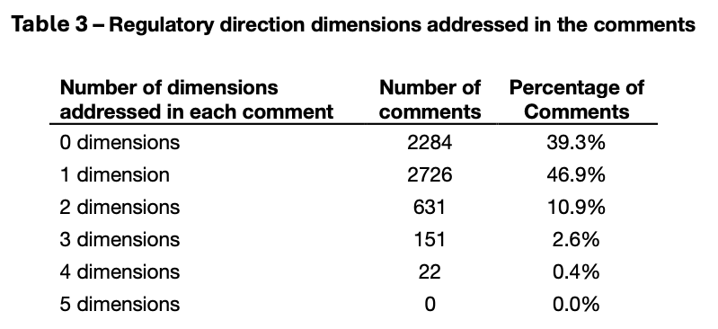
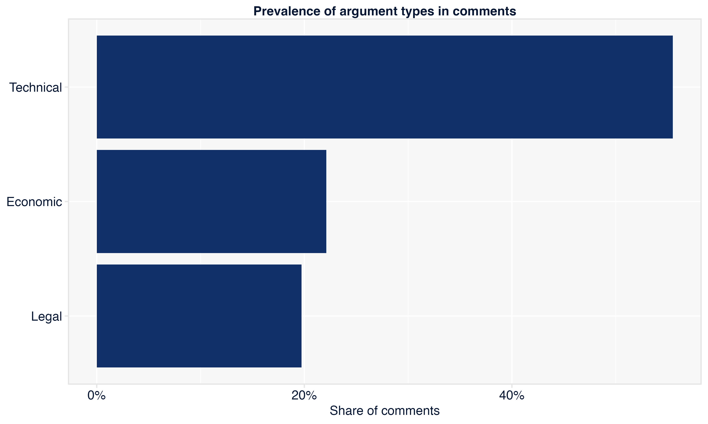
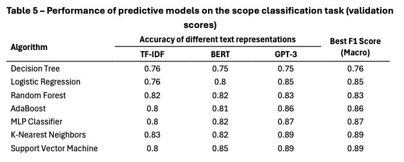
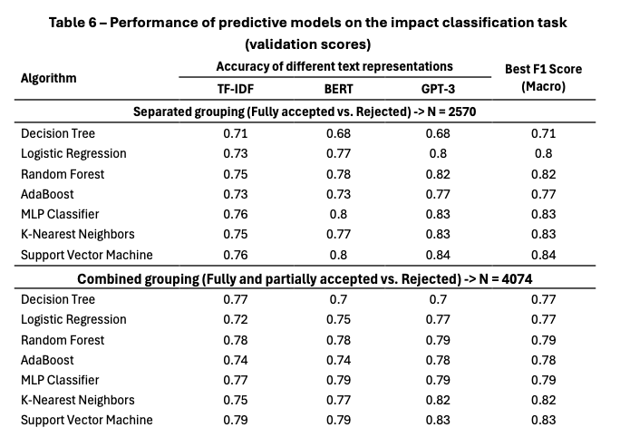
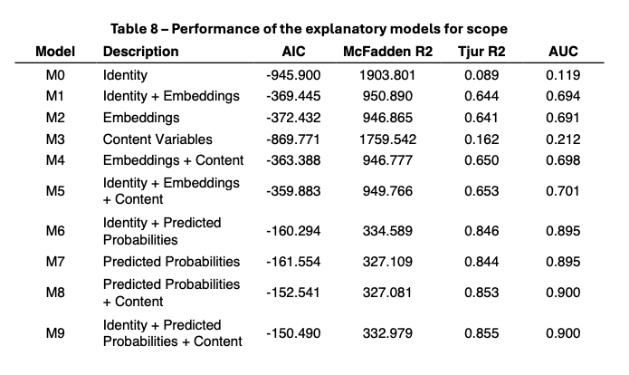

# Ideas, interests and the effectiveness of public participation

## 2025.2
Lucas Thevenard

---

<!-- 
paginate: true 
header: Dissertation: Ideas, interests and the effectiveness of public participation
footer: lucas.gomes@fgv.br | December 15, 2025
-->

## Context and background

* Regulation in numbers research on public participation
  - Large scale research project on notice and comment procedures of the independent agencies
  - Study group discussing similar applied research
  - Questions regarding "capture" or a "bias towards businesses"
* Same subject already explored in my Master's thesis
  - Opportunity to improve the results, strenghten the methodology and further explore the problem

---

## Framing the problem

* Does commenter identity matter in notice and comment procedures?
  * Balla (2022): bureaucrats say it doesn't
  * Legal framework: participation as information exchange (a dialogue)
* Implications for regulatory policy
  - Concrete policy implications
  - Access is not enough (Regulations.gov, examples from Anvisa and Aneel) 

---

## Outline:

- Chapter 1: Introduction
- Chapter 2: Theoretical Framework
- Chapter 3: ANATEL's public consultations: methodology and descriptive statistics
- Chapter 4: Who says it, or what is said?
- Chapter 5: Uncovering interest group dynamics
- Chapter 6: Issue networks and the circulation of ideas
- Chapter 7: Discussing policy implications and further research

---

## Theoretical Framework (Chapter 2)

* Traditional interest group theory (Iron Triangle)
  - "Participation as representation": theoretical focus on **who** participates and **who** gets heard
    * Ideas and arguments defined by pre-existing interests and preferences
    * **Dialogue and learning play a small role**, for both participants and regulators

---

## Theoretical Framework (Chapter 2)

- Extreme view:'Kabuki Theater' view of notice and comment (Donald Elliot)
  - Notice and comment as just a staged act for the sake of gathering materials for litigation in the future.
  * But if this was true, we would have to see two effects:
    - Identity would be very important, as some participants would be more likely to litigate effectively against the agency.
    - Comments opposing regulation would likely receive more attention from the agency.
  * Applicability to Brazil's legal system might be questioned, but still an interesting argument to explore. 

---

## Theoretical Framework (Chapter 2)

- Issue Network Theory
  * Shared knowledge and values play a central role in the formation of interests
  * Issue Network theory **rejects any ontological primacy between interests and ideas**: they are co-constitutive, as networks form around ideas that shape participants’ interests

---

## Theoretical Framework (Chapter 2)

- Facing the research challenges of measuring ideas
  - Current approaches to understanding the role of ideas in applied research have important limitations and are resource-intensive.
  * **Methodological contribution**: two new ways to "measure" the content of comments in public participation.
    - Statistical representation of text.
    - LLM-assisted coding.

---

## Theoretical Framework (Chapter 2)

- Selection of Anatel (a highly technical regulatory context) to stress the traditional theories and see in which conditions Issue Networks provide a better explanation.

> "No one argues that there are only issue networks or only subgovernments active in policymaking. Rather, the argument is over what is most typical and most descriptive of the policy process. Which should serve as our framework for analyzing how laws and regulations are made?" (Jeffrey Berry, 1989, p. 243-44)

---

## Next steps

- **Chapter 5**: similarity/consistency within interest groups:
  - Formal similarity (language) x substantive similarity (request and arguments)
  - Agreement within consultations and agreement cross-consultations (most salient problemas and interests)
- **Chapter 6**: observing/reconstructing network patterns
  - Patterns of participation? Is there enough heterogeneity?
  - Should this be a part of the previous chapter.
- **Chapter 7**:
  - Implications: for theory, for applied research, for policy

---

### Thank you

---

<!-- 
_header: ""
_footer: ""
-->

# Results: Methodology and descriptive statistics

---

<!-- 
_header: ""
_footer: ""
-->

## Composition of participants

---

---

---

<!-- 
_header: ""
_footer: ""
-->

## Regulatory direction of comments

---

---

---

---

---

<!-- 
_header: ""
_footer: ""
-->

## Argument types in comments

---

---

---

---

---

---

<!-- 
_header: ""
_footer: ""
-->

## Agency's responses to comments

---

---

---

---

---

---

<!-- 
_header: ""
_footer: ""
-->

# Results: Chapter 4

---

<!-- 
_header: ""
_footer: ""
-->

## Predictive modelling

---

---

<!-- 
_footer: ""
-->

---

<!-- 
_header: ""
_footer: ""
-->

## Explanatory modelling

---

---

<!-- 
_footer: ""
-->

---

<!-- 
_footer: ""
-->

