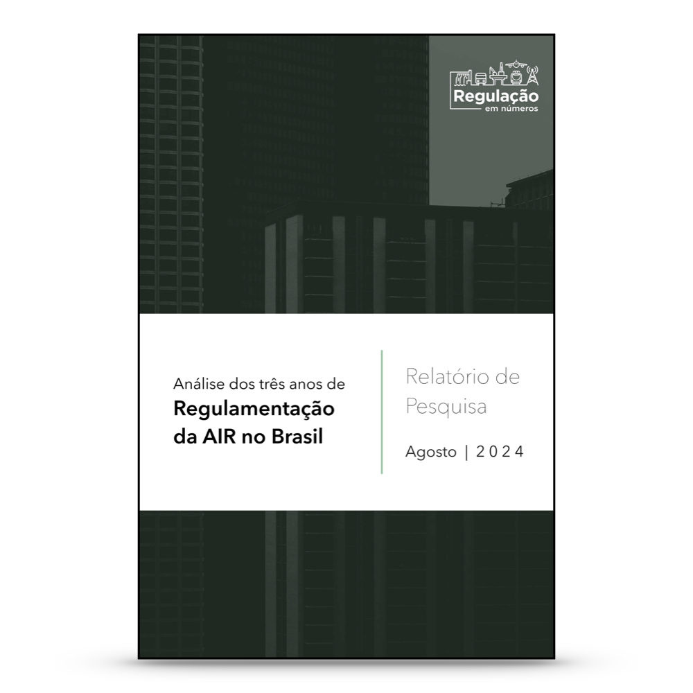

# Academic research summary for GW's Regulatory Studies Center
## From *Regulation in Numbers* projects and personal research – 2025.2
Lucas Thevenard

---
<!-- 
paginate: true 
header: Introduction & research summary
footer: lucas.gomes@fgv.br | September 30, 2025
-->

## Introduction

- **Lucas Thevenard**
  - PhD Candidate in Regulation Law, FGV Rio Law
  - Visiting Scholar, GW Regulatory Studies Center 🎉
  - I'm currently a professor at FGV Rio's Law School (Decision Theory), and a permanent researcher of FGV's *Regulation in Numbers* project
* Research interests:  
  - My main focus is on **regulatory governance**, including topics such as *public participation*, *regulatory impact assessments*, *regulatory agendas*,  *regulatory complexity*

---

## Regulation in Numbers

- Academic initiative based at FGV Rio Law
- Focus: empirical study of regulation in Brazil  
- Main Activities:
  - Outreach: Newsletter, media appearances
  - Regulatory committees
  - Academic research: **regulatory governance**, **control over regulation** 

---

## Topics for today
- A short introduction to the Regulatory State in Brazil
- Discussion of some research efforts in two main areas:
  - Public Participation (including my dissertation)
  - Regulatory impact assessment

---

<!-- 
_header: ""
_footer: ""
-->

# 1. A short introduction to the Regulatory State in Brazil

---

## Historical context
- 1964-1988: Military dictatorship
* 1988-1993: Political and economic turmoil (stagnation and high inflation)
  - 1993-1994: FHC at the Ministry of Finance, Plan "Real" is able to fight off inflation.
* 1994-2004: Reforms and macroeconomic stability
  - Privatization of a large number of state companies
  - Creation of the **independent regulatory agencies** at the federal level.

---

## Traditional view in Administrative Law (French influence)
* All bodies within the Executive answered directly to the President.
* **Principle of legality**: the Executive Branch could not "innovate" in the legal order.
  - In practice this had been pure fantasy for decades, but because of the strong Executive during the dictatorship period, legal thinkers in Brazil were very reticent to recognize that the Executive could create new Law.

---

## Brazilian Independent Regulatory Agencies
* Why?
  - Perceived need for **high-quality, technical** state supervision over infrastructural sectors that would be **insulated from political control**.
* **Independent agency model** in Brazil:
  - Colegiate body of directors, with fixed mandates, who cannot be unilaterally fired by the president.
  - Formal power to create rules, to enforce them and to adjudicate disputes.
  - Introduction of procedural controls (public participation, RIA, etc.)

---

## Brazil vs. US
- Independent agencies are more similar to Regulatory Commissions in the US system.
- But they had to deal with more **procedural controls** than other bodies within the Executive, so they have been the primary focus of discussions about governance.
  - In the past, mandatory procedural controls (such as Public Participation and RIA) have been aimed first at the Independent Regulatory Agencies 
  - However, recently these procedures have (legally) reached the Executive as a whole, althought there have been many challenges in the actual implementation of them.

---

<!-- 
_header: ""
_footer: ""
-->

# 2. Public Participation

---

## Legal framework
- **Independent Regulatory Agencies**
  - **1990s-2020**. The Laws that stablished the agencies required public consultations (mandatory for most agencies), but provided no clear model.
  - **2020-today**: The General Law of the Agencies (2019) created many rules on how public participation should be conducted by the independent agencies.
* **Other Executive Bodies (Direct Administration)**
  - **until 2022**: there was no obligation to open rules for notice and comment or conduct public hearings, although public participation was used for some rules.
  - **2022-today**: Decree no. 11.243 (2022) and Decree no. 12.002 (2024) required notice and comment for the aproval of new rules.

---

## Regulation in Numbers research on public participation

- The largest research effort we have conducted so far.
  * Comprehensive meta-data on every public consultation (similar to notice and comment) and public hearing procedure conducted by the 11 independent regulatory agencies since their creation. (+5k)
  * Comprehensive data collection about participants and their contributions, including agency responses.
    - For 2 agencies that had very large datasets of comments, we used sampling to analyze comment data, but for the other 9 agencies, all comments have been collected and classified during a 8-year long research effort. (~45k)

---

## Some important variables in the dataset

- Procedures (meta):
    - *When and how participation occurs?* → how it has evolved over time, purposes of participation, type of participation, stage of the reg process.
    - *How long does it take?* → time available for participation, time until the agency responds, time until the agency publishes its final project.
    - *How transparent is the agency?* → what kinds of information is available on the agency's website and what documents are available, for each procedure.
- Comments:
    - *Who participates and who gets heard?* → interest groups and sub-interest groups involved, representative entities, public x private, impact category.

---

## Publications / academic research

**AGENCY REPORTS**:
- Cover the period from agency creation to 2019 (they were published in 2020).
* One for each of the 11 independent agencies (plus the Brazil's Central Bank and CVM)
* Descriptive statistics of all the variables previously mentioned, with extensive analysis of the agency's  practices.

---

## Publications / academic research

**JOURNAL ARTICLES**:
- Many journal publications on diverse topics about participation.
* At first, cross-agency analysis and simple hypothesis testing.
  - Who participates? Who gets heard? Strategic behavior?
* Now, more efforts are being directed at qualitative analysis of comments and agency response.

---

<!-- 
_header: ""
_footer: ""
-->

# 2.1. My Dissertation
## *The role of ideas and language in public participation*

---

### One main overarching question

 

#### What is the role of **ideas** (what is actually said by participants) in notice and comment procedures?

---

## Three complementary questions

- What is the role of ideas to determine who gets heard (**influence**) in notice and comment procedures?  
  - *Who says it or what is said? Language and the influence of ideas in...*
* How ideas and goals affect the **formation of interest groups** and their discursive alignment? Are the demands of interest groups always coherent? 
  - *Investigating Coherence: Discursive Similarities and Differences within...*
* Do participants form **networks and coalitions** that transcend formal group identities? If so, what is the relationship between discursive allignment and the patterns of co-participation that form these networks?
  - *Recurring Actors, Shared Ideas: Uncovering Network Dynamics in Public...*

---

## Theoretical framework: testing two main interest group theories

- **Iron Triangle** (dominant view):
  - Stable, closed (agency–Congress–industry), interest-driven
  - Predictable alignments  

* **Issue Networks** (Heclo, 1978):  
  - Fluid, open, idea-driven  
  - Cross-cutting coalitions and shifting alliances

---

## Connecting to my research questions

- **Influence**: Are ideas more important than group identity?  
* **Coherence**: Do groups really have consistent policy preferences and speak with “one voice”?  
* **Networks**: Do actors connect across formal categories, building coalitions around ideas?

---

## Initial expectation

- I expect strong evidence that ideas matter and at least some evidence that issue networks provide relavant insight in certain policy areas.
- **General hypothesis**: ideas—the substantive content of public comments—play a pivotal role in participatory processes, shaping not only regulatory outcomes, but also the formation of interest groups and the broader structure of participation itself

> "No one argues that there are only issue networks or only subgovernments active in policymaking. Rather, the argument is over what is most typical and most descriptive of the policy process. Which should serve as our framework for analyzing how laws and regulations are made?" (Jeffrey Berry, 1989, p. 243-44)

---

## Some notes about the first study:

***Who says it or what is said? Language and the influence of ideas in the regulatory decision-making process of the Brazilian Telecommunications Agency***

- How important are interest groups (who says it) to explain influence over regulatory decisions once we take into account the actual content of submissions (what is said)?
- **Expectation**: interest group affiliation looses almost all its explanatory power once we take comment content (language and ideas expressed in the comments) into account.

---

## Some notes about the first study:

> If the agency receives 10,000 very similar, computer-generated comments, no one is paying attention to the names under which they are submitted, whether they are false or real. One cannot be misled by something of which one is unaware. If the submission is not computer-generated—a unique comment filed under a false name — the falsehood is irrelevant for purposes of the agency’s deliberation. The agency
will take the comment for what it is worth; the name adds nothing to its weight and will not affect how it is treated.
> Balla et al., 2022, p. 137-138.

---

## Predicting Agency Responses with NLP

* **Task 1 – Scope classification**: Distinguish if a comment is *within scope* or *out of scope*, in a balanced dataset (749 within scope × 749 out of scope)
* **Task 2 – Impact classification**: Distinguish if a comment is *accepted* (fully/partially) or *rejected*, in a balanced dataset (2,037 accepted × 2,037 rejected).
* **Method**  
  - Text represented with **GPT embeddings** (3,076 dimensions per comment)  
  - Tested multiple supervised classifiers (KNN, SVM, Random Forest, MLP, etc.)  
  - Stratified train/test split + grid search for hyperparameters  
  - Evaluated with Accuracy, F1, ROC-AUC, Precision/Recall
  - Final validation step with held-out data.

---

## How predictable is the agency identification of 'out-of-scope' cases?

* **Scope classification**  
  - Best results (final validation stage, N=150): **SVM** and **KNN**
    - SVM: Accuracy ≈ **89.3%**, F1 ≈ **0.89333**
    - KNN: Accuracy ≈ **88.7%**, F1 ≈ **0.88654**  
  - Comments judged “out of scope” can be predicted with high reliability

---

## How predictable are agency's acceptance/rejection responses?

* **Impact classification**  
  - Best results (final validation stage, N=815): **SVM** and **KNN**
    - SVM: Accuracy ≈ **83.4%**, F1 ≈ **0.83435**
    - KNN: Accuracy ≈ **81.9%**, F1 ≈ **0.81867** 
  - Agency acceptance/rejection is also highly predictable from comment text

---

## Key takeaway  

**The content of public comments strongly predicts regulatory outcomes.**

- This suggests that **ideas and discursive alignment** are central in determining whose voices get heard and what influences agency decision-making.
- **Next step in this paper**: Explanatory (regression) model with content variables (predicted probabilities from the models) vs. interest group categories to test the main hypothesis. 
 - PS: I'm currently going over the comments. 

---

<!-- 
_header: ""
_footer: ""
-->

# 3. Regulatory Impact Analysis

---

## Legal framework
- **Independent Regulatory Agencies**
  - **2008-2021**. Pro-Reg program starts and some agencies voluntarily use RIAs for some rules. The Health Surveillance Agency (Anvisa) was the only agency using RIAs consistently.
* **Other Executive Bodies (Direct Administration)**: Until 2021, the Direct Administration had produced almost no RIAs.
* **Common obligation (2021-today)**: Both the General Law of the Agencies (2019) and the Economic Freedom Act (2019) create a formal obligations to use RIA that extend both to Independent Agencies and to the Direct Administration. Decree no. 10.411 stablishes specific procedures, exemption cases, etc.

---

 

**Article: The use and exemption of Regulatory Impact Asssessment by the National Health Surveillance Agency.**
- Anvisa is a pioneer in implementing Regulatory Impact Assessment (RIA) in Brazil, but most normative acts between 2011–2020 were exempted from RIA (56.7%)
* Exemptions were overwhelmingly justified by urgency/severity, accounting for more than 80% of cases.
* Use and exemption of RIA vary significantly across regulatory themes (e.g., drugs, food, agrochemicals). Findings raise questions about whether exemptions are consistent with RIA’s rationality and legitimacy goals.

---

 

**Article: Open Exceptions: Why Does the Brazilian Health Regulatory Agency (ANVISA) Exempts RIA and *Ex Post* Reviews?**
- After the 2019 RIA mandate, Anvisa used exemptions **more often** than before, not less. Exemptions became the *predominant response* to the new requirement.
* The agency diversified justifications, drawing on multiple legal grounds beyond urgency (althought urgency remained a very common justification).
* The findings suggest a strategic adaptation of bureaucratic behavior that may undermine the effectiveness of mandatory RIAs.

---

<!-- 
_header: ""
_footer: ""
-->

---

 

**Report: Análise dos três anos de Regulamentação da AIR no Brasil.**
- Extensive data collection of all (normative) regulatory acts produced by all independent regulatory agencies during the first 3 years after the obligation to use RIAs came into effect.
* Over 50% of regulatory acts were issued without RIA or an exemption note.
* Exemptions were frequent.
* RIAs often lacked depth: few alternatives, minimal economic analysis, and limited public participation (below 20% in key agencies)

---

<!-- 
_header: ""
_footer: ""
-->

---

### Thank you for your attention!