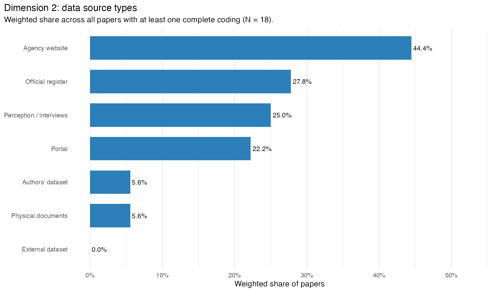
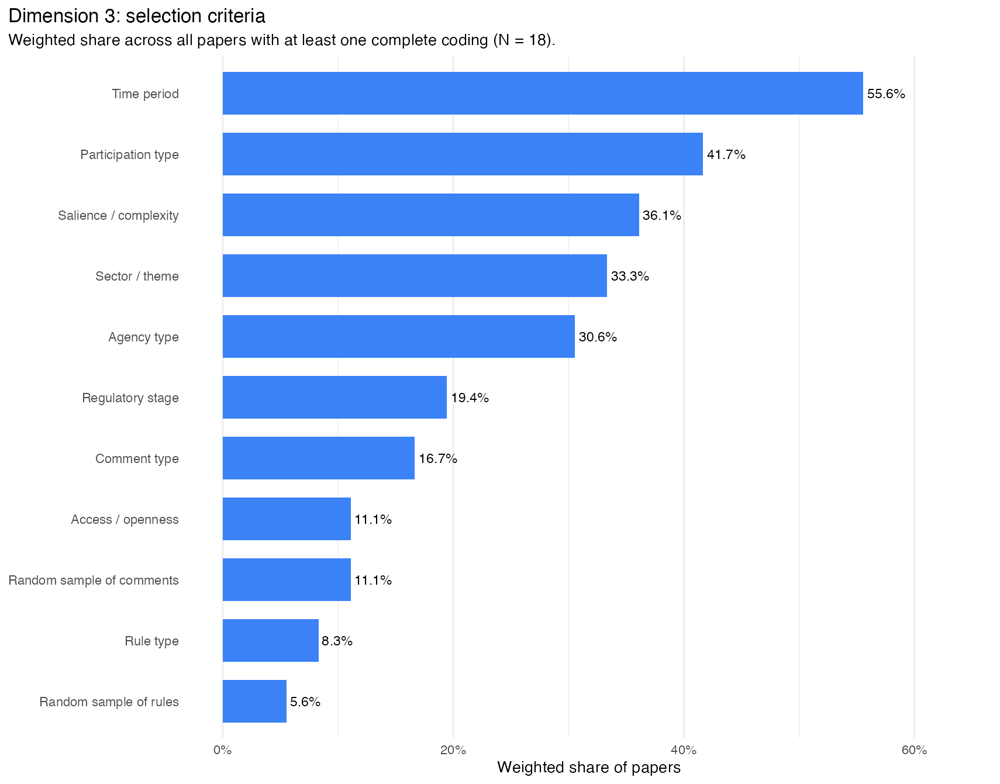
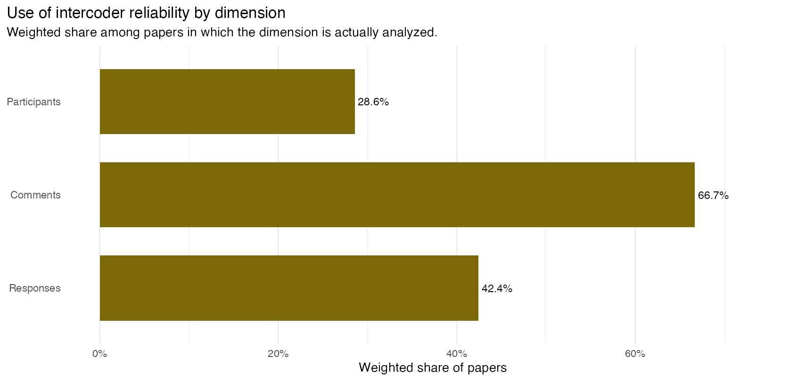
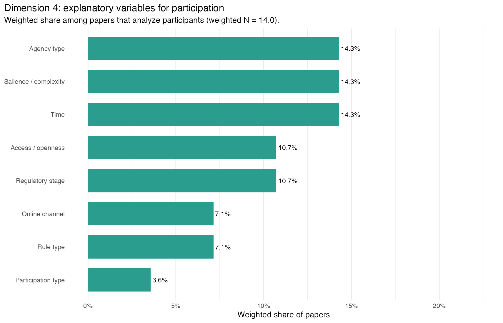
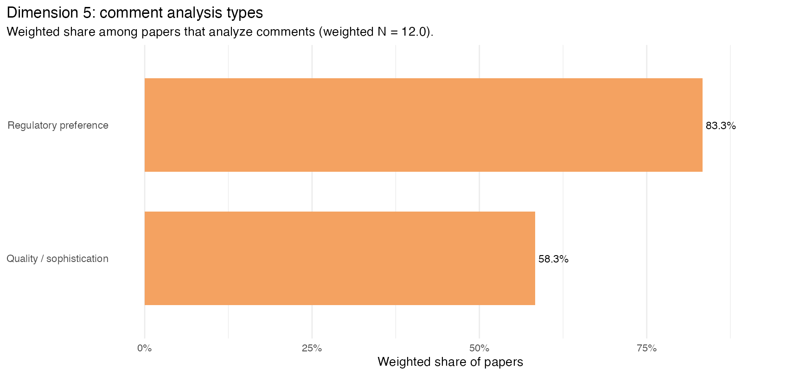
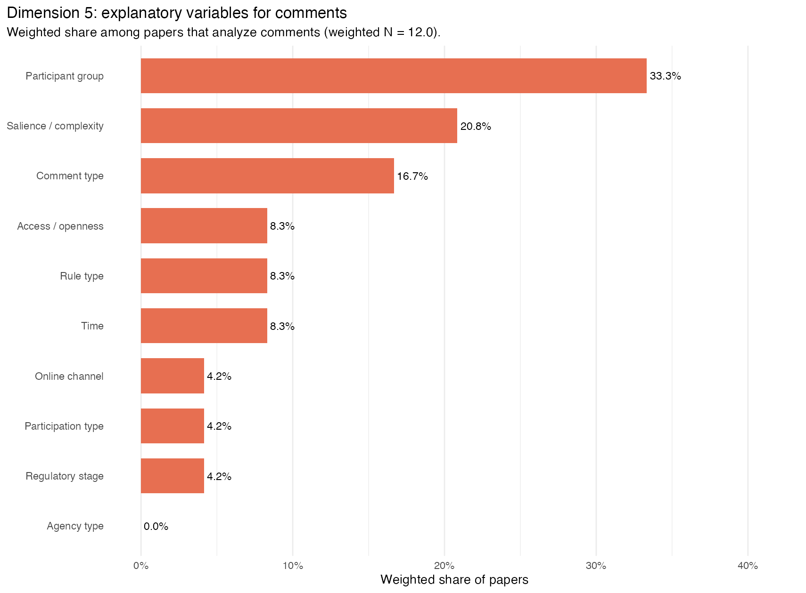
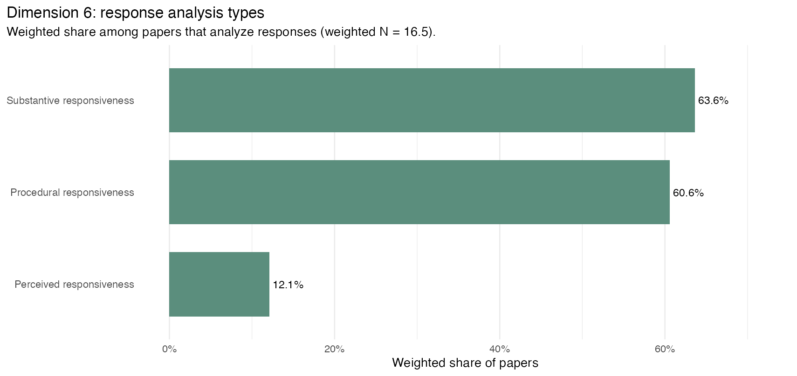
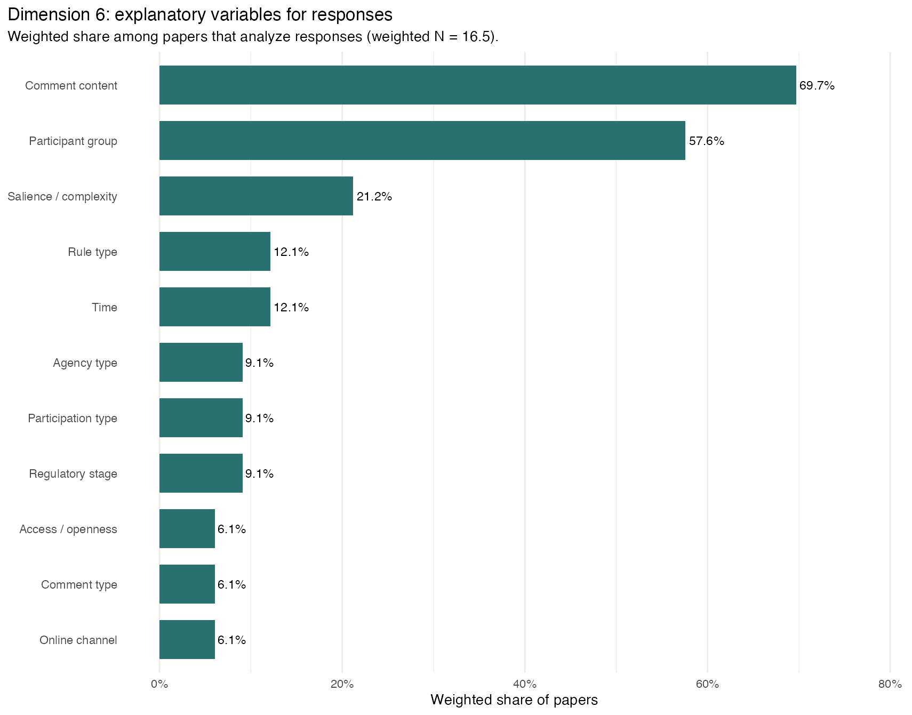

# Responsiveness Meeting – 2026-03-20
**2nd group of papers**
Lucas Thevenard

---
<!-- 
paginate: true 
header: Responsiveness Meeting
footer: lucas.gomes@fgv.br | 20/03/2026
-->

## Group 2 - Discrepancy Review

## Reviewed Pair Summary

 

| Pair | Eligible papers | Raw | Real | Fake |  Conv. desc. fake |
| --- | --- | --- | --- | --- | --- |
| Lucas vs Balla | 12, 16, 17 | 36 | 18 | 18 | 90.8% |
| Lucas vs Natasha | 10, 11 | 34 | 11 | 23 | 91.5% |
| Natasha vs Balla | 13 | 20 | 7 | 13 | 89.2% |

---

---

---

---

---

---

---

---

