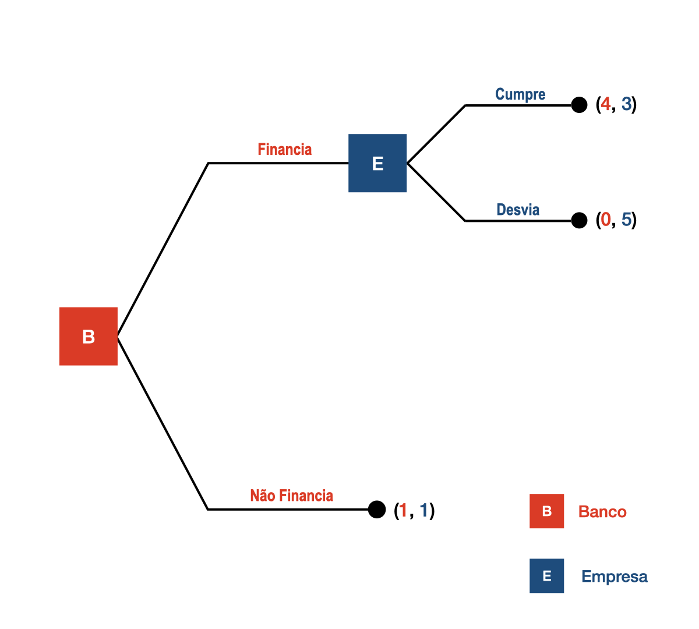
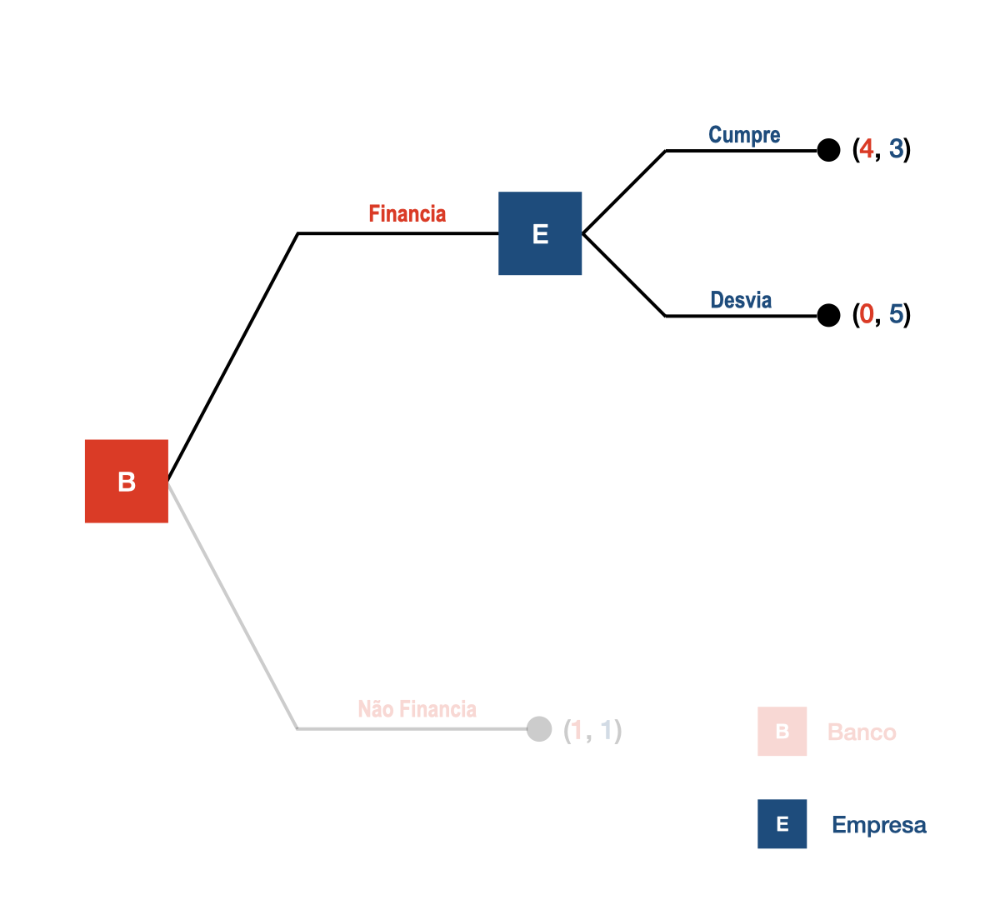
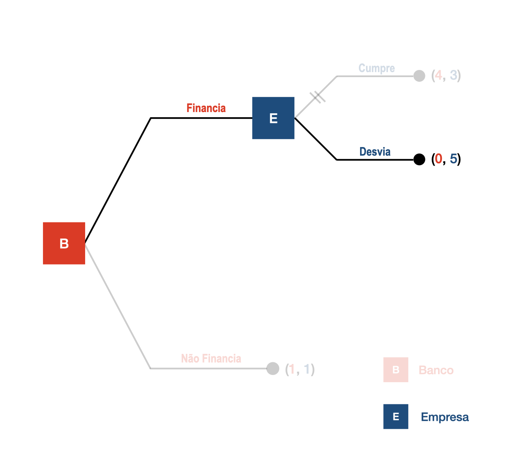
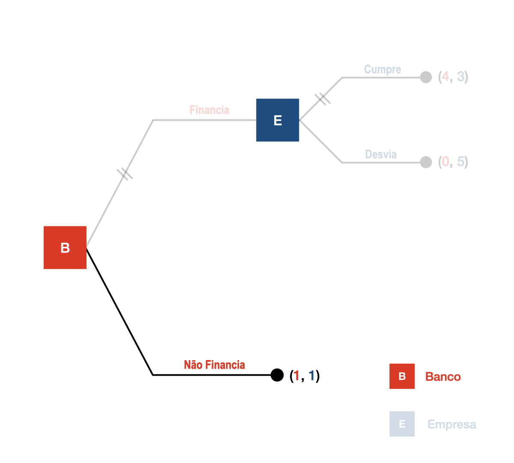
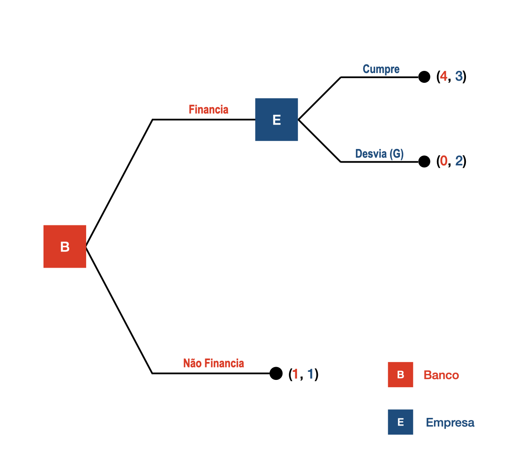
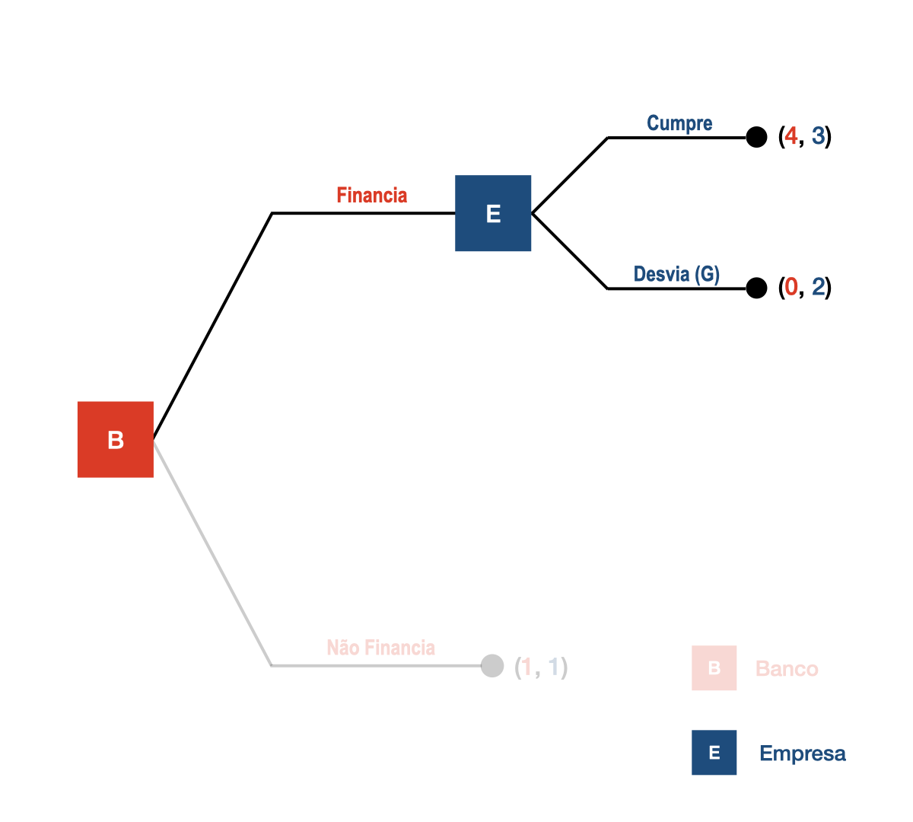
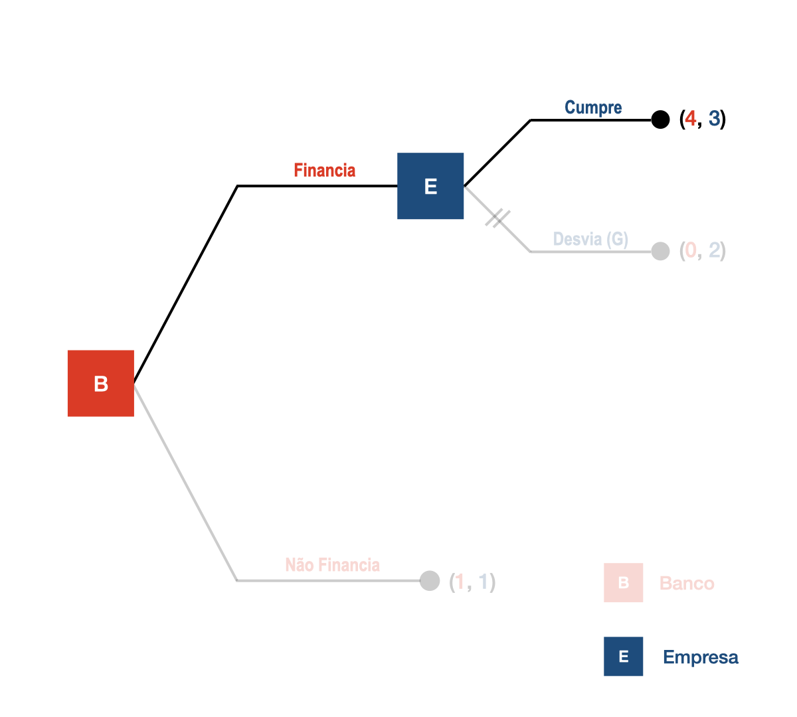
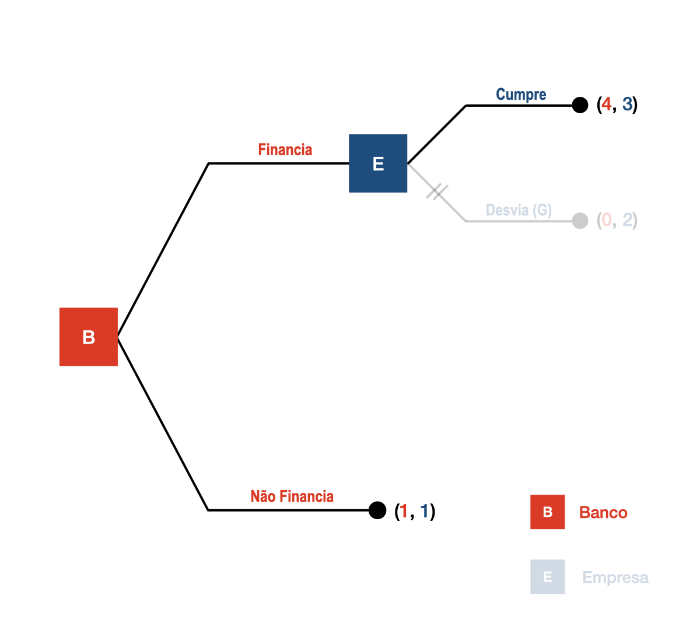
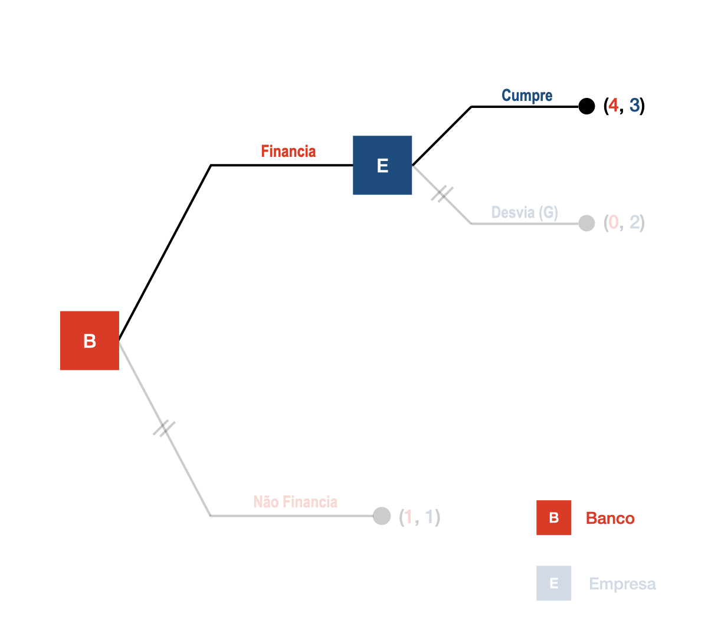

# Correção da Lista 6
**Teoria da Decisão - 2026.1**
Lucas Thevenard

---
<!--
paginate: true
header: Correção Lista 6 - Teoria da Decisão
footer: lucas.gomes@fgv.br
-->

# Exercício 1

---

## Exercício 1 - matriz do jogo

<table style="line-height: 120%;">

  <tr class="game action player2"> 
    <td></td>
    <td>Insistir</td>
    <td>Ceder</td>
  </tr>
  <tr>
    <td class="game action player1" style="width: 120px;"> Insistir &nbsp;</td>
    <td class="game">(&nbsp;
      -6, 
      -8
    &nbsp;)</td>
    <td class="game">(&nbsp;
      8, 
      2
    &nbsp;)</td>
  </tr>
  <tr>
    <td class="game action player1" style="width: 120px;"> Ceder &nbsp;</td>
    <td class="game">(&nbsp;
      1, 
      10
    &nbsp;)</td>
    <td class="game">(&nbsp;
      4, 
      5
    &nbsp;)</td>
  </tr>
</table>

 

- O jogo foi montado a partir do enunciado.
- Payoffs no formato **(Norte, Sul)**.
- Não há paralelismo de payoffs: as duas distribuições mistas precisam ser calculadas separadamente.

---

## Exercício 1 - melhores respostas

<table style="line-height: 120%;">

  <tr class="game action player2"> 
    <td></td>
    <td>Insistir</td>
    <td>Ceder</td>
  </tr>
  <tr>
    <td class="game action player1" style="width: 120px;"> Insistir &nbsp;</td>
    <td class="game">(&nbsp;
      -6, 
      -8
    &nbsp;)</td>
    <td class="game">(&nbsp;
      8, 
      2
    &nbsp;)</td>
  </tr>
  <tr>
    <td class="game action player1" style="width: 120px;"> Ceder &nbsp;</td>
    <td class="game">(&nbsp;
      1, 
      10
    &nbsp;)</td>
    <td class="game">(&nbsp;
      4, 
      5
    &nbsp;)</td>
  </tr>
</table>

---

## Exercício 1 - equilíbrio puro e classificação

 

- Equilíbrios de Nash em estratégias puras: **{ (Insistir, Ceder) e (Ceder, Insistir) }**.
- Classificação: **Jogo da Galinha**.
- A agressividade unilateral é o melhor resultado para quem insiste.
- A agressividade bilateral é o pior resultado para ambos.
- Os equilíbrios são assimétricos: um insiste e o outro cede.

---

## Exercício 1 - equilíbrio misto: encontrando $q$

Defina $q$ como a probabilidade de **Sul** escolher **Insistir**.

$$
U_N(Insistir) = (-6)q + 8(1-q) = 8 - 14q
$$

$$
U_N(Ceder) = 1q + 4(1-q) = 4 - 3q
$$

$$
8 - 14q = 4 - 3q \Rightarrow q = \frac{4}{11} = 36{,}36\%
$$

 

Sul deve insistir com probabilidade **36,36%** e ceder com probabilidade **63,64%**.

---

## Exercício 1 - equilíbrio misto: encontrando $p$

Defina $p$ como a probabilidade de **Norte** escolher **Insistir**.

$$
U_S(Insistir) = (-8)p + 10(1-p) = 10 - 18p
$$

$$
U_S(Ceder) = 2p + 5(1-p) = 5 - 3p
$$

$$
10 - 18p = 5 - 3p \Rightarrow p = \frac{1}{3} = 33{,}33\%
$$

 

Norte deve insistir com probabilidade **33,33%** e ceder com probabilidade **66,67%**.

---

## Exercício 1 - solução mista

 

Equilíbrio em estratégias mistas:

$$
\sigma_N = (Insistir: \frac{1}{3},\; Ceder: \frac{2}{3})
$$

$$
\sigma_S = (Insistir: \frac{4}{11},\; Ceder: \frac{7}{11})
$$

 

As probabilidades são diferentes porque os payoffs de Norte e Sul não são paralelos.

---

# Exercício 2

---

## Exercício 2 - árvore do jogo

  
Sem garantia

  
<strong>Banco</strong>

  
Não financiar → <strong>(1, 1)</strong>

  
Financiar → <strong>Empresa</strong>

  
Cumprir → <strong>(4, 3)</strong>

  
Desviar → <strong>(0, 5)</strong>

 

- Banco decide primeiro. Empresa só decide se houver financiamento.
- A análise deve ser feita de trás para frente.

---

---

---

---

---

---

## Exercício 2 - indução retroativa

- No nó da Empresa, se o Banco financiou: **Desviar** gera payoff 5 e **Cumprir** gera payoff 3.
- Logo, a Empresa escolhe **Desviar**.
- Antecipando isso, o Banco compara **Financiar** e obter 0 com **Não financiar** e obter 1.
- Resultado por indução retroativa: **Não financiar**, com payoff **(1, 1)**.

---

## Exercício 2 - garantia contratual

  
Com garantia

  
<strong>Banco</strong>

  
Não financiar → <strong>(1, 1)</strong>

  
Financiar → <strong>Empresa</strong>

  
Cumprir → <strong>(4, 3)</strong>

  
Desviar → <strong>(0, 2)</strong>

---

---

---

---

---

---

## Com a garantia

 

- Com garantia, se o Banco financia, a Empresa compara **Cumprir** e obter 3 com **Desviar** e obter 2.
- A Empresa passa a escolher **Cumprir**.
- Antecipando isso, o Banco compara **Financiar** e obter 4 com **Não financiar** e obter 1.
- Resultado com garantia: **Financiar, Cumprir**, com payoff **(4, 3)**.

---

## Exercício 2 - interpretação

- A garantia muda os incentivos da Empresa no nó posterior.
- Isso torna crível a promessa de cumprir o plano de investimento.
- O Banco, antecipando essa mudança, passa a financiar.
- O mecanismo funciona como uma **estratégia de comprometimento**.
