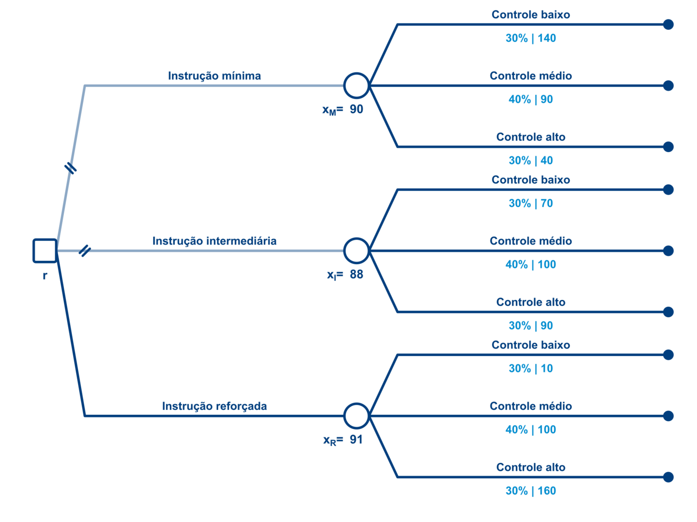

# Correção da P1
**Teoria da Decisão - 2026.1**
Lucas Thevenard

---
<!--
paginate: true
header: Gabarito P1 - Teoria da Decisão
footer: lucas.gomes@fgv.br
-->

# Questão 1
_Decisão sob risco e decisão sob ignorância_

---

## Questão 1 - Dados do problema

| Alternativa/Payoff | Controle baixo | Controle médio | Controle alto |
|:--|:--:|:--:|:--:|
| Instrução mínima | 140 | 90 | 40 |
| Instrução intermediária | 70 | 100 | 90 |
| Instrução reforçada | 10 | 100 | 160 |

 

- Probabilidades usadas nos itens A e B:
  - Controle baixo: **30%**.
  - Controle médio: **40%**.
  - Controle alto: **30%**.

---

## 1.A - Árvore de decisão

<!--
_paginate: false
_header: ''
_footer: ''
-->

---

## 1.A - Cálculo dos nós de estados do mundo

$$
\begin{aligned}
x_M &= 0.3 \cdot 140 + 0.4 \cdot 90 + 0.3 \cdot 40 \\
&= 42 + 36 + 12 = 90
\end{aligned}
$$

$$
\begin{aligned}
x_I &= 0.3 \cdot 70 + 0.4 \cdot 100 + 0.3 \cdot 90 \\
&= 21 + 40 + 27 = 88
\end{aligned}
$$

$$
\begin{aligned}
x_R &= 0.3 \cdot 10 + 0.4 \cdot 100 + 0.3 \cdot 160 \\
&= 3 + 40 + 48 = 91
\end{aligned}
$$

---

## 1.A - Decisão neutra ao risco

$$
\begin{aligned}
r &= \max(x_M, x_I, x_R) \\
&= \max(90, 88, 91) \\
&= 91
\end{aligned}
$$

 

- Um decisor **neutro ao risco** maximiza o valor esperado.
- Escolha ótima: **instrução reforçada**.
- Valor esperado no nó raiz: **91 milhões de reais**.

---

## 1.B - Avesso e propenso ao risco

**Extremamente avesso ao risco**

| Alternativa | Pior caso |
|:--|:--:|
| Mínima | 40 |
| Intermediária | 70 |
| Reforçada | 10 |

 

**Escolha:** instrução **intermediária**.

**Extremamente propenso ao risco**

| Alternativa | Melhor caso |
|:--|:--:|
| Mínima | 140 |
| Intermediária | 100 |
| Reforçada | 160 |

 

**Escolha:** instrução **reforçada**.

---

## 1.C - Decisão sob Ignorância (Forma normal)

 

| Alternativa | Controle baixo | Controle médio | Controle alto |
|:--|:--:|:--:|:--:|
| Instrução mínima | 140 | 90 | 40 |
| Instrução intermediária | 70 | 100 | 90 |
| Instrução reforçada | 10 | 100 | 160 |

 

- Agora não usamos as probabilidades de 30%, 40% e 30%.
- A decisão deve ser tomada apenas com a matriz de payoffs.

---

## 1.C - Maximin

**Piores resultados por alternativa:**

| Alternativa | Pior resultado |
|:--|:--:|
| Instrução mínima | 40 |
| Instrução intermediária | 70 |
| Instrução reforçada | 10 |

 

$$
\max(40, 70, 10) = 70
$$

- Escolha pelo método **Maximin**: **instrução intermediária**.

---

## 1.C - Minimax

**Tabela de arrependimento:**

| Alternativa | Baixo | Médio | Alto | Arrependimento máximo |
|:--|:--:|:--:|:--:|:--:|
| Instrução mínima | 0 | 10 | 120 | 120 |
| Instrução intermediária | 70 | 0 | 70 | 70 |
| Instrução reforçada | 130 | 0 | 0 | 130 |

 

$$
\min(120, 70, 130) = 70
$$

- Escolha pelo método **Minimax**: **instrução intermediária**.

---

## 1.C - Postulado da Razão Insuficiente

$$
\begin{aligned}
M_M &= \frac{140 + 90 + 40}{3} = 90 \\
M_I &= \frac{70 + 100 + 90}{3} = \frac{260}{3} \approx 86{,}67 \\
M_R &= \frac{10 + 100 + 160}{3} = 90
\end{aligned}
$$

 

- Assumindo estados equiprováveis, há **empate**.
- Escolha pelo **Postulado da Razão Insuficiente**:
  **instrução mínima** ou **instrução reforçada**.

---

## 1.D - Regra Otimismo-Pessimismo

Pela Regra de Hurwicz:

$$
V_i(\alpha) = (1-\alpha)\min(i) + \alpha\max(i)
$$

$$
\begin{aligned}
V_M(\alpha) &= 40 + 100\alpha \\
V_I(\alpha) &= 70 + 30\alpha \\
V_R(\alpha) &= 10 + 150\alpha
\end{aligned}
$$

Para a instrução mínima ser escolhida:

$$
\begin{aligned}
40 + 100\alpha &\geq 70 + 30\alpha \\
\alpha &\geq \frac{3}{7}
\end{aligned}
$$

$$
\begin{aligned}
40 + 100\alpha &\geq 10 + 150\alpha \\
\alpha &\leq \frac{3}{5}
\end{aligned}
$$

---

## 1.D - Intervalo de otimismo

$$
\boxed{\frac{3}{7} \leq \alpha \leq \frac{3}{5}}
$$

 

- Em valores decimais: **0,4286 ≤ α ≤ 0,6**.
- No limite inferior, há empate entre **mínima** e **intermediária**.
- No limite superior, há empate entre **mínima** e **reforçada**.

---

# Questão 2
_Jogo Simultâneo_

---

## 2.A - Matriz do jogo (Tribunal = Jogador 1)

<b style="color: #058ED0;">Tribunal de Contas</b>

<b style="color: #003E7E;">Município</b>

<table class="q2-game">
  <tr class="game action player2">
    <td></td>
    <td>Instrução mínima</td>
    <td>Instrução intermediária</td>
    <td>Instrução reforçada</td>
  </tr>
  <tr>
    <td class="game action player1">Monitoramento leve</td>
    <td class="game">(&nbsp;20, 140&nbsp;)</td>
    <td class="game">(&nbsp;60, 70&nbsp;)</td>
    <td class="game">(&nbsp;130, 10&nbsp;)</td>
  </tr>
  <tr>
    <td class="game action player1">Monitoramento moderado</td>
    <td class="game">(&nbsp;80, 90&nbsp;)</td>
    <td class="game">(&nbsp;120, 100&nbsp;)</td>
    <td class="game">(&nbsp;90, 100&nbsp;)</td>
  </tr>
  <tr>
    <td class="game action player1">Monitoramento intensivo</td>
    <td class="game">(&nbsp;140, 40&nbsp;)</td>
    <td class="game">(&nbsp;90, 90&nbsp;)</td>
    <td class="game">(&nbsp;30, 160&nbsp;)</td>
  </tr>
</table>

---

## 2.A - Matriz do jogo (Município = Jogador 1)

<b style="color: #058ED0;">Município</b>

<b style="color: #003E7E;">Tribunal de Contas</b>

<table class="q2-game">
  <tr class="game action player2">
    <td></td>
    <td>Leve</td>
    <td>Moderado</td>
    <td>Intensivo</td>
  </tr>
  <tr>
    <td class="game action player1">Instrução mínima</td>
    <td class="game">(&nbsp;140, 20&nbsp;)</td>
    <td class="game">(&nbsp;90, 80&nbsp;)</td>
    <td class="game">(&nbsp;40, 140&nbsp;)</td>
  </tr>
  <tr>
    <td class="game action player1">Instrução intermediária</td>
    <td class="game">(&nbsp;70, 60&nbsp;)</td>
    <td class="game">(&nbsp;100, 120&nbsp;)</td>
    <td class="game">(&nbsp;90, 90&nbsp;)</td>
  </tr>
  <tr>
    <td class="game action player1">Instrução reforçada</td>
    <td class="game">(&nbsp;10, 130&nbsp;)</td>
    <td class="game">(&nbsp;100, 90&nbsp;)</td>
    <td class="game">(&nbsp;160, 30&nbsp;)</td>
  </tr>
</table>

---

## 2.A - Melhores respostas do Município

<b style="color: #058ED0;">Município</b>

<b style="color: #003E7E;">Tribunal de Contas</b>

<table class="q2-game">
  <tr class="game action player2">
    <td></td>
    <td>Leve</td>
    <td>Moderado</td>
    <td>Intensivo</td>
  </tr>
  <tr>
    <td class="game action player1">Instrução mínima</td>
    <td class="game">(&nbsp;140, 20&nbsp;)</td>
    <td class="game">(&nbsp;90, 80&nbsp;)</td>
    <td class="game">(&nbsp;40, 140&nbsp;)</td>
  </tr>
  <tr>
    <td class="game action player1">Instrução intermediária</td>
    <td class="game">(&nbsp;70, 60&nbsp;)</td>
    <td class="game">(&nbsp;100, 120&nbsp;)</td>
    <td class="game">(&nbsp;90, 90&nbsp;)</td>
  </tr>
  <tr>
    <td class="game action player1">Instrução reforçada</td>
    <td class="game">(&nbsp;10, 130&nbsp;)</td>
    <td class="game">(&nbsp;100, 90&nbsp;)</td>
    <td class="game">(&nbsp;160, 30&nbsp;)</td>
  </tr>
</table>

Se o monitoramento é <b>leve</b>, o Município prefere <b>instrução mínima</b>.

---

## 2.A - Melhores respostas do Município

<b style="color: #058ED0;">Município</b>

<b style="color: #003E7E;">Tribunal de Contas</b>

<table class="q2-game">
  <tr class="game action player2">
    <td></td>
    <td>Leve</td>
    <td>Moderado</td>
    <td>Intensivo</td>
  </tr>
  <tr>
    <td class="game action player1">Instrução mínima</td>
    <td class="game">(&nbsp;140, 20&nbsp;)</td>
    <td class="game">(&nbsp;90, 80&nbsp;)</td>
    <td class="game">(&nbsp;40, 140&nbsp;)</td>
  </tr>
  <tr>
    <td class="game action player1">Instrução intermediária</td>
    <td class="game">(&nbsp;70, 60&nbsp;)</td>
    <td class="game">(&nbsp;100, 120&nbsp;)</td>
    <td class="game">(&nbsp;90, 90&nbsp;)</td>
  </tr>
  <tr>
    <td class="game action player1">Instrução reforçada</td>
    <td class="game">(&nbsp;10, 130&nbsp;)</td>
    <td class="game">(&nbsp;100, 90&nbsp;)</td>
    <td class="game">(&nbsp;160, 30&nbsp;)</td>
  </tr>
</table>

Se o monitoramento é <b>moderado</b>, o Município é indiferente entre <b>intermediária</b> e <b>reforçada</b>.

---

## 2.A - Melhores respostas do Município

<b style="color: #058ED0;">Município</b>

<b style="color: #003E7E;">Tribunal de Contas</b>

<table class="q2-game">
  <tr class="game action player2">
    <td></td>
    <td>Leve</td>
    <td>Moderado</td>
    <td>Intensivo</td>
  </tr>
  <tr>
    <td class="game action player1">Instrução mínima</td>
    <td class="game">(&nbsp;140, 20&nbsp;)</td>
    <td class="game">(&nbsp;90, 80&nbsp;)</td>
    <td class="game">(&nbsp;40, 140&nbsp;)</td>
  </tr>
  <tr>
    <td class="game action player1">Instrução intermediária</td>
    <td class="game">(&nbsp;70, 60&nbsp;)</td>
    <td class="game">(&nbsp;100, 120&nbsp;)</td>
    <td class="game">(&nbsp;90, 90&nbsp;)</td>
  </tr>
  <tr>
    <td class="game action player1">Instrução reforçada</td>
    <td class="game">(&nbsp;10, 130&nbsp;)</td>
    <td class="game">(&nbsp;100, 90&nbsp;)</td>
    <td class="game">(&nbsp;160, 30&nbsp;)</td>
  </tr>
</table>

Se o monitoramento é <b>intensivo</b>, o Município prefere <b>instrução reforçada</b>.

---

## 2.A - Melhores respostas do Município

<b style="color: #058ED0;">Município</b>

<b style="color: #003E7E;">Tribunal de Contas</b>

<table class="q2-game">
  <tr class="game action player2">
    <td></td>
    <td>Leve</td>
    <td>Moderado</td>
    <td>Intensivo</td>
  </tr>
  <tr>
    <td class="game action player1">Instrução mínima</td>
    <td class="game">(&nbsp;140, 20&nbsp;)</td>
    <td class="game">(&nbsp;90, 80&nbsp;)</td>
    <td class="game">(&nbsp;40, 140&nbsp;)</td>
  </tr>
  <tr>
    <td class="game action player1">Instrução intermediária</td>
    <td class="game">(&nbsp;70, 60&nbsp;)</td>
    <td class="game">(&nbsp;100, 120&nbsp;)</td>
    <td class="game">(&nbsp;90, 90&nbsp;)</td>
  </tr>
  <tr>
    <td class="game action player1">Instrução reforçada</td>
    <td class="game">(&nbsp;10, 130&nbsp;)</td>
    <td class="game">(&nbsp;100, 90&nbsp;)</td>
    <td class="game">(&nbsp;160, 30&nbsp;)</td>
  </tr>
</table>

<b>Melhores respostas:</b> Leve: mínima; Moderado: intermediária ou reforçada; Intensivo: reforçada.

---

## 2.A - Melhores respostas do Tribunal

<b style="color: #058ED0;">Município</b>

<b style="color: #003E7E;">Tribunal de Contas</b>

<table class="q2-game">
  <tr class="game action player2">
    <td></td>
    <td>Leve</td>
    <td>Moderado</td>
    <td>Intensivo</td>
  </tr>
  <tr>
    <td class="game action player1">Instrução mínima</td>
    <td class="game">(&nbsp;140, 20&nbsp;)</td>
    <td class="game">(&nbsp;90, 80&nbsp;)</td>
    <td class="game">(&nbsp;40, 140&nbsp;)</td>
  </tr>
  <tr>
    <td class="game action player1">Instrução intermediária</td>
    <td class="game">(&nbsp;70, 60&nbsp;)</td>
    <td class="game">(&nbsp;100, 120&nbsp;)</td>
    <td class="game">(&nbsp;90, 90&nbsp;)</td>
  </tr>
  <tr>
    <td class="game action player1">Instrução reforçada</td>
    <td class="game">(&nbsp;10, 130&nbsp;)</td>
    <td class="game">(&nbsp;100, 90&nbsp;)</td>
    <td class="game">(&nbsp;160, 30&nbsp;)</td>
  </tr>
</table>

Se o Município escolhe <b>instrução mínima</b>, o Tribunal prefere <b>monitoramento intensivo</b>.

---

## 2.A - Melhores respostas do Tribunal

<b style="color: #058ED0;">Município</b>

<b style="color: #003E7E;">Tribunal de Contas</b>

<table class="q2-game">
  <tr class="game action player2">
    <td></td>
    <td>Leve</td>
    <td>Moderado</td>
    <td>Intensivo</td>
  </tr>
  <tr>
    <td class="game action player1">Instrução mínima</td>
    <td class="game">(&nbsp;140, 20&nbsp;)</td>
    <td class="game">(&nbsp;90, 80&nbsp;)</td>
    <td class="game">(&nbsp;40, 140&nbsp;)</td>
  </tr>
  <tr>
    <td class="game action player1">Instrução intermediária</td>
    <td class="game">(&nbsp;70, 60&nbsp;)</td>
    <td class="game">(&nbsp;100, 120&nbsp;)</td>
    <td class="game">(&nbsp;90, 90&nbsp;)</td>
  </tr>
  <tr>
    <td class="game action player1">Instrução reforçada</td>
    <td class="game">(&nbsp;10, 130&nbsp;)</td>
    <td class="game">(&nbsp;100, 90&nbsp;)</td>
    <td class="game">(&nbsp;160, 30&nbsp;)</td>
  </tr>
</table>

Se o Município escolhe <b>instrução intermediária</b>, o Tribunal prefere <b>monitoramento moderado</b>.

---

## 2.A - Melhores respostas do Tribunal

<b style="color: #058ED0;">Município</b>

<b style="color: #003E7E;">Tribunal de Contas</b>

<table class="q2-game">
  <tr class="game action player2">
    <td></td>
    <td>Leve</td>
    <td>Moderado</td>
    <td>Intensivo</td>
  </tr>
  <tr>
    <td class="game action player1">Instrução mínima</td>
    <td class="game">(&nbsp;140, 20&nbsp;)</td>
    <td class="game">(&nbsp;90, 80&nbsp;)</td>
    <td class="game">(&nbsp;40, 140&nbsp;)</td>
  </tr>
  <tr>
    <td class="game action player1">Instrução intermediária</td>
    <td class="game">(&nbsp;70, 60&nbsp;)</td>
    <td class="game">(&nbsp;100, 120&nbsp;)</td>
    <td class="game">(&nbsp;90, 90&nbsp;)</td>
  </tr>
  <tr>
    <td class="game action player1">Instrução reforçada</td>
    <td class="game">(&nbsp;10, 130&nbsp;)</td>
    <td class="game">(&nbsp;100, 90&nbsp;)</td>
    <td class="game">(&nbsp;160, 30&nbsp;)</td>
  </tr>
</table>

Se o Município escolhe <b>instrução reforçada</b>, o Tribunal prefere <b>monitoramento leve</b>.

---

## 2.A - Equilíbrio de Nash

<b style="color: #058ED0;">Município</b>

<b style="color: #003E7E;">Tribunal de Contas</b>

<table class="q2-game">
  <tr class="game action player2">
    <td></td>
    <td>Leve</td>
    <td>Moderado</td>
    <td>Intensivo</td>
  </tr>
  <tr>
    <td class="game action player1">Instrução mínima</td>
    <td class="game">(&nbsp;140, 20&nbsp;)</td>
    <td class="game">(&nbsp;90, 80&nbsp;)</td>
    <td class="game">(&nbsp;40, 140&nbsp;)</td>
  </tr>
  <tr>
    <td class="game action player1">Instrução intermediária</td>
    <td class="game">(&nbsp;70, 60&nbsp;)</td>
    <td class="game" style="box-shadow: inset 0 0 0 3px #003E7E;">(&nbsp;100, 120&nbsp;)</td>
    <td class="game">(&nbsp;90, 90&nbsp;)</td>
  </tr>
  <tr>
    <td class="game action player1">Instrução reforçada</td>
    <td class="game">(&nbsp;10, 130&nbsp;)</td>
    <td class="game">(&nbsp;100, 90&nbsp;)</td>
    <td class="game">(&nbsp;160, 30&nbsp;)</td>
  </tr>
</table>

Única célula em que os dois jogadores estão dando melhor resposta: <b>(instrução intermediária, monitoramento moderado)</b>.

---

## 2.A - Resultado

- Equilíbrio de Nash em estratégias puras:

<b>(instrução intermediária, monitoramento moderado)</b>

 

- Dado monitoramento moderado, o Município não melhora trocando de estratégia:
  **intermediária = reforçada = 100 > mínima = 90**.
- Dada instrução intermediária, o Tribunal não melhora trocando de estratégia:
  **moderado = 120 > intensivo = 90 > leve = 60**.

---

## 2.B - Dominância: Município

| Estratégia do Município | Melhor resposta |
|:--|:--:|
| Instrução mínima | Mon. leve |
| Instrução intermediária | Mon. Moderado |
| Instrução reforçada | Mon. Moderado e Intensivo |

 

- Não há estratégia dominante para o Município, e também não há estratégia estritamente dominada por outra estratégia pura.
- **Há uma estratégia fracamente dominada: a Instrução Intermediária**, pois sempre há outra estratégia pelo menos tão boa ou melhor que ela.
  - Ninguém acertou, aceitei quem disse que não havia estratégias dominadas.

---

## 2.B - Dominância: Tribunal

| Estratégia do Tribunal | Melhor Resposta |
|:--|:--:|
| Monitoramento leve | Inst. Reforçada |
| Monitoramento moderado | Inst. Intermediária |
| Monitoramento intensivo | Inst. Mínima |

 

- Não há estratégia dominante para o Tribunal.
- Também não há estratégia dominada, nem por dominância estrita ou forte, nem por dominância fraca.

---

# Questão 3
_Análise conceitual: verdadeiro ou falso_

---

## 3.A - Argumentos consequencialistas

F **Falsa.**

<b>A)</b> Argumentos consequencialistas se distinguem dos raciocínios jurídicos usuais porque os primeiros se apoiam em consequências factuais, e não em fontes autoritativas do passado; contudo, para que esse tipo de argumento seja coerentemente empregado, é necessário adotar a ética utilitarista ou uma teoria normativamente orientada à avaliação de consequências, como a Análise Econômica do Direito.

 

- A primeira parte está correta: argumentos consequencialistas olham para efeitos práticos da decisão. O erro está em exigir adesão ao utilitarismo ou à AED.
- Como vimos, a avaliação de consequências pode funcionar apenas como <b>ônus argumentativo jurídico</b>, sem necessariamente implicar vinculação a uma teoria moral ou a uma vertente metodológica específica.

---

## 3.B - Reforma da LINDB

F **Falsa.**

<b>B)</b> Para Alexandre Aragão, a reforma da LINDB deve ser concebida como uma ruptura com a visão do Direito como ciência pura e com a concepção declaratória da interpretação, o que tem o condão de ampliar a discricionariedade judicial, sem produzir ônus argumentativos adicionais para os magistrados.

 

- A primeira parte está alinhada à ideia de ruptura com uma visão puramente declaratória.
- Não há erro em afirmar que isso amplia a discricionariedade judicial (esse é um elemento explícito na fala do prof. Aragão).
- <b>O erro está em negar o aumento do ônus argumentativo para os magistrados</b>. Em sua palestra Aragão destacou a preocupação dos juízes com esse ônus, com a necessidade de analisar alternativas de decisão e seus efeitos práticos.

---

## 3.C - Teorema de Arrow

F **Falsa.**

<b>C)</b> O teorema de Arrow aprofunda o problema da integração de preferências em decisões coletivas que já havia sido revelado pelo paradoxo de Condorcet: segundo o teorema, em processos de votação cardinais, não se consegue garantir simultaneamente um conjunto de propriedades desejáveis, como não-ditadura, unversalidade ou domínio restrito, dependência de alternativas irrelevantes, monotonicidade, não-imposição e eficiência de Pareto.

 

- Há mais de um erro na questão. Primeiro, o Teorema de Arrow trata de sistemas ordinais de votação.
- Além disso, a afirmativa também troca os nomes técnicos de condições desejáveis: o correto seria: "<b>sistema não-ditatorial</b>"; "domínio <b>irrestrito</b>"; e "<b>independência</b> de alternativas irrelevantes".

---

## 3.D - L. A. Paul

V **Verdadeira.**

<b>D)</b> A crítica de L. A. Paul aos métodos de decisão racional previsto pela Teoria da Escolha Racional põe em dúvida estabilidade das preferências do agente: segundo ela, quando escolhas envolvem experiências transformadoras o decisor nunca será capaz de justificar suas escolhas racionalmente, ex ante, com base em suas preferências.

 

- Antes da experiência, o agente não acessa plenamente o ponto de vista que terá depois.
- A escolha não pode ser justificada apenas por preferências previamente dadas.
- Isso desafia a estabilidade das preferências na Teoria da Escolha Racional.

---

## Questão 3 - Síntese

| Item | Gabarito | Justificativa curta |
|:--:|:--:|:--|
| A | F | Consequencialismo não exige utilitarismo ou AED. |
| B | F | A LINDB aumenta os ônus de motivação. |
| C | F | Arrow é ordinal e as condições foram mal nomeadas. |
| D | V | Experiências transformadoras desafiam preferências estáveis *ex ante*. |

 

**Resposta:** F, F, F, V.

---

# Questão 4
_Estado de direito e argumentos consequencialistas_

---

## Questão 4 - Ponto de partida

> “É (...) com apoio na Constituição e nas leis - e não na busca pragmática de resultados - que se deverá promover a solução do justo equilíbrio (...)”
>
> “O respeito pela autoridade da Constituição e das leis [não] configuraria fator (...) de frustração da eficácia da investigação social.”

 

- A questão pede para o aluno mostrar por que essa oposição entre **Estado de direito** e **consideração de consequências** não deve ser tratada como necessária.

---

## 4.A - Compatibilidade com o Estado de Direito

1. **O próprio direito positivo pode exigir a consideração de consequências.**
   LINDB, arts. 5º e 20: fins sociais, bem comum e consequências práticas.
2. **Métodos tradicionais de exegese também mobilizam consequências.**
   Ex.: estrutura teleológica dos princípios e proporcionalidade em sentido estrito.
3. **Decisões judiciais produzem efeitos no mundo, difíceis de ignorar.**
   Em certos casos, abstrair esses efeitos empobrece a própria fundamentação.
4. **Na prática institucional, juízes já consideram consequências.**
   As pesquisas discutidas em aula mostram convivência entre parâmetros legais e consequências sociais.
5. **Nem todo consequencialismo é contra legem ou se opõem diretamente a argumentos institucionais.**
   Há posturas <i>secundum legem</i> e <i>praeter legem</i>, bem como consequencialismo fraco e residual.

---

## 4.A - Resposta esperada

- A fala do ministro exagera ao opor, de forma rígida, Constituição e leis, de um lado, e busca pragmática de resultados, de outro.
- Com base nas aulas 1 e 2, a resposta correta é mostrar que considerar consequências pode ser uma exigência do próprio Direito, pode estar embutido em métodos interpretativos tradicionais e pode ocorrer de modo compatível com limites institucionais. Ou seja, **era esperado que o aluno mobilizasse os argumentos que discutimos em aula**.
- Assim, **não há tensão necessária** entre Estado de direito e argumentos consequencialistas; há, no máximo, tensão contingente em certas modalidades mais agressivas de consequencialismo.
- Em especial, a tensão cresce em cenários <i>contra legem</i> e de consequencialismo forte.

---

## 4.B - Estrutura do argumento consequencialista

| Elemento | Conteúdo | Dimensão |
|:--|:--|:--|
| **Ponto de vista** | A decisão/ação X é desejável | - |
| **Premissa empírica** | X produz a consequência Y | positiva |
| **Premissa normativa** | Y é desejável | normativa |

 

- Em linguagem da aula 2:
  **alternativas de ação** + **consequências vinculadas às alternativas** + **relação de preferência entre as consequências**.

---

## 4.B - Desafios da dimensão positiva

- **Especificação do problema decisório**:
  é preciso identificar quais alternativas realmente estão disponíveis e quais consequências devem entrar na análise.
- **Desconhecimento do futuro / erros de prognose**:
  o julgador precisa estimar cenários e probabilidades sob incerteza.
- **Cadeias causais frágeis**:
  previsões podem escorregar para raciocínios especulativos, como a falácia do efeito-dominó.

 

- Ou seja, nessa dimensão, os desafios estão relacionados a demonstrar, com algum rigor empírico, que a decisão X realmente tende a produzir Y.

---

## 4.B - Desafios da dimensão normativa

- **Seleção dos critérios de valoração**:
  quais consequências importam para o julgamento?
- **Operacionalização dos critérios escolhidos**:
  o que conta, concretamente, como eficiência, segurança, igualdade, bem comum etc.?
- **Conflitos entre critérios**:
  consequências desejáveis segundo um critério podem ser indesejáveis segundo outro.

 

- Nesta dimensão, os desafios consistem em justificar por que uma consequência (e, por conseguinte, a decisão que a produz) deve ser considerada melhor do que outra.

---

# Questão 5
_Exemplo de jogo_

---

## Questão 5 - Exemplo simples

| J1 \\ J2 | E | F | G | ~~H~~ |
|:--|:--:|:--:|:--:|:--:|
| A | **(5,5)** | (0,0) | (0,0) | (**1**,-1) |
| B | (0,0) | **(2,2)** | (0,0) | (-1,-1) |
| C | (0,0) | (0,0) | **(2,2)** | (-1,-1) |
| ~~D~~ | (-1,**1**) | (-1,-1) | (-1,-1) | (-1,-1) |

 

- Equilíbrios de Nash: (A, E); (B, F); (C, G)
- Equilíbrio Pareto Superior: (A, E)
- Estratégias dominadas: "D" para o jogador 1, "H" para o jogador 2.

