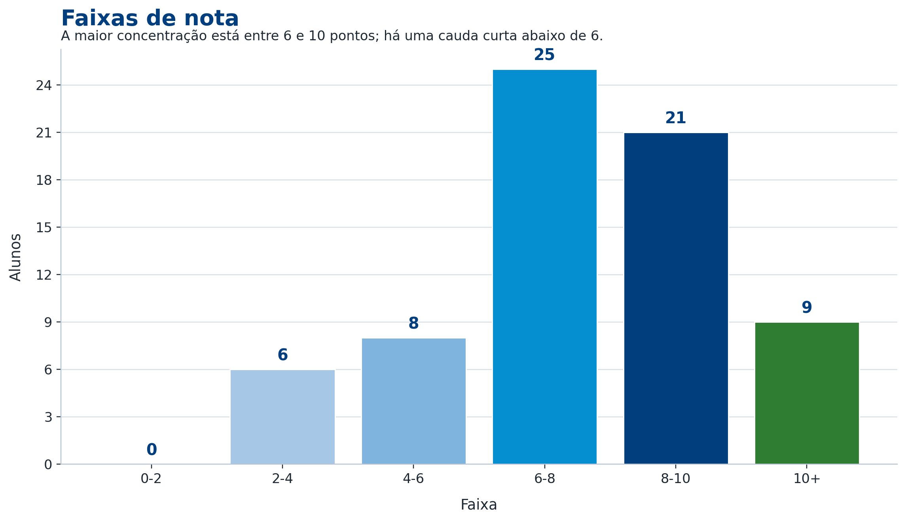
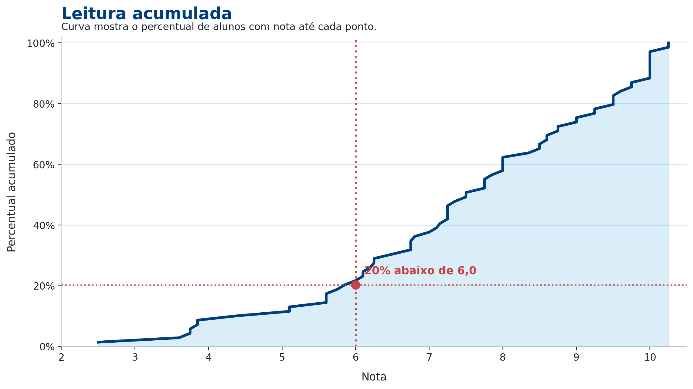
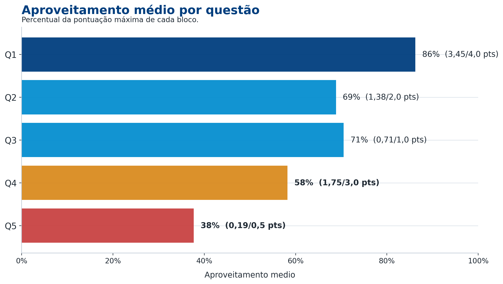
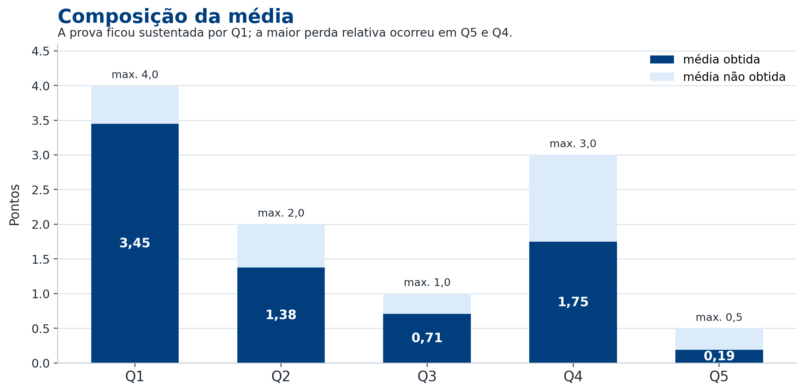
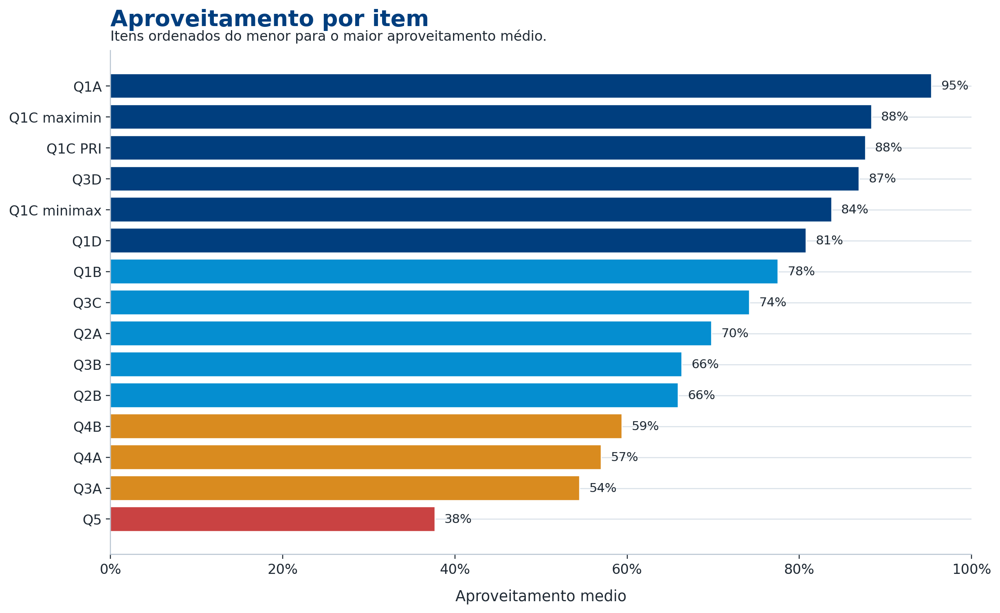

# Resultados da P1
**Teoria da Decisão – 2026.1**
Lucas Thevenard

---
<!--
paginate: true
header: Resultados da P1
footer: lucas.gomes@fgv.br | 28/04/2026
-->

## Visão geral

69

presentes

7,50

mediana

80%

com nota >= 6,0

 

10

ausentes

7,47

média

10,25

maior nota

 

**Resultado Geral:** a turma foi bem em geral. Muitos acertaram a Q1, as questões mais problemáticas foram Q2 e Q5. No entanto, o resultado mais decepcionante foi na Q4, que era simples. Há alguma dispersão de notas, mas a massa principal ficou acima de 6,0.

---

## Concentração da turma

---

## Curva de densidade acumulada

---

## Aproveitamento por questão

---

## Pontos obtidos e pontos deixados

---

## Aproveitamento por item

---

## Faixas para consulta

 

<table>
<thead><tr><th>Faixa</th><th>Alunos</th><th>Percentual dos presentes</th></tr></thead>
<tbody>
<tr><td>0-2</td><td>0</td><td>0%</td></tr><tr><td>2-4</td><td>6</td><td>9%</td></tr><tr><td>4-6</td><td>8</td><td>12%</td></tr><tr><td>6-8</td><td>25</td><td>36%</td></tr><tr><td>8-10</td><td>21</td><td>30%</td></tr><tr><td>10+</td><td>9</td><td>13%</td></tr>
</tbody>
</table>

