

# Modelos de Decisão Racional Não-Estratégicos: MDRC e MDRR
**Teoria da Decisão – 2026.1** 
Lucas Thevenard

---
<!-- 
paginate: true 
header: Aula 3 - Modelos de Decisão Racional Não-Estratégicos: MDRC e MDRR
footer: lucas.gomes@fgv.br | 10/03/2026
-->

## Recapitulando: terminamos nossa introdução teórica!
* **Aula 1**:
  * Debate sobre o consequenciachismo
  * O que é Teoria da Decisão?
  * Aparente incompatibilidade entre o consequencialismo e o Direito
  * Argumento consequencialista: distinções conceituais importantes
* **Aula 2**:
  * Leal e Aragão: aprofundamento conceitual e transição epistemológica 
  * Desafios dos argumentos consequencialistas
  * Posturas consequencialistas (quanto à adequação da decisão, quanto ao peso na fundamentação da decisão)

---

## Roteiro da aula
* Modelos de Teoria da Decisão: Certeza, Risco, Ignorância
* Modelo de Decisão Racional sob Certeza (MDRC)
  - Representação de problemas decisórios. 
* Modelo de Decisão Racional sob Risco (MDRR)
  * O conceito de valor esperado
  * Posturas em relação ao risco

---

# Modelos de Teoria da Decisão: Certeza, Risco, Ignorância

---

## Quebra contratual - certeza
- Ganho de causa (certo): R$ 100 mil
- Custos da ação (todos): R$ 10 mil
- Acordo: R$ 80 mil

---

## Quebra contratual - risco
- Ganho de causa: R$ 100 mil | 75%
- Perda da causa: R$ 0 | 25%
- Custos da ação (todos): R$ 10 mil
- Acordo: R$ 80 mil

---

## Quebra contratual - ignorância
- Ganho integral da causa (danos emergentes e lucros cessantes): R$ 100 mil
- Ganho parcial da causa (danos emergentes, mas não lucros cessantes): R$ 85 mil
- Ganho parcial da causa (apenas parte dos danos emergentes): R$ 65 mil
- Perda da causa: R$ 0
- Custos da ação (todos): R$ 10 mil
- Acordo: R$ 80 mil

---

## Modelos de Decisão Racional
* Certeza (MDRC), Risco (MDRR), Ignorância ou Incerteza (MDRI)
  * Risco x Ignorância/Incerteza: Relação com o dilema da especificação.
  * Obs: Ignorância e ignorância profunda
  
---

## MDRC
- Elementos básicos do MDRC:
  - Alternativas de decisão;
  - Associadas a estados do mundo (consequências);
  - Relação de preferências.
* Como podemos representar o problema?
  * Forma normal: tabela
  * Forma estendida: árvore de decisão

---

### Forma Normal: Tabela
 

Alternativas         | Resultados
---------------------|:----------------:
Ingressar com a ação | 90
Aceitar o Acordo     | 80

---

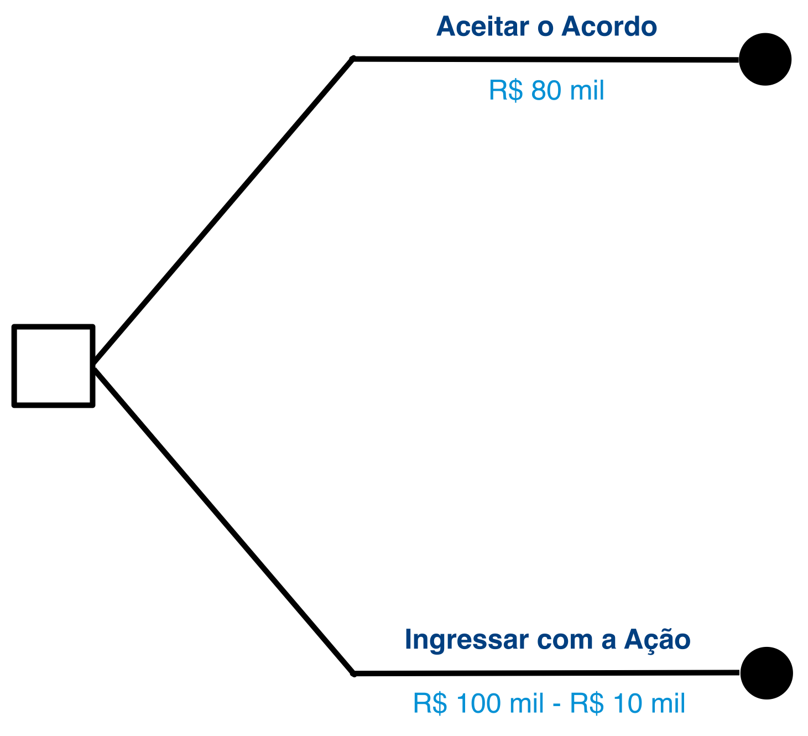

    

### Forma Estendida:
### Árvore de Decisão

---

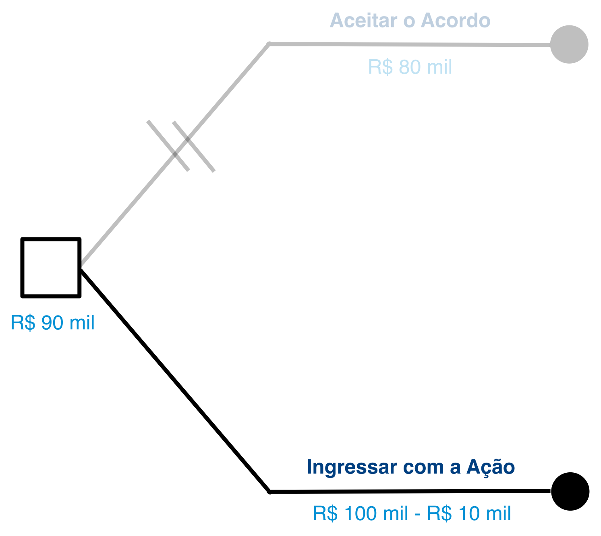

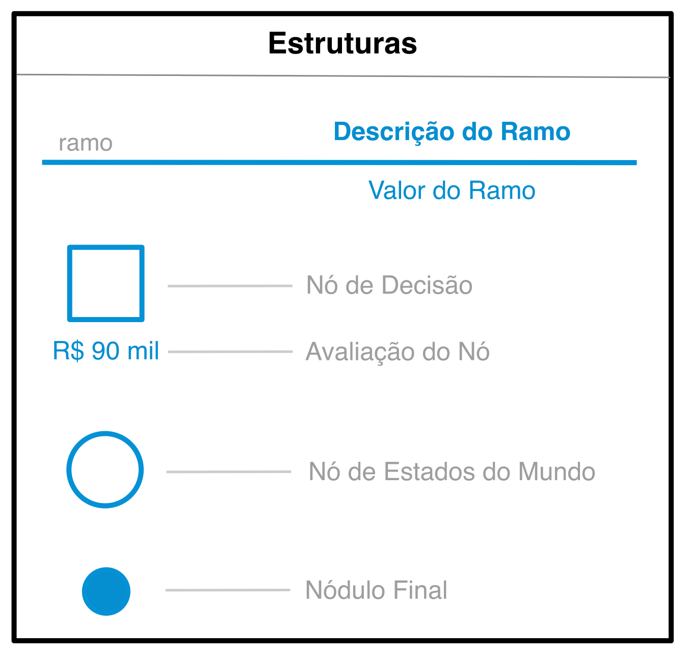

---

## Utilidade do MDRC
- Nos força a apresentar e visualizar o problema claramente.
  - Avaliação das alternativas de decisão;
  - Uso de uma escala explícita de preferências.
- Casos de estruturas decisórias complexas (múltiplas etapas decisórias).

---

# Modelo de Decisão Racional sob Risco (MDRR)

---

## MDRR
- Elementos básicos do MDRR:
  - Alternativas de decisão;
  - Associadas a estados do mundo (consequências);
  - **Chances/probabilidades dos EDMs**;
  - Relação de preferências.

---

## Quebra contratual - risco
- Ganho de causa: R$ 100 mil | 75%
- Perda da causa: R$ 0 | 25%
- Custos da ação (todos): R$ 10 mil
- Acordo: R$ 80 mil

---

### Forma normal
 

Alternativas         | Ganho de Causa   | Perda na Causa
---------------------|:----------------:|:--------------:
Ingressar com a ação | R$ 100 mil (75%) | R$ 0 (25%)
Aceitar o acordo     | R$ 80 mil        | R$ 80 mil

---

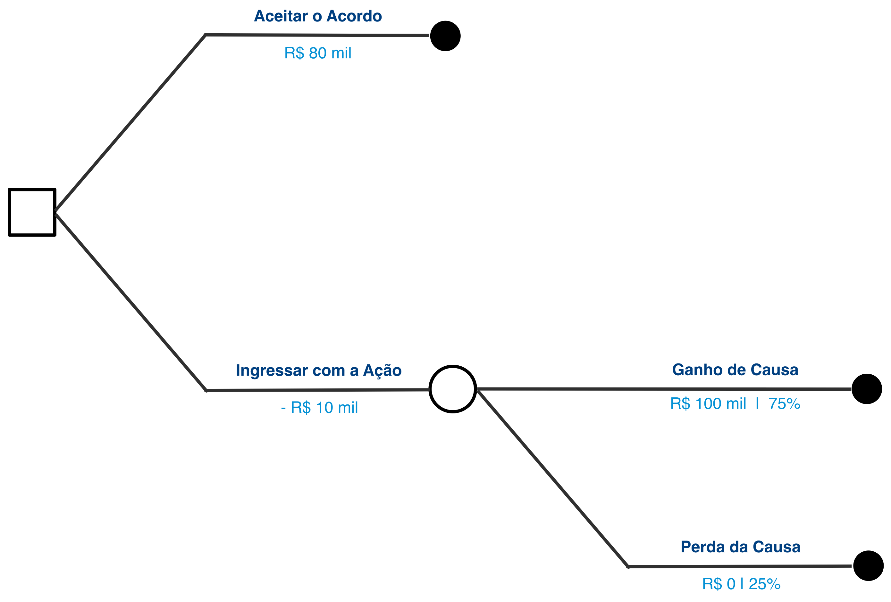

---

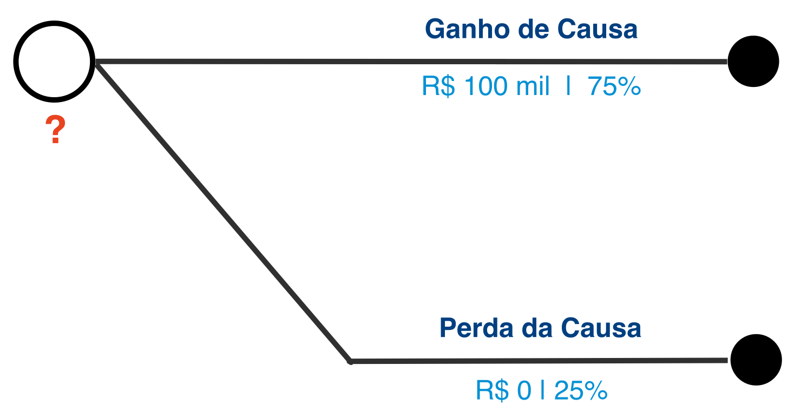

## Um problema para resolver:

- E agora, quanto vale a opção “ingressar com ação”?
- Pagamos R$ 10 mil para ter acesso a diferentes cenários com valores e probabilidades distintos.

---

## Reformulando o problema:

- Quanto vale uma loteria que me dá 75% de chance de ganhar R$ 100.000,00 e 25% de chance de ganhar R$ 0,00? 

---

# Valor Esperado

$$(75\% \times 100.000) + (25\% \times 0) = \,?$$
$$(0,75 \times 100.000) + (0,25 \times 0) = \,?$$
$$75.000 + 0 = 75.000$$

---

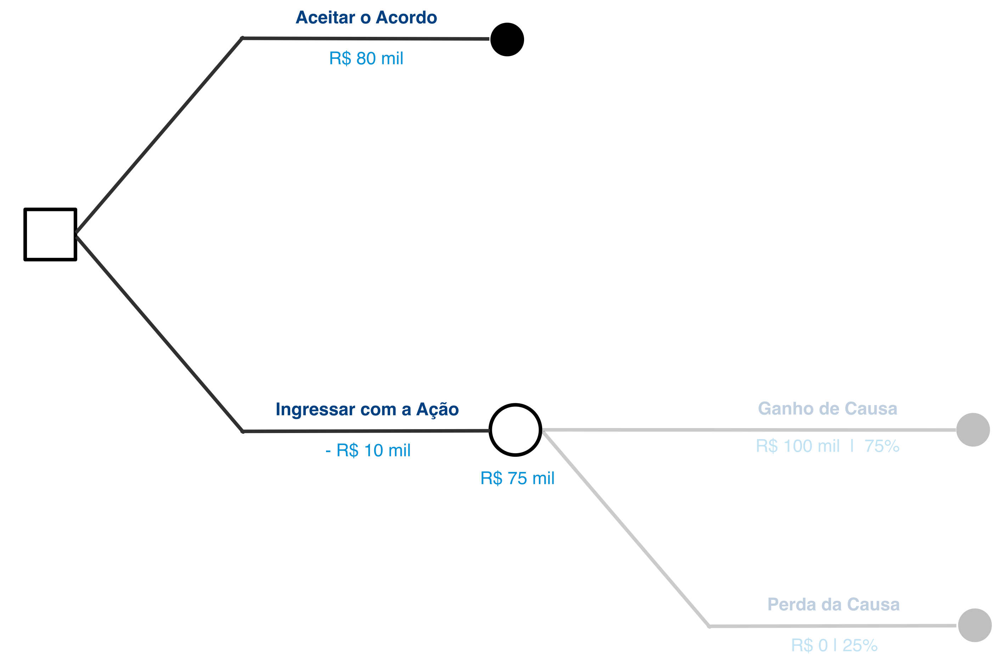

---

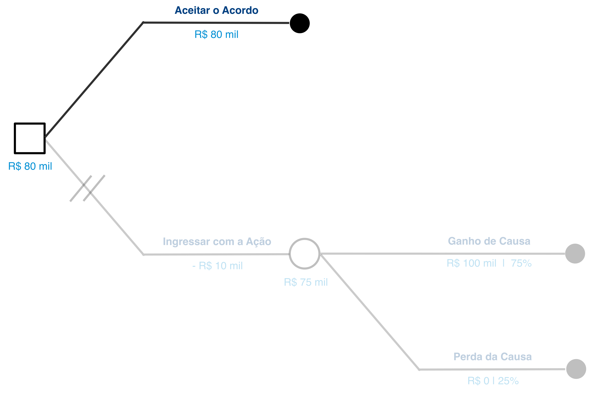

---

## Recapitulando: conceitos importantes até aqui
* Certeza, Risco, Ignorância/Incerteza
* Formas de representação
  * Forma normal: tabela com alternativas de decisão nas linhas e estados do mundo nas colunas.
  * Forma estendida: conjunto de ramos e nódulos que representam as combinações de escolhas de forma hierárquica.
    - Nós de decisão X Nós de estados do mundo
* Método de solução (MDRC e MDRR): indução retroativa + valor esperado

---

## Um outro exemplo
- Empreendimento imobiliário
  - **Compra do Terreno A**: - R$ 300 mil
  - **Compra do Terreno B**: - R$ 200 mil
    - Terreno Contaminado: - R$ 200 mil | 50%
    - Terreno Limpo: R$ 0 | 50%

---

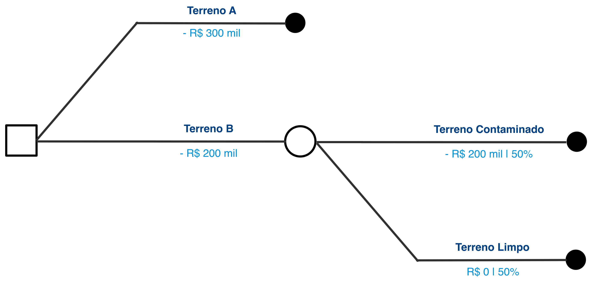

* Qual é o valor esperado do nó de estados do mundo? 

  * $(50\% \times - 200.000) + (50\% \times 0) = -100.000$

---

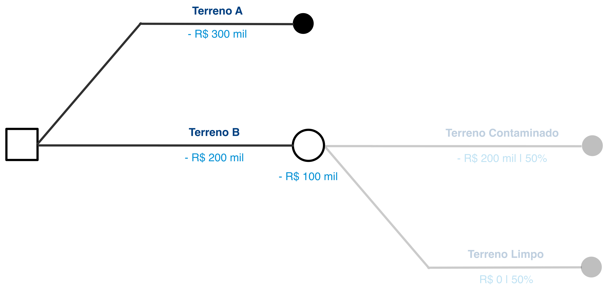

- Qual é o valor esperado do nó de estados do mundo? 

  - $(50\% \times - 200.000) + (50\% \times 0) = -100.000$

---

# O conceito de valor esperado

---

## O que é o valor esperado?
* O valor que o organizador da loteria teria que cobrar para obter de volta o valor pago em prêmios.
* O valor médio que esperamos ganhar nessa loteria se apostarmos nela muitas vezes. 

---

## Loteria Hipotética A
- **Prêmio 1**: R$ 20,00 | 25%
- **Prêmio 2**: R$ 40,00 | 25%
- **Sem Prêmio**: R$ 0,00 | 50%

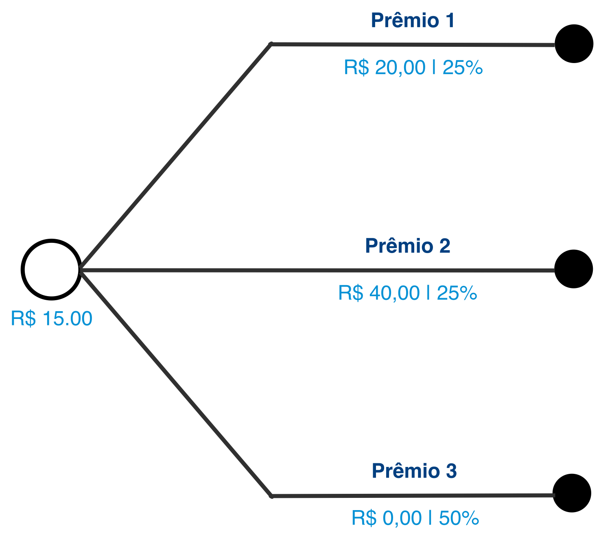

---

_O valor que o organizador da loteria teria que cobrar para obter de volta o valor pago em prêmios._

* Vendermos 12 bilhetes, quanto obteremos se cobrarmos o valor esperado?
  * $12 \times 15 = 180$
* Se as probabilidades se verificarem, quanto teremos que pagar de prêmios?
  * $\left( \frac{12}{4} \times 20 \right) + \left( \frac{12}{4} \times 40 \right) + \left( \frac{12}{2} \times 0 \right)$

  * $\left( 3 \times 20 \right) + \left( 3 \times 40 \right) + \left( 6 \times 0 \right)$

  * $60 + 120 + 0 = 180$

* Qual é o significado desse resultado?

---

_O valor médio que esperamos ganhar nessa loteria se apostarmos nela muitas vezes._

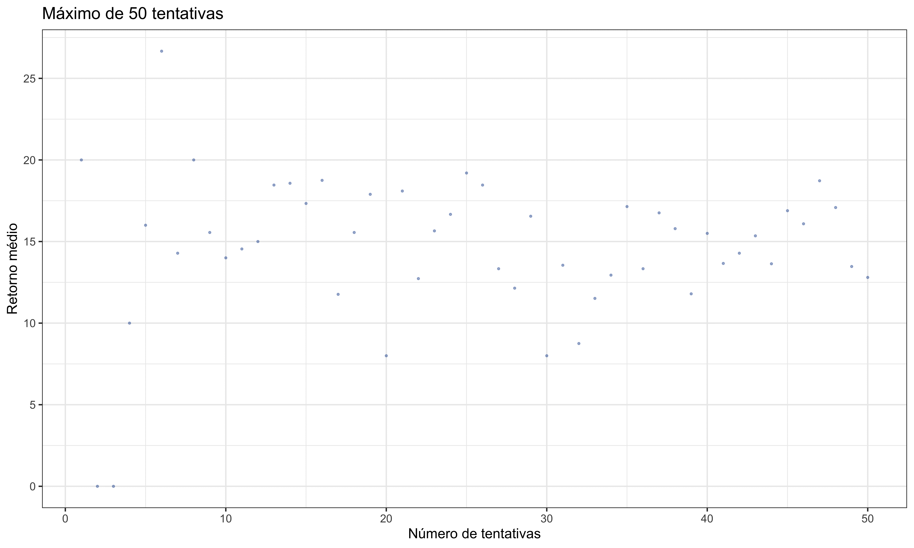

#### Obs: teste como funciona valores esperados em loterias usando [este app](https://lthevenard.github.io/post/#/pt/apps/lotteries) que eu escrevi.

---

## Voltando ao exemplo do terreno
- As duas opções realmente têm o mesmo valor?

---

## Loteria Hipotética B
- **Prêmio 1**: R$ 120,00 | 25%
- **Prêmio 2**: R$ 140,00 | 25%
- **Perda**: - R$ 100,00 | 50%

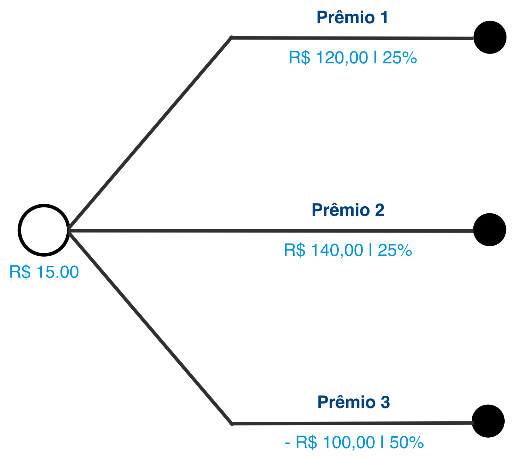

---

### Qual é a melhor loteria?

 

---

# Posturas em relação ao risco

---

## Três posturas racionais diante do risco
* **Neutro em relação ao risco**: valor esperado é uma boa medida de avaliação de cenário incertos. indiferente em relação a alternativas com o mesmo valor esperado.
* **Avesso ao risco**: Dadas duas alternativas com o mesmo valor esperado, escolhe a menos arriscada. Busca evitar o risco, desconta o valor de alternativas arriscadas.
* **Propenso ao risco**: Dadas duas alternativas com o mesmo valor esperado, escolhe a mais arriscada, que pode ter maior retorno. Aproveita o risco para ter chance ganhar mais.

---

### Voltando ao exemplo do terreno

#### O que escolheriam indivíduos neutros, avessos ou propensos ao risco?

---

## A decisão de obter informação
- Suponha que é possível realizar um teste prévio no Terreno B, que custa R$ 45 mil, para verificar se o terreno está contaminado. Vale a pena fazer esse teste?

---

<!-- 
_paginate: false 
_header: ''
_footer: ''
-->

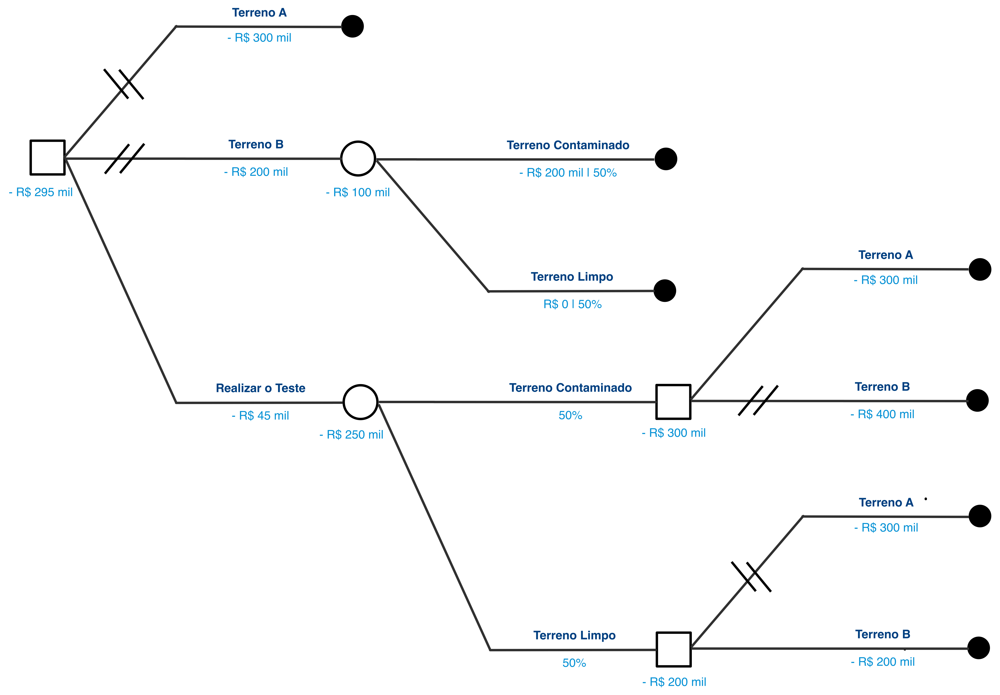

---

<!-- 
_paginate: false 
_header: ''
_footer: ''
-->

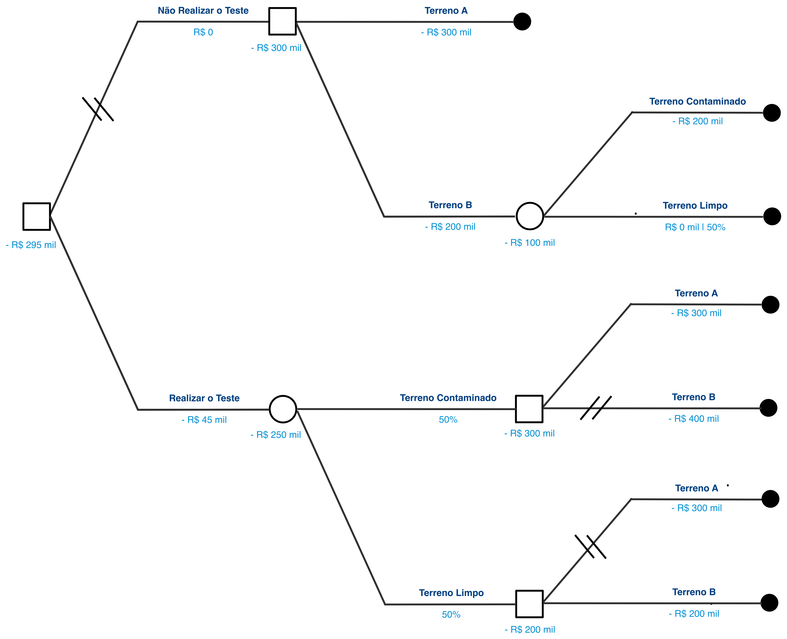

---

## A decisão de obter informação
- Suponha que é possível realizar um teste prévio no Terreno B, que custa R$ 45 mil, para verificar se o terreno está contaminado. Vale a pena fazer esse teste?
* Como responderia um indivíduo neutro, avesso ou propenso ao risco?

---

## Como saber se uma representação é correta?
- A representação deve seguir a especificação do problema:
  - Deve ser **completa e exaustiva**.
  - Os estados do mundo e alternativas de decisão (ramos) devem ser **mutuamente excludentes**.
- OBS: as probabilidades dos estados do mundo devem somar 1 (100%):
  - Forma estendida: devem somar 100% em cada nó de estados do mundo.
  - Forma normal: devem somar 100% para cada linha da tabela (alternativas de decisão).

---

## Avaliando o MDRR
* Quais são os principais desafios do MDRR?
  * Sabemos estimar probabilidades e payoffs para nossas alternativas de decisão?

---

## Como interpretar probabilidades?
* Duas interpretações da probabilidade: 
  * Pespectiva objetiva/frequentista: probabilidade como a taxa de ocorrência de um resultado no mundo.
  * Perspectiva subjetiva/bayesiana: plausabilidade subjetiva, ou o grau em que um resultado está amparado por evidências.
    * Obs: Exemplo do argumento de Leibnitz para a existência de Deus. Não depende de um processo randômico.

---

## Construção de cenários: estipulação de probabilidades
* No basquete, quando vale à pena tentar o arremesso de 3 pontos?
* Suponha que você acerta 100% das cestas de 2 pontos. Qual deve ser sua porcentagem de acerto para valer à pena tentar uma cesta de 3 pontos?
  * $p \times 3 = 2 \,\, , \,\, p = \frac{2}{3} \approx 0,67$
* Agora suponha que você acerta apenas 50% das cestas de 2 pontos.
  * $V_e = 0,5 \times 2 = 1 \implies p \times 3 = 1 \,\, , \,\, p = \frac{1}{3} \approx 0,32$
* OBS: revolução das cestas de 3 na NBA a partir de 2010 (51% vs. 38% entre os melhores atacantes de cada categoria).

---

## Avaliando o MDRR
- Quais são os principais desafios do MDRR?
  - Sabemos estimar probabilidades e payoffs para nossas alternativas de decisão?
    * Estipulação de probabilidades subjetivas
    * Teste de cenários e flexibilização do grau de confiança

---

## OBS: não esqueça dos exercícios!
- Lista 1: Prazo = 16/03 (segunda-feira), até as 23:59.

---

## Novo APP de Exercícios

- Exercícios envolvendo Decisões sob condição de risco.
  - Exercícios para treinar o cálculo do valor esperado de uma loteria.
  - Exercícios para simular e resolver árvores de decisão.

