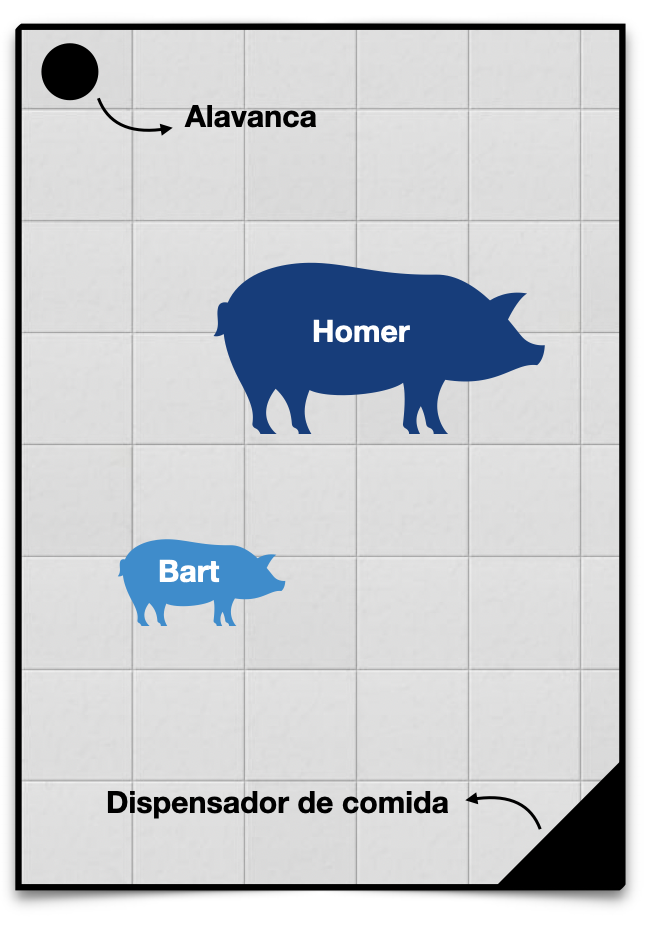

# Aula 6 – Introdução à Teoria dos Jogos 
**Teoria da Decisão – 2026.1**
Lucas Thevenard

---
<!-- 
paginate: true 
header: Aula 6 – Introdução à Teoria dos Jogos
footer: lucas.gomes@fgv.br | 31/03/2026
-->

# 1. Críticas aos modelos de decisão sob condição de ignorância

---

## Quais são os principais problemas do método Maximin?

---

## Maximin
- Método extremamente conservador.
- Impede a consideração das melhores oportunidades de ganho.
- Não considera todas as alternativas.

 

__ | EDM1 | EDM2 
---|:----:|:----:
A  | 1.5  | 1.75      
B  | 1    | 900      

__ | EDM1 | EDM2 | EDM3 | ... | EDM99 | EDM100
---|:----:|:----:|:----:|:---:|:-----:|:------:
A  | 10   | 10   | 10   | ... | 10    | 10
B  | 9    | 20   | 20   | ... | 20    | 20

---

## Quais são os principais problemas do método Minimax?

---

## Minimax
- Ao contrário do maximin, neste método pode haver influência excessiva de alternativas melhores
 

__ | EDM1 | EDM2 
---|:----:|:----:
A  | 300  | 300      
B  | -100 | 900      

__ | EDM1 | EDM2 | EDM3 | ... | EDM99 | EDM100
---|:----:|:----:|:----:|:---:|:-----:|:------:
A  | 10   | 10   | 10   | ... | 10    | 10
B  | 20   | 5    | 5    | ... | 5     | 5

---

## Minimax
- Permutações dos mesmos resultados de uma alternativa de decisão entre os Estados do mundo podem levar a soluções diferentes.
 

__ | EDM1 | EDM2 | EDM3
---|:----:|:----:|:----:
A  |  0   | 1    | 3
B  |  0   | 1    | 3
C  |  3   | 0    | 1

EDM1 | EDM2 | EDM3
:---:|:----:|:----:
3    | 0    | 0
3    | 0    | 0
0    | 1    | 2

---

- A inclusão de uma alternativa que não é escolhida pode mudar a solução do problema.

__ | EDM1 | EDM2 | EDM3
---|:----:|:----:|:----:
A  | 0    | 10   | 4 
B  | 5    | 2    | 10

 

__ | EDM1 | EDM2 | EDM3
---|:----:|:----:|:----:
A  | 0    | 10   | 4 
B  | 5    | 2    | 10
C  | 10   | 5    | 1

EDM1 | EDM2 | EDM3
:---:|:----:|:----:
5    | 0    | 6
0    | 8    | 0

 

EDM1 | EDM2 | EDM3
:---:|:----:|:----:
10   | 0    | 6
5    | 8    | 0
0    | 5    | 9

---

## Minimax
- Ao contrário do maximin, neste método pode haver influência excessiva de alternativas melhores
- Permutações dos mesmos resultados de uma alternativa de decisão entre os Estados do mundo podem levar a soluções diferentes.
- A inclusão de uma alternativa que não é escolhida pode mudar a solução do problema.

---

## Quais são os principais problemas da Regra do Otimismo?

---

## Regra do Otimismo
- Necessidade de escolher o nível de otimismo (arbitrário).
- Considera apenas parte das opções.
- Pode se reverter em max-max ou maxmin:
  - Quando adotamos níveis de otimismo 1 ou 0;
  - Quando as melhores alternativas ou as piores são idênticas

 

__ | EDM1 | EDM2 | EDM3 | EDM4
---|:----:|:----:|:----:|:----:
A  | 0    | 1    | 1    | 11
B  | 0    | 10   | 10   | 10

__ | EDM1 | EDM2 | EDM3 | EDM4
---|:----:|:----:|:----:|:----:
A  | 10   | 9    | 9    | 1
B  | 10   | 2    | 2    | 2

---

## Quais são os principais problemas do Postulado da Razão Insuficiente?

---

## Postulado da Razão Insuficiente
- Presunção de que as alternativas são equiprováveis.
- Presume neutralidade entre os cenários equiprováveis: pode ser um tratamento inadequado de riscos muito altos.
 

__ | EDM1 | EDM2 | EDM3
---|:----:|:----:|:----:
A  | -200 | 150  | 150
B  | 0    | 45   | 45

---

## Conclusão geral sobre métodos de decisão racional sob condições de ignorância
* Todos os métodos enfrentam limitações.
  - Para utilizá-los é necessário entender qual método melhor se aplica ao problema analisado.
  - Sistema de votação dos métodos não funciona (pode incorrer no mesmo problema indicado por Arrow).

---

### Paradoxo de condorcet na composição de métodos

#### Vamos considerar, no exemplo a seguir, como os três métodos ordenariam as alternativas, tomadas duas a duas (considerando um nível de otimismo de 0,5).
 

__ | EDM1 | EDM2 | EDM3
---|:----:|:----:|:----:
A  | 1    | 14   | 13
B  | -1   | 17   | 11
C  | 0    | 20   | 6

Método   | A vs. B | B vs. C | A vs. C
---------|:-------:|:-------:|:----:
Maximin  | A       | C       | A
Minimax  | B       | B       | A
Otimismo | B       | C       | C

 

Chegamos a a um resultado que viola a transitividade, pois: $C \succ B \succ A \succ C$

---

## L.A. Paul
- Professora de filosofia e ciência cognitiva em Yale.
- Escreveu o livro "Transformative Experience" (2014) e o paper "What you can't expect when you're expecting" (2015).

---

## Conclusão geral sobre métodos de decisão racional sob condições de ignorância
- Todos os métodos enfrentam limitações.
  - Para utilizá-los é necessário entender qual método melhor se aplica ao problema analisado.
  - Sistema de votação dos métodos não funciona (pode incorrer no mesmo problema indicado por Arrow).
* Limites de racionalidade em casos de ignorância profunda.
  - Método maximin é o único que admite uma escala ordinal de preferências.
  - Problema das experiências transformativas não tem solução na literatura.

---

# 2. Introdução ao conceito de Jogos

---

## O que é um jogo?
* Interação estratégica entre os jogadores.
* Conceito de estratégia: antecipar ações/decisões alheias.
* Qual é a aplicabilidade desse conceito a fenômenos sociais e jurídicos?

---

## Formalização de um jogo
- Elementos estruturais mínimos
  - Jogadores
  - Estratégias (cursos de ação ou ‘jogadas')
  - Payoffs (para cada jogador e cada combinação de jogadas)

---

### Vamos Jogar: o jogo dos porquinhos

---

### Vamos Jogar: o jogo dos porquinhos

 

  
<h2 style="color: #058ED0">Bart</h2>

<h3 style="color: #003E7E">&nbsp;&nbsp;&nbsp;&nbsp;&nbsp;&nbsp;&nbsp;&nbsp; Homer</h3>

<table>

  <tr class="game action player2"> 
    <td></td>
    <td>Aciona</td>
    <td>Espera</td>
  </tr>
  <tr>
    <td class="game action player1"> Aciona &nbsp;</td>
    <td class="game">(&nbsp;
      1/3, 
      2/3
    &nbsp;)</td>
    <td class="game">(&nbsp;
      0, 
      1
    &nbsp;)</td>
  </tr>
  <tr>
    <td class="game action player1"> Espera &nbsp;</td>
    <td class="game">(&nbsp;
      2/3, 
      1/3
    &nbsp;)</td>
    <td class="game">(&nbsp;
      0, 
      0
    &nbsp;)</td>
  </tr>

</table>

---

### Solução: jogo dos porquinhos

 

  
<h2 style="color: #058ED0">Bart</h2>

<h3 style="color: #003E7E">&nbsp;&nbsp;&nbsp;&nbsp;&nbsp;&nbsp;&nbsp;&nbsp; Homer</h3>

<table>

  <tr class="game action player2"> 
    <td></td>
    <td>Aciona</td>
    <td>Espera</td>
  </tr>
  <tr>
    <td class="game action player1"> Aciona &nbsp;</td>
    <td class="game">(&nbsp;
      1/3, 
      2/3
    &nbsp;)</td>
    <td class="game">(&nbsp;
      0, 
      1
    &nbsp;)</td>
  </tr>
  <tr>
    <td class="game action player1"> Espera &nbsp;</td>
    <td class="game">(&nbsp;
      2/3, 
      1/3
    &nbsp;)</td>
    <td class="game">(&nbsp;
      0, 
      0
    &nbsp;)</td>
  </tr>

</table>

---

### Solução: jogo dos porquinhos

 

  
<h2 style="color: #058ED0">Bart</h2>

<h3 style="color: #003E7E">&nbsp;&nbsp;&nbsp;&nbsp;&nbsp;&nbsp;&nbsp;&nbsp; Homer</h3>

<table>

  <tr class="game action player2"> 
    <td></td>
    <td>Aciona</td>
    <td>Espera</td>
  </tr>
  <tr>
    <td class="game action player1"> Aciona &nbsp;</td>
    <td class="game">(&nbsp;
      1/3, 
      2/3
    &nbsp;)</td>
    <td class="game">(&nbsp;
      0, 
      1
    &nbsp;)</td>
  </tr>
  <tr>
    <td class="game action player1"> Espera &nbsp;</td>
    <td class="game">(&nbsp;
      2/3, 
      1/3
    &nbsp;)</td>
    <td class="game">(&nbsp;
      0, 
      0
    &nbsp;)</td>
  </tr>

</table>

---

### Solução: jogo dos porquinhos

 

  
<h2 style="color: #058ED0">Bart</h2>

<h3 style="color: #003E7E">&nbsp;&nbsp;&nbsp;&nbsp;&nbsp;&nbsp;&nbsp;&nbsp; Homer</h3>

<table>

  <tr class="game action player2"> 
    <td></td>
    <td>Aciona</td>
    <td>Espera</td>
  </tr>
  <tr>
    <td class="game action player1"> Aciona &nbsp;</td>
    <td class="game">(&nbsp;
      1/3, 
      2/3
    &nbsp;)</td>
    <td class="game">(&nbsp;
      0, 
      1
    &nbsp;)</td>
  </tr>
  <tr>
    <td class="game action player1"> Espera &nbsp;</td>
    <td class="game">(&nbsp;
      2/3, 
      1/3
    &nbsp;)</td>
    <td class="game">(&nbsp;
      0, 
      0
    &nbsp;)</td>
  </tr>

</table>

---

### Solução: jogo dos porquinhos

 

  
<h2 style="color: #058ED0">Bart</h2>

<h3 style="color: #003E7E">&nbsp;&nbsp;&nbsp;&nbsp;&nbsp;&nbsp;&nbsp;&nbsp; Homer</h3>

<table>

  <tr class="game action player2"> 
    <td></td>
    <td>Aciona</td>
    <td>Espera</td>
  </tr>
  <tr>
    <td class="game action player1"> Aciona &nbsp;</td>
    <td class="game">(&nbsp;
      1/3, 
      2/3
    &nbsp;)</td>
    <td class="game">(&nbsp;
      0, 
      1
    &nbsp;)</td>
  </tr>
  <tr>
    <td class="game action player1"> Espera &nbsp;</td>
    <td class="game">(&nbsp;
      2/3, 
      1/3
    &nbsp;)</td>
    <td class="game">(&nbsp;
      0, 
      0
    &nbsp;)</td>
  </tr>

</table>

---

### Solução: jogo dos porquinhos

 

  
<h2 style="color: #058ED0">Bart</h2>

<h3 style="color: #003E7E">&nbsp;&nbsp;&nbsp;&nbsp;&nbsp;&nbsp;&nbsp;&nbsp; Homer</h3>

<table>

  <tr class="game action player2"> 
    <td></td>
    <td>Aciona</td>
    <td>Espera</td>
  </tr>
  <tr>
    <td class="game action player1"> Aciona &nbsp;</td>
    <td class="game">(&nbsp;
      1/3, 
      2/3
    &nbsp;)</td>
    <td class="game">(&nbsp;
      0, 
      1
    &nbsp;)</td>
  </tr>
  <tr>
    <td class="game action player1"> Espera &nbsp;</td>
    <td class="game">(&nbsp;
      2/3, 
      1/3
    &nbsp;)</td>
    <td class="game">(&nbsp;
      0, 
      0
    &nbsp;)</td>
  </tr>

</table>

<b>Solução do Jogo</b>: (Espera, Aciona)

---

## Solução do jogo dos porquinhos
- **Solução**: (Espera, Aciona)
  - Importante: sempre indicamos a solução como um par de estratégias, na ordem dos jogadores (jogador 1 nas linhas, jogador 2 nas colunas).
* Interações estratégicas podem ter resultados contra-intuitivos:
  * Bart "vence" o jogo, apesar de ser o mais fraco,
  * Insights interessantes para interações sociais,
  * Falta de alternativas pode levar a vantagens estratégicas.

---

# 3. Primeiro método de solução: dominância

---

## Dominância
* **Estratégias dominadas**: aquelas que nunca são preferíveis às demais, independente das ações do outro jogador.
* **Estratégia dominante**: sempre oferece o melhor resultado, ou seja, única estratégia que não é dominada.
* **Níveis de dominância**:
  * Dominância forte ou estrita: $A_i \succ B_i$, para todas as possíveis $i$ combinações de jogadas envolvendo $A$ e $B$.
  * Dominância fraca: $A_i \succsim B_i$, para todas as possíveis $i$ combinações de jogadas envolvendo $A$ e $B$. 

---

### Exemplo 1: equilíbrio de estratégias dominantes
 
<table>

  <tr class="game action player2"> 
    <td></td>
    <td>C</td>
    <td>D</td>
  </tr>
  <tr>
    <td class="game action player1">A</td>
    <td class="game">(&nbsp;
      4, 
      2
    &nbsp;)</td>
    <td class="game">(&nbsp;
      6, 
      3
    &nbsp;)</td>
  </tr>
  <tr>
    <td class="game action player1">B</td>
    <td class="game">(&nbsp;
      2, 
      4
    &nbsp;)</td>
    <td class="game">(&nbsp;
      5, 
      5
    &nbsp;)</td>
  </tr>

</table>

---

### Exemplo 1: equilíbrio de estratégias dominantes
 
<table>

  <tr class="game action player2"> 
    <td></td>
    <td>C</td>
    <td>D</td>
  </tr>
  <tr>
    <td class="game action player1">A</td>
    <td class="game">(&nbsp;
      4, 
      2
    &nbsp;)</td>
    <td class="game">(&nbsp;
      6, 
      3
    &nbsp;)</td>
  </tr>
  <tr>
    <td class="game action player1">B</td>
    <td class="game">(&nbsp;
      2, 
      4
    &nbsp;)</td>
    <td class="game">(&nbsp;
      5, 
      5
    &nbsp;)</td>
  </tr>

</table>

---

### Exemplo 1: equilíbrio de estratégias dominantes
 
<table>

  <tr class="game action player2"> 
    <td></td>
    <td>C</td>
    <td>D</td>
  </tr>
  <tr>
    <td class="game action player1">A</td>
    <td class="game">(&nbsp;
      4, 
      2
    &nbsp;)</td>
    <td class="game">(&nbsp;
      6, 
      3
    &nbsp;)</td>
  </tr>
  <tr>
    <td class="game action player1">B</td>
    <td class="game">(&nbsp;
      2, 
      4
    &nbsp;)</td>
    <td class="game">(&nbsp;
      5, 
      5
    &nbsp;)</td>
  </tr>

</table>

---

### Exemplo 1: equilíbrio de estratégias dominantes
 
<table>

  <tr class="game action player2"> 
    <td></td>
    <td>C</td>
    <td>D</td>
  </tr>
  <tr>
    <td class="game action player1">A</td>
    <td class="game">(&nbsp;
      4, 
      2
    &nbsp;)</td>
    <td class="game">(&nbsp;
      6, 
      3
    &nbsp;)</td>
  </tr>
  <tr>
    <td class="game action player1">B</td>
    <td class="game">(&nbsp;
      2, 
      4
    &nbsp;)</td>
    <td class="game">(&nbsp;
      5, 
      5
    &nbsp;)</td>
  </tr>
</table>

---

### Exemplo 1: equilíbrio de estratégias dominantes
 
<table>

  <tr class="game action player2"> 
    <td></td>
    <td>C</td>
    <td>D</td>
  </tr>
  <tr>
    <td class="game action player1">A</td>
    <td class="game">(&nbsp;
      4, 
      2
    &nbsp;)</td>
    <td class="game">(&nbsp;
      6, 
      3
    &nbsp;)</td>
  </tr>
  <tr>
    <td class="game action player1">B</td>
    <td class="game">(&nbsp;
      2, 
      4
    &nbsp;)</td>
    <td class="game">(&nbsp;
      5, 
      5
    &nbsp;)</td>
  </tr>
</table>

---

### Exemplo 1: equilíbrio de estratégias dominantes
 
<table>

  <tr class="game action player2"> 
    <td></td>
    <td>C</td>
    <td>D</td>
  </tr>
  <tr>
    <td class="game action player1">A</td>
    <td class="game">(&nbsp;
      4, 
      2
    &nbsp;)</td>
    <td class="game">(&nbsp;
      6, 
      3
    &nbsp;)</td>
  </tr>
  <tr>
    <td class="game action player1">B</td>
    <td class="game">(&nbsp;
      2, 
      4
    &nbsp;)</td>
    <td class="game">(&nbsp;
      5, 
      5
    &nbsp;)</td>
  </tr>
</table>

---

### Exemplo 1: equilíbrio de estratégias dominantes
 
<table>

  <tr class="game action player2"> 
    <td></td>
    <td>C</td>
    <td>D</td>
  </tr>
  <tr>
    <td class="game action player1">A</td>
    <td class="game">(&nbsp;
      4, 
      2
    &nbsp;)</td>
    <td class="game">(&nbsp;
      6, 
      3
    &nbsp;)</td>
  </tr>
  <tr>
    <td class="game action player1">B</td>
    <td class="game">(&nbsp;
      2, 
      4
    &nbsp;)</td>
    <td class="game">(&nbsp;
      5, 
      5
    &nbsp;)</td>
  </tr>
</table>

#### Solução: **(A, D)**

---

## Método do equilíbrio de estratégias dominantes
- Solução: **(A, D)**
- Método de solução: Identificamos a estratégia dominante de um jogador, quando ela existe, e presumimos que ele certamente optará por ela.
  - Em alguns casos, todos os jogadores têm estratégias dominantes (equilíbrio de estratégias dominantes).
  - Em outros casos, solucionando o jogo para parte dos jogadores, conseguimos prever a melhor resposta dos demais.

---

### Exemplo 2: eliminação iterada de estratégias dominadas
 

<table style="line-height: 120%;">

  <tr class="game action player2"> 
    <td></td>
    <td>D</td>
    <td>E</td>
    <td>F</td>
  </tr>
  <tr>
    <td class="game action player1">A</td>
    <td class="game">(&nbsp;
      13, 
      3
    &nbsp;)</td>
    <td class="game">(&nbsp;
      1, 
      4
    &nbsp;)</td>
    <td class="game">(&nbsp;
      7, 
      3
    &nbsp;)</td>
  </tr>
  <tr>
    <td class="game action player1">B</td>
    <td class="game">(&nbsp;
      4, 
      1
    &nbsp;)</td>
    <td class="game">(&nbsp;
      3, 
      3
    &nbsp;)</td>
    <td class="game">(&nbsp;
      6, 
      2
    &nbsp;)</td>
  </tr>
  <tr>
    <td class="game action player1">C</td>
    <td class="game">(&nbsp;
      -1, 
      9
    &nbsp;)</td>
    <td class="game">(&nbsp;
      2, 
      8
    &nbsp;)</td>
    <td class="game">(&nbsp;
      8, 
      -1
    &nbsp;)</td>
  </tr>
</table>

---

### Exemplo 2: eliminação iterada de estratégias dominadas
 

<table style="line-height: 120%;">

  <tr class="game action player2"> 
    <td></td>
    <td>D</td>
    <td>E</td>
    <td>F</td>
  </tr>
  <tr>
    <td class="game action player1">A</td>
    <td class="game">(&nbsp;
      13, 
      3
    &nbsp;)</td>
    <td class="game">(&nbsp;
      1, 
      4
    &nbsp;)</td>
    <td class="game">(&nbsp;
      7, 
      3
    &nbsp;)</td>
  </tr>
  <tr>
    <td class="game action player1">B</td>
    <td class="game">(&nbsp;
      4, 
      1
    &nbsp;)</td>
    <td class="game">(&nbsp;
      3, 
      3
    &nbsp;)</td>
    <td class="game">(&nbsp;
      6, 
      2
    &nbsp;)</td>
  </tr>
  <tr>
    <td class="game action player1">C</td>
    <td class="game">(&nbsp;
      -1, 
      9
    &nbsp;)</td>
    <td class="game">(&nbsp;
      2, 
      8
    &nbsp;)</td>
    <td class="game">(&nbsp;
      8, 
      -1
    &nbsp;)</td>
  </tr>
</table>

---

### Exemplo 2: eliminação iterada de estratégias dominadas
 

<table style="line-height: 120%;">

  <tr class="game action player2"> 
    <td></td>
    <td>D</td>
    <td>E</td>
    <td>F</td>
  </tr>
  <tr>
    <td class="game action player1">A</td>
    <td class="game">(&nbsp;
      13, 
      3
    &nbsp;)</td>
    <td class="game">(&nbsp;
      1, 
      4
    &nbsp;)</td>
    <td class="game">(&nbsp;
      7, 
      3
    &nbsp;)</td>
  </tr>
  <tr>
    <td class="game action player1">B</td>
    <td class="game">(&nbsp;
      4, 
      1
    &nbsp;)</td>
    <td class="game">(&nbsp;
      3, 
      3
    &nbsp;)</td>
    <td class="game">(&nbsp;
      6, 
      2
    &nbsp;)</td>
  </tr>
  <tr>
    <td class="game action player1">C</td>
    <td class="game">(&nbsp;
      -1, 
      9
    &nbsp;)</td>
    <td class="game">(&nbsp;
      2, 
      8
    &nbsp;)</td>
    <td class="game">(&nbsp;
      8, 
      -1
    &nbsp;)</td>
  </tr>
</table>

---

### Exemplo 2: eliminação iterada de estratégias dominadas
 

<table style="line-height: 120%;">

  <tr class="game action player2"> 
    <td></td>
    <td>D</td>
    <td>E</td>
    <td>F</td>
  </tr>
  <tr>
    <td class="game action player1">A</td>
    <td class="game">(&nbsp;
      13, 
      3
    &nbsp;)</td>
    <td class="game">(&nbsp;
      1, 
      4
    &nbsp;)</td>
    <td class="game">(&nbsp;
      7, 
      3
    &nbsp;)</td>
  </tr>
  <tr>
    <td class="game action player1">B</td>
    <td class="game">(&nbsp;
      4, 
      1
    &nbsp;)</td>
    <td class="game">(&nbsp;
      3, 
      3
    &nbsp;)</td>
    <td class="game">(&nbsp;
      6, 
      2
    &nbsp;)</td>
  </tr>
  <tr>
    <td class="game action player1">C</td>
    <td class="game">(&nbsp;
      -1, 
      9
    &nbsp;)</td>
    <td class="game">(&nbsp;
      2, 
      8
    &nbsp;)</td>
    <td class="game">(&nbsp;
      8, 
      -1
    &nbsp;)</td>
  </tr>
</table>

---

### Exemplo 2: eliminação iterada de estratégias dominadas
 

<table style="line-height: 120%;">

  <tr class="game action player2"> 
    <td></td>
    <td>D</td>
    <td>E</td>
    <td>F</td>
  </tr>
  <tr>
    <td class="game action player1">A</td>
    <td class="game">(&nbsp;
      13, 
      3
    &nbsp;)</td>
    <td class="game">(&nbsp;
      1, 
      4
    &nbsp;)</td>
    <td class="game">(&nbsp;
      7, 
      3
    &nbsp;)</td>
  </tr>
  <tr>
    <td class="game action player1">B</td>
    <td class="game">(&nbsp;
      4, 
      1
    &nbsp;)</td>
    <td class="game">(&nbsp;
      3, 
      3
    &nbsp;)</td>
    <td class="game">(&nbsp;
      6, 
      2
    &nbsp;)</td>
  </tr>
  <tr>
    <td class="game action player1">C</td>
    <td class="game">(&nbsp;
      -1, 
      9
    &nbsp;)</td>
    <td class="game">(&nbsp;
      2, 
      8
    &nbsp;)</td>
    <td class="game">(&nbsp;
      8, 
      -1
    &nbsp;)</td>
  </tr>
</table>

---

### Exemplo 2: eliminação iterada de estratégias dominadas
 

<table style="line-height: 120%;">

  <tr class="game action player2"> 
    <td></td>
    <td>D</td>
    <td>E</td>
    <td class="eliminated">F</td>
  </tr>
  <tr>
    <td class="game action player1">A</td>
    <td class="game">(&nbsp;
      13, 
      3
    &nbsp;)</td>
    <td class="game">(&nbsp;
      1, 
      4
    &nbsp;)</td>
    <td class="game eliminated">(&nbsp;
      7, 
      3
    &nbsp;)</td>
  </tr>
  <tr>
    <td class="game action player1">B</td>
    <td class="game">(&nbsp;
      4, 
      1
    &nbsp;)</td>
    <td class="game">(&nbsp;
      3, 
      3
    &nbsp;)</td>
    <td class="game eliminated">(&nbsp;
      6, 
      2
    &nbsp;)</td>
  </tr>
  <tr>
    <td class="game action player1">C</td>
    <td class="game">(&nbsp;
      -1, 
      9
    &nbsp;)</td>
    <td class="game">(&nbsp;
      2, 
      8
    &nbsp;)</td>
    <td class="game eliminated">(&nbsp;
      8, 
      -1
    &nbsp;)</td>
  </tr>
</table>

---

### Exemplo 2: eliminação iterada de estratégias dominadas
 

<table style="line-height: 120%;">

  <tr class="game action player2"> 
    <td></td>
    <td>D</td>
    <td>E</td>
    <td class="eliminated">F</td>
  </tr>
  <tr>
    <td class="game action player1">A</td>
    <td class="game">(&nbsp;
      13, 
      3
    &nbsp;)</td>
    <td class="game">(&nbsp;
      1, 
      4
    &nbsp;)</td>
    <td class="game eliminated">(&nbsp;
      7, 
      3
    &nbsp;)</td>
  </tr>
  <tr>
    <td class="game action player1">B</td>
    <td class="game">(&nbsp;
      4, 
      1
    &nbsp;)</td>
    <td class="game">(&nbsp;
      3, 
      3
    &nbsp;)</td>
    <td class="game eliminated">(&nbsp;
      6, 
      2
    &nbsp;)</td>
  </tr>
  <tr>
    <td class="game action player1">C</td>
    <td class="game">(&nbsp;
      -1, 
      9
    &nbsp;)</td>
    <td class="game">(&nbsp;
      2, 
      8
    &nbsp;)</td>
    <td class="game eliminated">(&nbsp;
      8, 
      -1
    &nbsp;)</td>
  </tr>
</table>

---

### Exemplo 2: eliminação iterada de estratégias dominadas
 

<table style="line-height: 120%;">

  <tr class="game action player2"> 
    <td></td>
    <td>D</td>
    <td>E</td>
    <td class="eliminated">F</td>
  </tr>
  <tr>
    <td class="game action player1">A</td>
    <td class="game">(&nbsp;
      13, 
      3
    &nbsp;)</td>
    <td class="game">(&nbsp;
      1, 
      4
    &nbsp;)</td>
    <td class="game eliminated">(&nbsp;
      7, 
      3
    &nbsp;)</td>
  </tr>
  <tr>
    <td class="game action player1">B</td>
    <td class="game">(&nbsp;
      4, 
      1
    &nbsp;)</td>
    <td class="game">(&nbsp;
      3, 
      3
    &nbsp;)</td>
    <td class="game eliminated">(&nbsp;
      6, 
      2
    &nbsp;)</td>
  </tr>
  <tr>
    <td class="game action player1">C</td>
    <td class="game">(&nbsp;
      -1, 
      9
    &nbsp;)</td>
    <td class="game">(&nbsp;
      2, 
      8
    &nbsp;)</td>
    <td class="game eliminated">(&nbsp;
      8, 
      -1
    &nbsp;)</td>
  </tr>
</table>

---

### Exemplo 2: eliminação iterada de estratégias dominadas
 

<table style="line-height: 120%;">

  <tr class="game action player2"> 
    <td></td>
    <td>D</td>
    <td>E</td>
    <td class="eliminated">F</td>
  </tr>
  <tr>
    <td class="game action player1">A</td>
    <td class="game">(&nbsp;
      13, 
      3
    &nbsp;)</td>
    <td class="game">(&nbsp;
      1, 
      4
    &nbsp;)</td>
    <td class="game eliminated">(&nbsp;
      7, 
      3
    &nbsp;)</td>
  </tr>
  <tr>
    <td class="game action player1">B</td>
    <td class="game">(&nbsp;
      4, 
      1
    &nbsp;)</td>
    <td class="game">(&nbsp;
      3, 
      3
    &nbsp;)</td>
    <td class="game eliminated">(&nbsp;
      6, 
      2
    &nbsp;)</td>
  </tr>
  <tr>
    <td class="game action player1">C</td>
    <td class="game">(&nbsp;
      -1, 
      9
    &nbsp;)</td>
    <td class="game">(&nbsp;
      2, 
      8
    &nbsp;)</td>
    <td class="game eliminated">(&nbsp;
      8, 
      -1
    &nbsp;)</td>
  </tr>
</table>

---

### Exemplo 2: eliminação iterada de estratégias dominadas
 

<table style="line-height: 120%;">

  <tr class="game action player2"> 
    <td></td>
    <td>D</td>
    <td>E</td>
    <td class="eliminated">F</td>
  </tr>
  <tr>
    <td class="game action player1">A</td>
    <td class="game">(&nbsp;
      13, 
      3
    &nbsp;)</td>
    <td class="game">(&nbsp;
      1, 
      4
    &nbsp;)</td>
    <td class="game eliminated">(&nbsp;
      7, 
      3
    &nbsp;)</td>
  </tr>
  <tr>
    <td class="game action player1">B</td>
    <td class="game">(&nbsp;
      4, 
      1
    &nbsp;)</td>
    <td class="game">(&nbsp;
      3, 
      3
    &nbsp;)</td>
    <td class="game eliminated">(&nbsp;
      6, 
      2
    &nbsp;)</td>
  </tr>
  <tr>
    <td class="game action player1 eliminated">C</td>
    <td class="game eliminated">(&nbsp;
      -1, 
      9
    &nbsp;)</td>
    <td class="game eliminated">(&nbsp;
      2, 
      8
    &nbsp;)</td>
    <td class="game eliminated">(&nbsp;
      8, 
      -1
    &nbsp;)</td>
  </tr>
</table>

---

### Exemplo 2: eliminação iterada de estratégias dominadas
 

<table style="line-height: 120%;">

  <tr class="game action player2"> 
    <td></td>
    <td>D</td>
    <td>E</td>
    <td class="eliminated">F</td>
  </tr>
  <tr>
    <td class="game action player1">A</td>
    <td class="game">(&nbsp;
      13, 
      3
    &nbsp;)</td>
    <td class="game">(&nbsp;
      1, 
      4
    &nbsp;)</td>
    <td class="game eliminated">(&nbsp;
      7, 
      3
    &nbsp;)</td>
  </tr>
  <tr>
    <td class="game action player1">B</td>
    <td class="game">(&nbsp;
      4, 
      1
    &nbsp;)</td>
    <td class="game">(&nbsp;
      3, 
      3
    &nbsp;)</td>
    <td class="game eliminated">(&nbsp;
      6, 
      2
    &nbsp;)</td>
  </tr>
  <tr>
    <td class="game action player1 eliminated">C</td>
    <td class="game eliminated">(&nbsp;
      -1, 
      9
    &nbsp;)</td>
    <td class="game eliminated">(&nbsp;
      2, 
      8
    &nbsp;)</td>
    <td class="game eliminated">(&nbsp;
      8, 
      -1
    &nbsp;)</td>
  </tr>
</table>

---

### Exemplo 2: eliminação iterada de estratégias dominadas
 

<table style="line-height: 120%;">

  <tr class="game action player2"> 
    <td></td>
    <td class="eliminated">D</td>
    <td>E</td>
    <td class="eliminated">F</td>
  </tr>
  <tr>
    <td class="game action player1">A</td>
    <td class="game eliminated">(&nbsp;
      13, 
      3
    &nbsp;)</td>
    <td class="game">(&nbsp;
      1, 
      4
    &nbsp;)</td>
    <td class="game eliminated">(&nbsp;
      7, 
      3
    &nbsp;)</td>
  </tr>
  <tr>
    <td class="game action player1">B</td>
    <td class="game eliminated">(&nbsp;
      4, 
      1
    &nbsp;)</td>
    <td class="game">(&nbsp;
      3, 
      3
    &nbsp;)</td>
    <td class="game eliminated">(&nbsp;
      6, 
      2
    &nbsp;)</td>
  </tr>
  <tr>
    <td class="game action player1 eliminated">C</td>
    <td class="game eliminated">(&nbsp;
      -1, 
      9
    &nbsp;)</td>
    <td class="game eliminated">(&nbsp;
      2, 
      8
    &nbsp;)</td>
    <td class="game eliminated">(&nbsp;
      8, 
      -1
    &nbsp;)</td>
  </tr>
</table>

---

### Exemplo 2: eliminação iterada de estratégias dominadas
 

<table style="line-height: 120%;">

  <tr class="game action player2"> 
    <td></td>
    <td class="eliminated">D</td>
    <td>E</td>
    <td class="eliminated">F</td>
  </tr>
  <tr>
    <td class="game action player1 eliminated">A</td>
    <td class="game eliminated">(&nbsp;
      13, 
      3
    &nbsp;)</td>
    <td class="game eliminated">(&nbsp;
      1, 
      4
    &nbsp;)</td>
    <td class="game eliminated">(&nbsp;
      7, 
      3
    &nbsp;)</td>
  </tr>
  <tr>
    <td class="game action player1">B</td>
    <td class="game eliminated">(&nbsp;
      4, 
      1
    &nbsp;)</td>
    <td class="game">(&nbsp;
      3, 
      3
    &nbsp;)</td>
    <td class="game eliminated">(&nbsp;
      6, 
      2
    &nbsp;)</td>
  </tr>
  <tr>
    <td class="game action player1 eliminated">C</td>
    <td class="game eliminated">(&nbsp;
      -1, 
      9
    &nbsp;)</td>
    <td class="game eliminated">(&nbsp;
      2, 
      8
    &nbsp;)</td>
    <td class="game eliminated">(&nbsp;
      8, 
      -1
    &nbsp;)</td>
  </tr>
</table>

#### Solução: **(B, E)**

---

## Método da eliminação iterada de estratégias dominadas
- Solução: **(B, E)**
- Forma de solução: Eliminamos gradualmente as estratégias de cada jogador que nunca seriam escolhidas.
- A cada passo descartamos as estratégias dominadas:
  - Se o jogador 1 tem uma estratégia dominada, eliminamos a respectiva linha.
  - Se o jogador 2 tem uma estratégia dominada, eliminamos a respectiva coluna.
  - Repetimos o processo até sobrar apenas um par de estratégias.

---

# 4. Segundo método de solução: equilíbrio de Nash

---

### A solução por dominância nem sempre é suficiente
 
<table>
  <tr class="game action player2"> 
    <td></td>
    <td>C</td>
    <td>D</td>
  </tr>
  <tr>
    <td class="game action player1">A</td>
    <td class="game">(&nbsp;
      1, 
      1
    &nbsp;)</td>
    <td class="game">(&nbsp;
      0, 
      0
    &nbsp;)</td>
  </tr>
  <tr>
    <td class="game action player1">B</td>
    <td class="game">(&nbsp;
      0, 
      0
    &nbsp;)</td>
    <td class="game">(&nbsp;
      1, 
      1
    &nbsp;)</td>
  </tr>
</table>

---

## Equilíbrio de Nash
* Dados dois jogadores A e B dizemos que a combinação de estratégias (a, b) desses jogadores, respectivamente, é um “equilíbrio de Nash” se 'a' é a melhor resposta do Jogador A à estratégia ‘b' do Jogador B, ao mesmo tempo em que ‘b' é a melhor resposta do Jogador B à estratégia ‘a' do Jogador A.
  * Cada jogador dá sua melhor resposta à jogada do outro.
  * Pode haver mais de um equilíbrio de Nash em um mesmo jogo.
  * Qualquer jogo finito tem ao menos um equilíbrio de Nash (que pode ser em estratégias mistas).

---

### 1.A) Jogo da Licitação

 

<b style="color: #058ED0;">Empresa A</b>

<b style="color: #003E7E; text-align: center;">Empresa B</b>

<table>
  <tr class="game action player2"> 
    <td></td>
    <td>Oferta Alta</td>
    <td>Oferta Baixa</td>
  </tr>
  <tr>
    <td class="game action player1" style="width: 180px;">Oferta Alta</td>
    <td class="game">(&nbsp;
      12, 
      12
    &nbsp;)</td>
    <td class="game">(&nbsp;
      0, 
      18
    &nbsp;)</td>
  </tr>
  <tr>
    <td class="game action player1">Oferta Baixa</td>
    <td class="game">(&nbsp;
      18, 
      0
    &nbsp;)</td>
    <td class="game">(&nbsp;
      8, 
      8
    &nbsp;)</td>
  </tr>
</table>

---

### 1.A) Jogo da Licitação

 

<b style="color: #058ED0;">Empresa A</b>

<b style="color: #003E7E; text-align: center;">Empresa B</b>

<table>
  <tr class="game action player2"> 
    <td></td>
    <td>Oferta Alta</td>
    <td>Oferta Baixa</td>
  </tr>
  <tr>
    <td class="game action player1" style="width: 180px;">Oferta Alta</td>
    <td class="game">(&nbsp;
      12, 
      12
    &nbsp;)</td>
    <td class="game">(&nbsp;
      0, 
      18
    &nbsp;)</td>
  </tr>
  <tr>
    <td class="game action player1">Oferta Baixa</td>
    <td class="game">(&nbsp;
      18, 
      0
    &nbsp;)</td>
    <td class="game">(&nbsp;
      8, 
      8
    &nbsp;)</td>
  </tr>
</table>

---

### 1.A) Jogo da Licitação

 

<b style="color: #058ED0;">Empresa A</b>

<b style="color: #003E7E; text-align: center;">Empresa B</b>

<table>
  <tr class="game action player2"> 
    <td></td>
    <td>Oferta Alta</td>
    <td>Oferta Baixa</td>
  </tr>
  <tr>
    <td class="game action player1" style="width: 180px;">Oferta Alta</td>
    <td class="game">(&nbsp;
      12, 
      12
    &nbsp;)</td>
    <td class="game">(&nbsp;
      0, 
      18
    &nbsp;)</td>
  </tr>
  <tr>
    <td class="game action player1">Oferta Baixa</td>
    <td class="game">(&nbsp;
      18, 
      0
    &nbsp;)</td>
    <td class="game">(&nbsp;
      8, 
      8
    &nbsp;)</td>
  </tr>
</table>

---

### 1.A) Jogo da Licitação

 

<b style="color: #058ED0;">Empresa A</b>

<b style="color: #003E7E; text-align: center;">Empresa B</b>

<table>
  <tr class="game action player2"> 
    <td></td>
    <td>Oferta Alta</td>
    <td>Oferta Baixa</td>
  </tr>
  <tr>
    <td class="game action player1" style="width: 180px;">Oferta Alta</td>
    <td class="game">(&nbsp;
      12, 
      12
    &nbsp;)</td>
    <td class="game">(&nbsp;
      0, 
      18
    &nbsp;)</td>
  </tr>
  <tr>
    <td class="game action player1">Oferta Baixa</td>
    <td class="game">(&nbsp;
      18, 
      0
    &nbsp;)</td>
    <td class="game">(&nbsp;
      8, 
      8
    &nbsp;)</td>
  </tr>
</table>

---

### 1.A) Jogo da Licitação

 

<b style="color: #058ED0;">Empresa A</b>

<b style="color: #003E7E; text-align: center;">Empresa B</b>

<table>
  <tr class="game action player2"> 
    <td></td>
    <td>Oferta Alta</td>
    <td>Oferta Baixa</td>
  </tr>
  <tr>
    <td class="game action player1" style="width: 180px;">Oferta Alta</td>
    <td class="game">(&nbsp;
      12, 
      12
    &nbsp;)</td>
    <td class="game">(&nbsp;
      0, 
      18
    &nbsp;)</td>
  </tr>
  <tr>
    <td class="game action player1">Oferta Baixa</td>
    <td class="game">(&nbsp;
      18, 
      0
    &nbsp;)</td>
    <td class="game">(&nbsp;
      8, 
      8
    &nbsp;)</td>
  </tr>
</table>

---

### 1.A) Jogo da Licitação

 

<b style="color: #058ED0;">Empresa A</b>

<b style="color: #003E7E; text-align: center;">Empresa B</b>

<table>
  <tr class="game action player2"> 
    <td></td>
    <td>Oferta Alta</td>
    <td>Oferta Baixa</td>
  </tr>
  <tr>
    <td class="game action player1" style="width: 180px;">Oferta Alta</td>
    <td class="game">(&nbsp;
      12, 
      12
    &nbsp;)</td>
    <td class="game">(&nbsp;
      0, 
      18
    &nbsp;)</td>
  </tr>
  <tr>
    <td class="game action player1">Oferta Baixa</td>
    <td class="game">(&nbsp;
      18, 
      0
    &nbsp;)</td>
    <td class="game">(&nbsp;
      8, 
      8
    &nbsp;)</td>
  </tr>
</table>

---

### 1.A) Jogo da Licitação

 

<b style="color: #058ED0;">Empresa A</b>

<b style="color: #003E7E; text-align: center;">Empresa B</b>

<table>
  <tr class="game action player2"> 
    <td></td>
    <td>Oferta Alta</td>
    <td>Oferta Baixa</td>
  </tr>
  <tr>
    <td class="game action player1" style="width: 180px;">Oferta Alta</td>
    <td class="game">(&nbsp;
      12, 
      12
    &nbsp;)</td>
    <td class="game">(&nbsp;
      0, 
      18
    &nbsp;)</td>
  </tr>
  <tr>
    <td class="game action player1">Oferta Baixa</td>
    <td class="game">(&nbsp;
      18, 
      0
    &nbsp;)</td>
    <td class="game">(&nbsp;
      8, 
      8
    &nbsp;)</td>
  </tr>
</table>

---

### 1.A) Jogo da Licitação

 

<b style="color: #058ED0;">Empresa A</b>

<b style="color: #003E7E; text-align: center;">Empresa B</b>

<table>
  <tr class="game action player2"> 
    <td></td>
    <td>Oferta Alta</td>
    <td>Oferta Baixa</td>
  </tr>
  <tr>
    <td class="game action player1" style="width: 180px;">Oferta Alta</td>
    <td class="game">(&nbsp;
      12, 
      12
    &nbsp;)</td>
    <td class="game">(&nbsp;
      0, 
      18
    &nbsp;)</td>
  </tr>
  <tr>
    <td class="game action player1">Oferta Baixa</td>
    <td class="game">(&nbsp;
      18, 
      0
    &nbsp;)</td>
    <td class="game">(&nbsp;
      8, 
      8
    &nbsp;)</td>
  </tr>
</table>

#### Solução do Jogo: **(Oferta Baixa, Oferta Baixa)**

---

### 1.B) Jogo das Aparências

 

<b style="color: #058ED0;">Pedro</b>

<b style="color: #003E7E; text-align: center;">João</b>

<table>
  <tr class="game action player2"> 
    <td></td>
    <td>Investe Menos</td>
    <td>Investe Mais</td>
  </tr>
  <tr>
    <td class="game action player1" style="width: 200px;">Investe Menos</td>
    <td class="game">(&nbsp;
      84, 
      84
    &nbsp;)</td>
    <td class="game">(&nbsp;
      40, 
      100
    &nbsp;)</td>
  </tr>
  <tr>
    <td class="game action player1">Investe Mais</td>
    <td class="game">(&nbsp;
      100, 
      40
    &nbsp;)</td>
    <td class="game">(&nbsp;
      60, 
      60
    &nbsp;)</td>
  </tr>
</table>

---

### 1.B) Jogo das Aparências

 

<b style="color: #058ED0;">Pedro</b>

<b style="color: #003E7E; text-align: center;">João</b>

<table>
  <tr class="game action player2"> 
    <td></td>
    <td>Investe Menos</td>
    <td>Investe Mais</td>
  </tr>
  <tr>
    <td class="game action player1" style="width: 200px;">Investe Menos</td>
    <td class="game">(&nbsp;
      84, 
      84
    &nbsp;)</td>
    <td class="game">(&nbsp;
      40, 
      100
    &nbsp;)</td>
  </tr>
  <tr>
    <td class="game action player1">Investe Mais</td>
    <td class="game">(&nbsp;
      100, 
      40
    &nbsp;)</td>
    <td class="game">(&nbsp;
      60, 
      60
    &nbsp;)</td>
  </tr>
</table>

---

### 1.B) Jogo das Aparências

 

<b style="color: #058ED0;">Pedro</b>

<b style="color: #003E7E; text-align: center;">João</b>

<table>
  <tr class="game action player2"> 
    <td></td>
    <td>Investe Menos</td>
    <td>Investe Mais</td>
  </tr>
  <tr>
    <td class="game action player1" style="width: 200px;">Investe Menos</td>
    <td class="game">(&nbsp;
      84, 
      84
    &nbsp;)</td>
    <td class="game">(&nbsp;
      40, 
      100
    &nbsp;)</td>
  </tr>
  <tr>
    <td class="game action player1">Investe Mais</td>
    <td class="game">(&nbsp;
      100, 
      40
    &nbsp;)</td>
    <td class="game">(&nbsp;
      60, 
      60
    &nbsp;)</td>
  </tr>
</table>

---

### 1.B) Jogo das Aparências

 

<b style="color: #058ED0;">Pedro</b>

<b style="color: #003E7E; text-align: center;">João</b>

<table>
  <tr class="game action player2"> 
    <td></td>
    <td>Investe Menos</td>
    <td>Investe Mais</td>
  </tr>
  <tr>
    <td class="game action player1" style="width: 200px;">Investe Menos</td>
    <td class="game">(&nbsp;
      84, 
      84
    &nbsp;)</td>
    <td class="game">(&nbsp;
      40, 
      100
    &nbsp;)</td>
  </tr>
  <tr>
    <td class="game action player1">Investe Mais</td>
    <td class="game">(&nbsp;
      100, 
      40
    &nbsp;)</td>
    <td class="game">(&nbsp;
      60, 
      60
    &nbsp;)</td>
  </tr>
</table>

---

### 1.B) Jogo das Aparências

 

<b style="color: #058ED0;">Pedro</b>

<b style="color: #003E7E; text-align: center;">João</b>

<table>
  <tr class="game action player2"> 
    <td></td>
    <td>Investe Menos</td>
    <td>Investe Mais</td>
  </tr>
  <tr>
    <td class="game action player1" style="width: 200px;">Investe Menos</td>
    <td class="game">(&nbsp;
      84, 
      84
    &nbsp;)</td>
    <td class="game">(&nbsp;
      40, 
      100
    &nbsp;)</td>
  </tr>
  <tr>
    <td class="game action player1">Investe Mais</td>
    <td class="game">(&nbsp;
      100, 
      40
    &nbsp;)</td>
    <td class="game">(&nbsp;
      60, 
      60
    &nbsp;)</td>
  </tr>
</table>

---

### 1.B) Jogo das Aparências

 

<b style="color: #058ED0;">Pedro</b>

<b style="color: #003E7E; text-align: center;">João</b>

<table>
  <tr class="game action player2"> 
    <td></td>
    <td>Investe Menos</td>
    <td>Investe Mais</td>
  </tr>
  <tr>
    <td class="game action player1" style="width: 200px;">Investe Menos</td>
    <td class="game">(&nbsp;
      84, 
      84
    &nbsp;)</td>
    <td class="game">(&nbsp;
      40, 
      100
    &nbsp;)</td>
  </tr>
  <tr>
    <td class="game action player1">Investe Mais</td>
    <td class="game">(&nbsp;
      100, 
      40
    &nbsp;)</td>
    <td class="game">(&nbsp;
      60, 
      60
    &nbsp;)</td>
  </tr>
</table>

---

### 1.B) Jogo das Aparências

 

<b style="color: #058ED0;">Pedro</b>

<b style="color: #003E7E; text-align: center;">João</b>

<table>
  <tr class="game action player2"> 
    <td></td>
    <td>Investe Menos</td>
    <td>Investe Mais</td>
  </tr>
  <tr>
    <td class="game action player1" style="width: 200px;">Investe Menos</td>
    <td class="game">(&nbsp;
      84, 
      84
    &nbsp;)</td>
    <td class="game">(&nbsp;
      40, 
      100
    &nbsp;)</td>
  </tr>
  <tr>
    <td class="game action player1">Investe Mais</td>
    <td class="game">(&nbsp;
      100, 
      40
    &nbsp;)</td>
    <td class="game">(&nbsp;
      60, 
      60
    &nbsp;)</td>
  </tr>
</table>

---

### 1.B) Jogo das Aparências

 

<b style="color: #058ED0;">Pedro</b>

<b style="color: #003E7E; text-align: center;">João</b>

<table>
  <tr class="game action player2"> 
    <td></td>
    <td>Investe Menos</td>
    <td>Investe Mais</td>
  </tr>
  <tr>
    <td class="game action player1" style="width: 200px;">Investe Menos</td>
    <td class="game">(&nbsp;
      84, 
      84
    &nbsp;)</td>
    <td class="game">(&nbsp;
      40, 
      100
    &nbsp;)</td>
  </tr>
  <tr>
    <td class="game action player1">Investe Mais</td>
    <td class="game">(&nbsp;
      100, 
      40
    &nbsp;)</td>
    <td class="game">(&nbsp;
      60, 
      60
    &nbsp;)</td>
  </tr>
</table>

---

### 1.B) Jogo das Aparências

 

<b style="color: #058ED0;">Pedro</b>

<b style="color: #003E7E; text-align: center;">João</b>

<table>
  <tr class="game action player2"> 
    <td></td>
    <td>Investe Menos</td>
    <td>Investe Mais</td>
  </tr>
  <tr>
    <td class="game action player1" style="width: 200px;">Investe Menos</td>
    <td class="game">(&nbsp;
      84, 
      84
    &nbsp;)</td>
    <td class="game">(&nbsp;
      40, 
      100
    &nbsp;)</td>
  </tr>
  <tr>
    <td class="game action player1">Investe Mais</td>
    <td class="game">(&nbsp;
      100, 
      40
    &nbsp;)</td>
    <td class="game">(&nbsp;
      60, 
      60
    &nbsp;)</td>
  </tr>
</table>

---

### 1.B) Jogo das Aparências

 

<b style="color: #058ED0;">Pedro</b>

<b style="color: #003E7E; text-align: center;">João</b>

<table>
  <tr class="game action player2"> 
    <td></td>
    <td>Investe Menos</td>
    <td>Investe Mais</td>
  </tr>
  <tr>
    <td class="game action player1" style="width: 200px;">Investe Menos</td>
    <td class="game">(&nbsp;
      84, 
      84
    &nbsp;)</td>
    <td class="game">(&nbsp;
      40, 
      100
    &nbsp;)</td>
  </tr>
  <tr>
    <td class="game action player1">Investe Mais</td>
    <td class="game">(&nbsp;
      100, 
      40
    &nbsp;)</td>
    <td class="game">(&nbsp;
      60, 
      60
    &nbsp;)</td>
  </tr>
</table>

#### Solução do Jogo: **(Investe Mais, Investe Mais)**
